# Monitoraggio multitemporale della copertura di neve alle Svalbard (2016-2020-2024)

> #### Progetto d'esame - Telerilevamento Geo-Ecologico in R - 2026
>> ##### Jacopo Moresco, matricola n.1237448

# Abstract

# 1. Introduzione 📌

Le Svalbard rappresentano una delle regioni artiche più sensibili al riscaldamento climatico in atto, con tassi di aumento della temperatura superiori alla media globale e conseguenze dirette sulla dinamica dei ghiacciai dell'arcipelago. Studi recenti documentano una consistente perdita di massa e un arretramento marcato alternato solo da fasi di avanzata legate a eventi di *surge* (Zagorski et al. 2023)[7]. Questo quadro rende le Svalbard un caso di studio rilevante per verificare, tramite telerilevamento multitemporale, se e come la copertura di neve stia effettivamente variando in un intervallo temporale recente e osservabile da satellite.

## 1.1 Area di studio 🛰️

L'area di studio è situata nella porzione sud-occidentale dell'isola di Spitsbergen, nell'arcipelago norvegese delle Svalbard, all'interno del Sør-Spitsbergen National Park. In particolare, il sito interessa la parte nord-occidentale del Recherchefjorden e la costa meridionale di Bellsund, nella regione di Wedel Jarlsberg Land (~77°N, 14°E). Nel ritaglio considerato sono presenti Renardbreen — un ghiacciaio vallivo che in passato terminava in mare — Scottbreen, Blomlibreen e alcune superfici glaciali minori.

Si tratta di ghiacciai di tipo *surge*, soggetti a temporanei e violenti avanzamenti pulsanti seguiti da lunghe fasi di quiescenza; tuttavia, la tendenza dominante osservata negli ultimi decenni in questa regione, fortemente influenzata dal rapido riscaldamento artico, è quella di un arretramento marcato e di una consistente perdita di massa.

<p align="center">
  
</p>

> Figura 1. Localizzazione dell'area di studio nel settore sud-occidentale di Spitsbergen, Svalbard.

## 1.2 Obiettivo 🎯

L'obiettivo del progetto è stimare la variazione della copertura di neve nell'area di studio tra il 2016 e il 2024, utilizzando immagini Sentinel-2 attraverso il calcolo di indici spettrali e un'analisi multitemporale, nell'ipotesi che tale estensione si riduca per effetto del riscaldamento climatico in atto alle Svalbard.

# 2. Materiali e Metodi 🧪

## 2.1 Raccolta delle immagini 📂

Le immagini satellitari sono state ottenute tramite [**Google Earth Engine**](https://earthengine.google.com/) (GEE), una piattaforma cloud che consente di accedere direttamente all'archivio satellitare pubblico, tra cui le collezioni Sentinel-2, e di elaborarlo senza doverlo scaricare in locale: è possibile filtrare le scene disponibili per area geografica, intervallo temporale e percentuale di copertura nuvolosa, per poi esportare l'immagine risultante già ritagliata sull'area di interesse. Per questo progetto sono state selezionate immagini con una copertura nuvolosa massima del 10% (`CLOUDY_PIXEL_PERCENTAGE < 10`), soglia scelta per ridurre il più possibile l'interferenza delle nuvole nel calcolo degli indici spettrali.

+ Le immagini utilizzate sono composti mediani mensili: per ciascun anno, tutte le scene Sentinel-2 di agosto (2016, 2020, 2024) con copertura nuvolosa inferiore al 10% sono state combinate calcolando il valore mediano pixel per pixel, riducendo così l'effetto di rumore residuo e le differenze radiometriche tra acquisizioni singole. 
+ Il dataset di partenza è Sentinel-2 Surface Reflectance Harmonized (Level-2A), già corretto atmosfericamente.
+ Il periodo estivo è stato scelto perché corrisponde alla fase di massima ablazione glaciale, durante la quale la copertura nevosa stagionale è generalmente ridotta, rendendo più semplice distinguere il ghiaccio permanente dalle superfici circostanti.

> [!NOTE]
> Il codice completo in JavaScript utilizzato per ottenere le immagini si trova nel file `Code.js`.

Per ciascun anno sono state scaricate le bande Sentinel-2 riportate in tabella, esportate a una risoluzione uniforme di 20 m (nativamente B2, B3, B4 e B8 sarebbero a 10 m, ma sono state allineate alla risoluzione di B11 in fase di esportazione):

| Banda | Nome | Indice/uso |
|---|---|---|
| B2 | Blue | Composizione RGB |
| B3 | Green | Composizione RGB, NDSI, NDWI |
| B4 | Red | Composizione RGB, NDVI |
| B8 | NIR | NDWI, NDVI, filtro NIR |
| B11 | SWIR1 | NDSI |

## 2.2 Importazione e visualizzazione in R 💻

Una volta scaricate, le tre immagini sono state importate in RStudio dopo aver impostato una working directory.

```r
setwd("C:/Users/Jacopo/OneDrive/Università/Magistrale/Telerilevamento_Rocchini/Exam")
```

Successivamente sono stati installati i seguenti pacchetti:

```r
library(terra)      # Gestione raster e vettori spaziali
library(imageRy)    # Visualizzazione immagini telerilevate
library(viridis)    # Palette cromatiche per mappe
library(ggplot2)    # Grafici finali
library(patchwork)  # Affiancamento grafici
library(ggridges)   # Distribuzioni degli indici
library(reshape2)   # Riorganizzazione tabelle per ggplot
```

### Immagini

I tre raster Sentinel-2 sono stati importati con la funzione `rast()` di `terra`, che legge direttamente il file multibanda in formato `.tif` mantenendo la struttura originale delle cinque bande selezionate in fase di esportazione da GEE.

```r
image_2016 <- rast("data_raw/svalbard_glaciers_2016_late_summer.tif")
image_2016          # visualizzo le specifiche del raster
plot(image_2016)    # visualizzo l'immagine
dev.off()           # chiudo il pannello grafico

image_2020 <- rast("data_raw/svalbard_glaciers_2020_late_summer.tif")
image_2020
plot(image_2020)
dev.off()

image_2024 <- rast("data_raw/svalbard_glaciers_2024_late_summer.tif")
image_2024
plot(image_2024)
dev.off()
```

## Outlines glaciali di riferimento 🗺️

Oltre alle tre immagini Sentinel-2, è stato importato lo shapefile con gli outlines glaciali ufficiali del Norwegian Polar Institute (NPI), disponibile per l'anno 2020. Questo dato vettoriale costituisce l'unico riferimento indipendente disponibile nel progetto e viene utilizzato più avanti per validare la classificazione della copertura nevosa ottenuta dagli indici spettrali.

```r
# Cerco tutti i file .shp nella cartella Shapefile_2020
shapefiles_2020 <- list.files(path = "data_raw/Shapefile_2020", pattern = "\\.shp$", full.names = TRUE)

# Importo gli outlines del 2020
glacier_outlines_2020 <- vect(shapefiles_2020[1]) 
glacier_outlines_2020        # Visualizzo informazioni del vettore

# Confronto il sistema di riferimento (crs) e l'estensione del raster 2020 e dello shapefile
crs(image_2020) == crs(glacier_outlines_2020)

# C'è una discrepanza, quindi riproietto gli outlines nel CRS dell raster del 2020
glacier_outlines_2020_proj <- project(glacier_outlines_2020, crs(image_2020))

# Ritaglio gli outlines sull'area di studio
study_glaciers_2020 <- crop(glacier_outlines_2020_proj, image_2020)

# Salvo gli outlines ritagliati come GeoPackage
writeVector(study_glaciers_2020, "data_processed/study_glaciers_2020.gpkg", overwrite = TRUE)
```

## Visualizzazione RGB e bande 🌈

Una prima composizione a colori naturali (bande 4-3-2) è stata prodotta per i tre anni, utile per farsi un'idea generale della copertura del terreno e della qualità delle immagini prima di procedere al calcolo degli indici.

### Visualizzazione RGB 🎨
```r
png("output/rgb_multitemporal_glaciers.png", width = 2150, height = 1150, res = 200)
im.multiframe(1,3)
plotRGB(image_2016, r = 3, g = 2, b = 1, stretch = "lin", main = "2016", cex.main = 1.8)
plotRGB(image_2020, r = 3, g = 2, b = 1, stretch = "lin", main = "2020", cex.main = 1.8)
plotRGB(image_2024, r = 3, g = 2, b = 1, stretch = "lin", main = "2024", cex.main = 1.8)
dev.off()
```

<p align="center">
  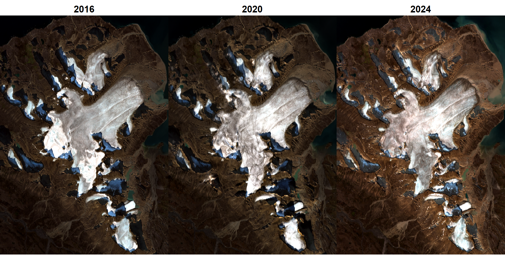
</p>

> Figura 2. Composizione RGB (bande 4-3-2) a confronto tra 2016, 2020 e 2024.

### Le cinque bande del 2020 🔎

Sono state poi visualizzate singolarmente le cinque bande disponibili per ciascun anno (è stata inserita solo l'immagine del 2020 per non appesantire troppo il documento), per verificare la qualità radiometrica delle immagini e la corrispondenza tra bande e superfici osservabili (neve, roccia, acqua, ombre) prima di calcolare gli indici.
```r
png("output/bands_2020.png", width = 2200, height = 1400, res = 200)
im.multiframe(2,3)
plot(image_2020[["B2"]],  main = "B2 - Blue",  col = viridis(100))
plot(image_2020[["B3"]],  main = "B3 - Green", col = viridis(100))
plot(image_2020[["B4"]],  main = "B4 - Red",   col = viridis(100))
plot(image_2020[["B8"]],  main = "B8 - NIR",   col = viridis(100))
plot(image_2020[["B11"]], main = "B11 - SWIR1", col = viridis(100))
dev.off()
```

<p align="center">
  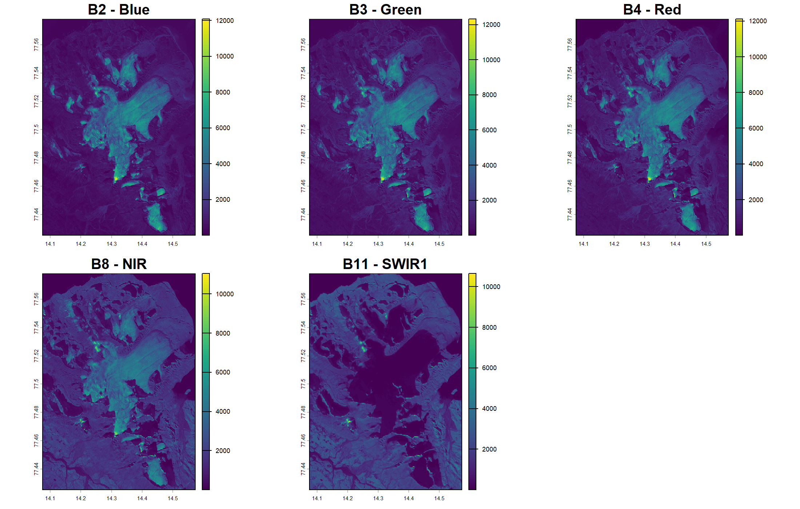
</p>

> Figura 3. Le cinque bande Sentinel-2 disponibili per il 2020.

### Bande del visibile: confronto dei tre anni 👁️
Prima di calcolare gli indici spettrali, le bande del visibile e le bande NIR/SWIR1 sono state confrontate tra i tre anni: le prime sono propedeutiche a NDVI e alla composizione RGB, le seconde a NDSI e NDWI.

```r
png("output/visible_bands.png", width = 2600, height = 2200, res = 200)
im.multiframe(3, 3)
plot(image_2016[["B2"]], main = "B2 - Blue (2016)", cex.main = 1.8, col = viridis(100))
plot(image_2016[["B3"]], main = "B3 - Green (2016)", cex.main = 1.8, col = viridis(100))
plot(image_2016[["B4"]], main = "B4 - Red (2016)", cex.main = 1.8, col = viridis(100))
plot(image_2020[["B2"]], main = "B2 - Blue (2020)", cex.main = 1.8, col = viridis(100))
plot(image_2020[["B3"]], main = "B3 - Green (2020)", cex.main = 1.8, col = viridis(100))
plot(image_2020[["B4"]], main = "B4 - Red (2020)", cex.main = 1.8, col = viridis(100))
plot(image_2024[["B2"]], main = "B2 - Blue (2024)", cex.main = 1.8, col = viridis(100))
plot(image_2024[["B3"]], main = "B3 - Green (2024)", cex.main = 1.8, col = viridis(100))
plot(image_2024[["B4"]], main = "B4 - Red (2024)", cex.main = 1.8, col = viridis(100))
dev.off()
```

<p align="center">
  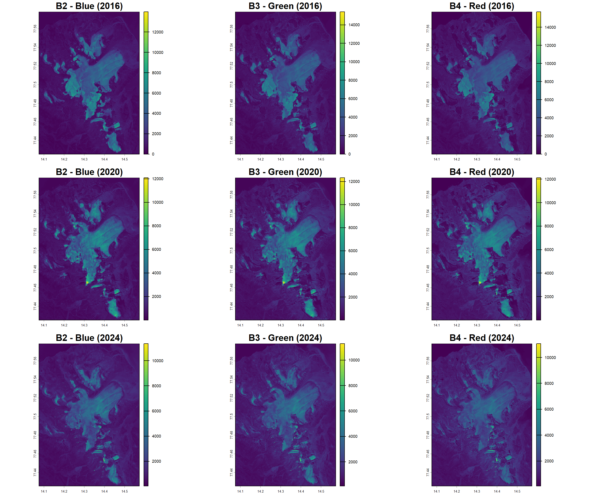
</p>

> Figura 4. Bande del visibile (B2, B3, B4) a confronto tra 2016, 2020 e 2024.

### Bande NIR e SWIR: confronto dei tre anni 📡

```r
png("output/nir_swir_bands.png", width = 1600, height = 2200, res = 200)
im.multiframe(3, 2)
plot(image_2016[["B8"]],  main = "B8 - NIR (2016)", cex.main = 1.8, col = viridis(100))
plot(image_2016[["B11"]], main = "B11 - SWIR1 (2016)", cex.main = 1.8, col = viridis(100))
plot(image_2020[["B8"]],  main = "B8 - NIR (2020)",   cex.main = 1.8, col = viridis(100))
plot(image_2020[["B11"]], main = "B11 - SWIR1 (2020)", cex.main = 1.8, col = viridis(100))
plot(image_2024[["B8"]],  main = "B8 - NIR (2024)",   cex.main = 1.8, col = viridis(100))
plot(image_2024[["B11"]], main = "B11 - SWIR1 (2024)", cex.main = 1.8, col = viridis(100))
dev.off()
```

<p align="center">
  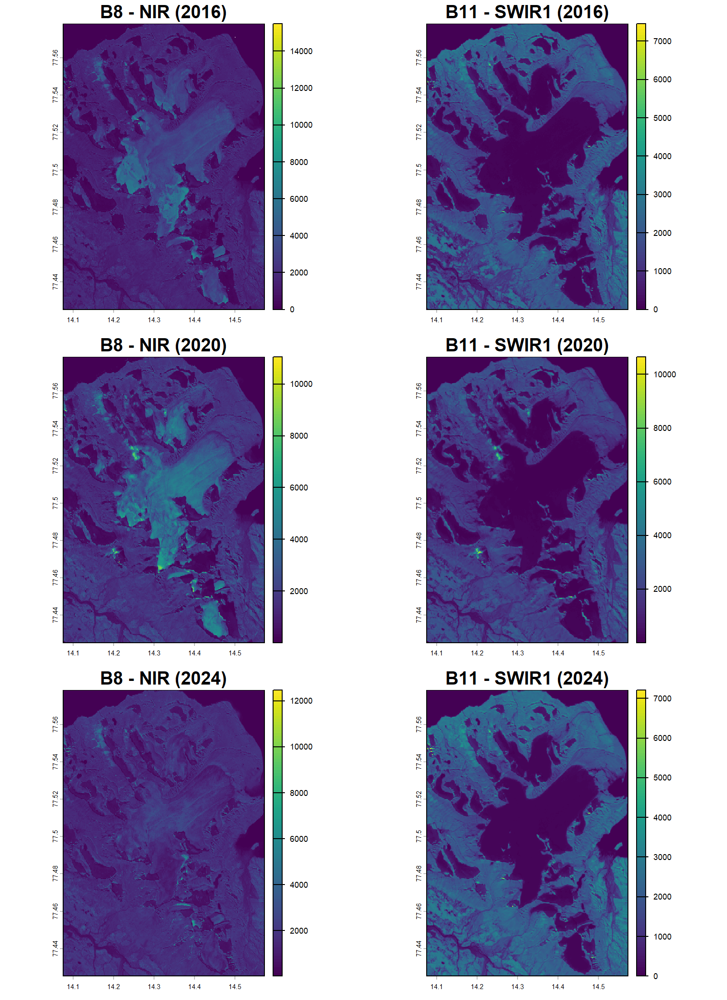
</p>

> Figura 5. Bande B8 (NIR) e B11 (SWIR1) a confronto tra 2016, 2020 e 2024.

## 2.3 Indici spettrali 📐

Per caratterizzare la copertura di neve, l'acqua e la vegetazione sono stati calcolati tre indici spettrali normalizzati: **NDSI**, **NDWI** e **NDVI**. Ciascun indice è stato calcolato per i tre anni, e la relativa variazione temporale è stata ottenuta come differenza tra il 2024 e il 2016 (*Δindice = indice_2024 - indice_2016*): valori **positivi** indicano un aumento dell'indice nel 2024, valori **negativi** una diminuzione.

## NDSI - Normalized Difference Snow Index ❄️

$$ NDSI = \frac{Green - SWIR1}{Green + SWIR1} $$

L'NDSI, formulato da **Hall e Riggs (2011) [1]** per la mappatura standardizzata della criosfera, sfrutta il comportamento spettrale tipico della neve e del ghiaccio, che riflettono *intensamente* nel verde e assorbono *fortemente* nello SWIR1: superfici innevate o ghiacciate assumono quindi valori di NDSI **elevati**, generalmente superiori a 0.4, mentre roccia, vegetazione e acqua restano su valori più bassi. È l'indice **centrale** del progetto, su cui si basa l'intera classificazione del capitolo successivo.

> [!NOTE]
> Chiamo "neve" la classe individuata dall'NDSI: neve stagionale e ghiaccio glaciale hanno la stessa firma spettrale (verde alto, SWIR1 basso) e l'indice non li distingue.

Il limite principale dell'NDSI, ben noto in letteratura, è la **confusione spettrale** con superfici che condividono una firma simile a quella della neve: specchi d'acqua, laghi proglaciali e ombre topografiche possono infatti restituire valori di NDSI altrettanto elevati, portando a una *sovrastima* dell'area effettivamente coperta da neve se l'indice viene usato da solo. Questo limite motiva la scelta metodologica, illustrata più avanti, di combinare l'NDSI con altri indici e bande per isolare i falsi positivi.

```r
ndsi_2016 <- (image_2016[["B3"]] - image_2016[["B11"]]) / (image_2016[["B3"]] + image_2016[["B11"]])
ndsi_2020 <- (image_2020[["B3"]] - image_2020[["B11"]]) / (image_2020[["B3"]] + image_2020[["B11"]])
ndsi_2024 <- (image_2024[["B3"]] - image_2024[["B11"]]) / (image_2024[["B3"]] + image_2024[["B11"]])
dndsi <- ndsi_2024 - ndsi_2016

png("output/ndsi_multitemporal.png", width = 2150, height = 2150, res = 200)
im.multiframe(2, 2)
plot(ndsi_2016, main = "NDSI - 2016", col = viridis(100))
plot(ndsi_2020, main = "NDSI - 2020", col = viridis(100))
plot(ndsi_2024, main = "NDSI - 2024", col = viridis(100))
plot(dndsi, main = "ΔNDSI", col = viridis(100))
dev.off()
```

<p align="center">
  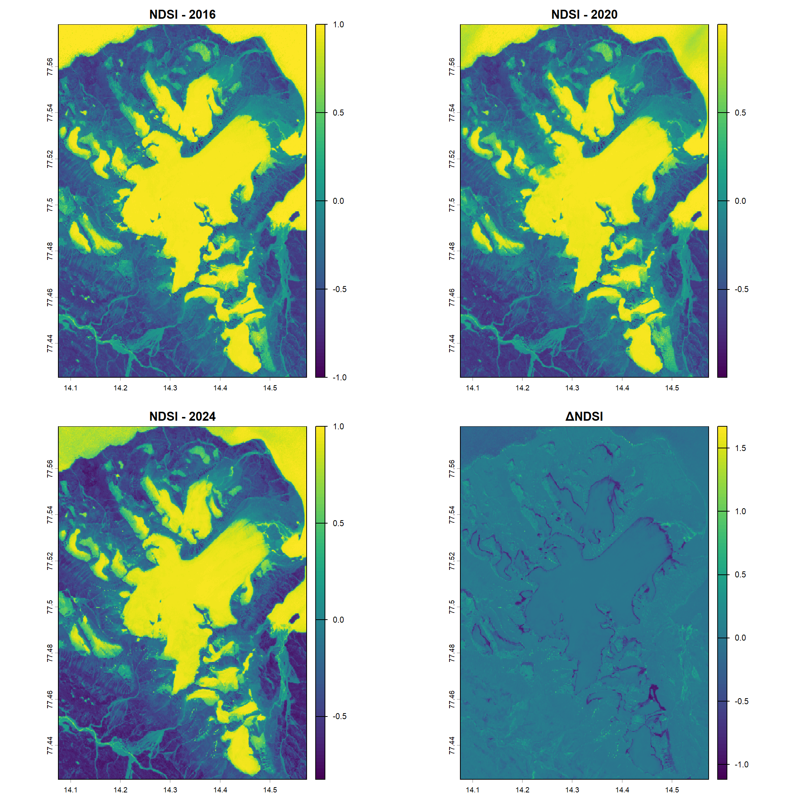
</p>

> Figura 6. NDSI nei tre anni e relativa differenza (ΔNDSI, 2024-2016).

Nei tre anni la mappa NDSI mostra un pattern spaziale coerente: i valori più **alti** (verso il giallo) si concentrano stabilmente sui corpi glaciali, mentre il mare aperto e le superfici rocciose esposte restano su valori **bassi o negativi** (viola/blu scuro), come atteso dalla formula dell'indice. 

Nel pannello ΔNDSI la maggior parte dell'area glaciale interna appare in colori intermedi (variazione contenuta, vicina allo zero), mentre le anomalie più marcate si concentrano lungo i **margini e i fronti dei ghiacciai**, suggerendo un segnale di cambiamento localizzato ai bordi piuttosto che una perdita uniforme sull'intero corpo glaciale.

## NDWI - Normalized Difference Water Index 🌊

$$ NDWI = \frac{Green - NIR}{Green + NIR} $$

L'NDWI, proposto da **McFeeters (1996) [3]**, evidenzia la presenza di **acqua libera** (mare, laghi proglaciali, superfici umide), che assorbe fortemente nel NIR pur mantenendo una riflettanza relativamente alta nel verde. Nel progetto questo indice viene utilizzato principalmente per *distinguere l'acqua dalla neve*, entrambe caratterizzate da riflettanza elevata nel verde e quindi facilmente confondibili dal solo NDSI.

```r
ndwi_2016 <- (image_2016[["B3"]] - image_2016[["B8"]]) / (image_2016[["B3"]] + image_2016[["B8"]])
ndwi_2020 <- (image_2020[["B3"]] - image_2020[["B8"]]) / (image_2020[["B3"]] + image_2020[["B8"]])
ndwi_2024 <- (image_2024[["B3"]] - image_2024[["B8"]]) / (image_2024[["B3"]] + image_2024[["B8"]])
dndwi<- ndwi_2024 - ndwi_2016

png("output/ndwi_multitemporal.png", width = 2150, height = 2150, res = 200)
im.multiframe(2, 2)
plot(ndwi_2016, main = "NDWI - 2016", col = viridis(100))
plot(ndwi_2020, main = "NDWI - 2020", col = viridis(100))
plot(ndwi_2024, main = "NDWI - 2024", col = viridis(100))
plot(dndwi, main = "ΔNDWI", col = viridis(100))
dev.off()
```

<p align="center">
  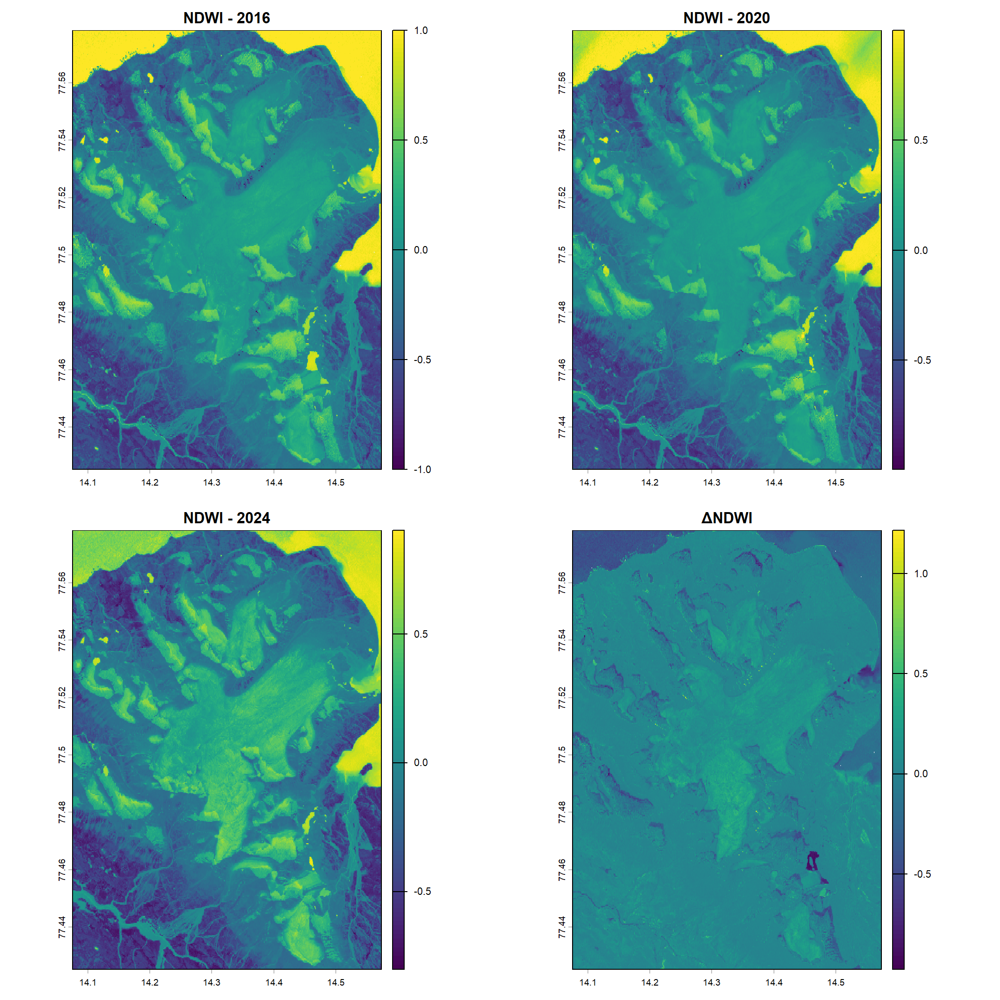
</p>

> Figura 7. NDWI nei tre anni e relativa differenza (ΔNDWI, 2024-2016).

La mappa NDWI separa nettamente il mare aperto del Bellsund/Recherchefjorden (valori elevati) dai corpi glaciali, che restano su valori negativi o prossimi allo zero: questa netta distinzione conferma che l'indice è **efficace nel discriminare l'acqua dalla neve**, ed è proprio ciò che lo rende utile come filtro nella classificazione. 

Il pannello ΔNDWI mostra le variazioni più marcate lungo la linea di costa e nelle aree proglaciali, mentre l'interno dei ghiacciai resta più stabile: un segnale che rafforza l'idea che l'NDWI stia isolando correttamente la componente acquosa, senza "sporcare" la lettura della neve vera e propria.

## NDVI - Normalized Difference Vegetation Index 🌿

$$ NDVI = \frac{NIR - Red}{NIR + Red} $$

L'NDVI individua l'eventuale presenza di **vegetazione o tundra**, distinguendola dalle superfici prive di copertura vegetale. Nel contesto artico i valori di NDVI restano generalmente *contenuti* rispetto ad ambienti temperati.

```r
ndvi_2016 <- im.ndvi(image_2016, nir = 4, red = 3)
ndvi_2020 <- im.ndvi(image_2020, nir = 4, red = 3)
ndvi_2024 <- im.ndvi(image_2024, nir = 4, red = 3)
dndvi <- ndvi_2024 - ndvi_2016

png("output/ndvi_multitemporal.png", width = 2150, height = 2150, res = 200)
im.multiframe(2, 2)
plot(ndvi_2016, main = "NDVI - 2016", col = viridis(100))
plot(ndvi_2020, main = "NDVI - 2020", col = viridis(100))
plot(ndvi_2024, main = "NDVI - 2024", col = viridis(100))
plot(dndvi, main = "ΔNDVI 2024 - 2016", col = viridis(100))
dev.off()
```

<p align="center">
  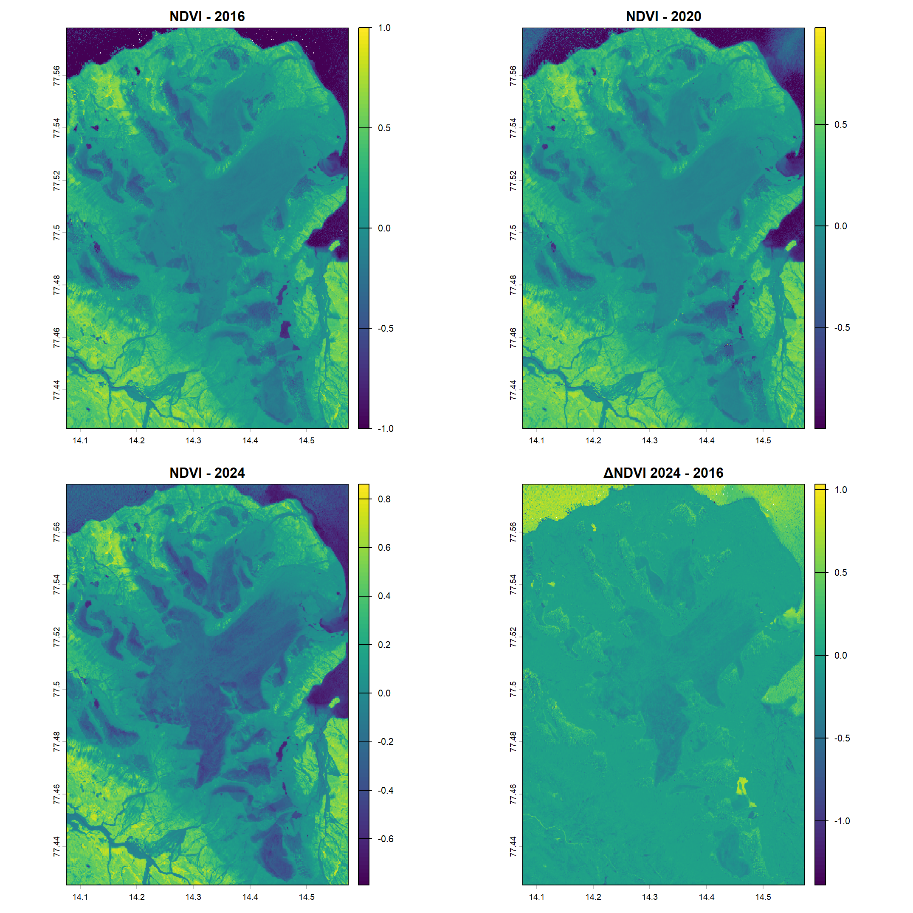
</p>

> Figura 8. NDVI nei tre anni e relativa differenza (ΔNDVI, 2024-2016).

I valori di NDVI restano contenuti su gran parte dell'area, coerentemente con un ambiente artico a vegetazione scarsa: la maggior parte della superficie si colloca vicino allo zero o su valori leggermente negativi, con isolate zone a NDVI più alto concentrate nelle aree libere dal ghiaccio (morene, terreni costieri). 

Il pannello ΔNDVI 2024-2016 non mostra variazioni sistematiche di grande entità, un risultato in linea con l'aspettativa: l'indice è stato incluso per verificare un eventuale **aumento della vegetazione** legato al riscaldamento artico (fenomeno noto come *arctic greening*), più che per un ruolo attivo nella classificazione, dove i valori così contenuti e poco variabili non offrono un potere discriminante utile.

## Confronto delle variazioni multitemporali 🔀

Le tre differenze (ΔNDSI, ΔNDWI, ΔNDVI) sono state confrontate **fianco a fianco** per avere un quadro sintetico di come le tre componenti spettrali si siano modificate tra il 2016 e il 2024 nella stessa area.

```r
png("output/index_differences_2024_2016.png", width = 2100, height = 800, res = 200)
im.multiframe(1, 3)
plot(dndsi, col = viridis(100), main = "ΔNDSI 2024 - 2016")
plot(dndwi, col = viridis(100), main = "ΔNDWI 2024 - 2016")
plot(dndvi, col = viridis(100), main = "ΔNDVI 2024 - 2016")
dev.off()
```

<p align="center">
  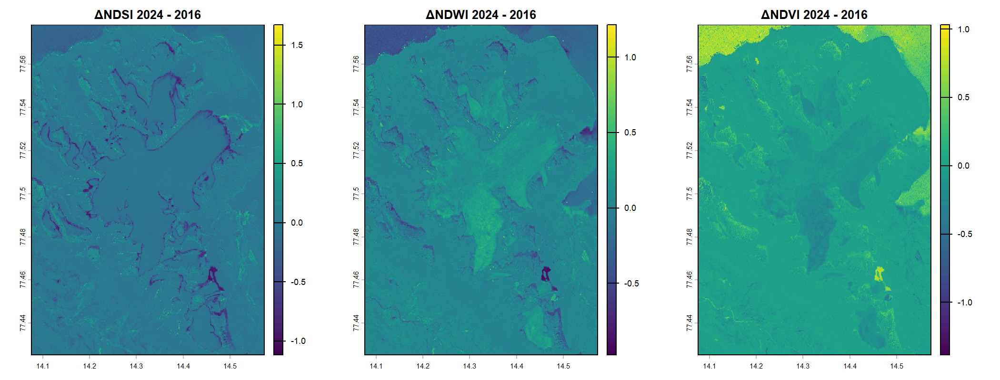
</p>

> Figura 9. Confronto tra le variazioni 2024-2016 di NDSI, NDWI e NDVI.

Il confronto affiancato delle tre differenze mostra come i segnali di cambiamento più marcati si distribuiscano in porzioni diverse dell'area di studio: il ΔNDWI si concentra lungo la costa e le aree proglaciali, il ΔNDSI ai margini dei ghiacciai, mentre il ΔNDVI resta diffuso e di **bassa intensità** su tutta l'area. Questo conferma che NDSI e NDWI stanno leggendo fenomeni spazialmente distinti ma complementari — rispettivamente neve e acqua — il che giustifica il loro uso combinato nella classificazione del capitolo successivo.

L'NDVI, pur mostrando un pattern spaziale coerente con la vegetazione artica, non presenta variazioni sufficientemente marcate da fornire un contributo discriminante analogo, e nel progetto resta quindi un indicatore **complementare** di monitoraggio ambientale piuttosto che un filtro operativo.

## 2.4 Classificazione della copertura nevosa 🧊

La classificazione binaria (neve vs. non neve) è stata validata sul 2020, l'unico anno per cui sono disponibili gli outlines glaciali ufficiali del Norwegian Polar Institute. La stessa soglia viene poi applicata anche al 2016 e al 2024, per garantire la confrontabilità tra le tre epoche.

La confusion matrix spaziale è costruita combinando aritmeticamente il raster classificato con il raster di riferimento (`classificato + 2 × riferimento`), ottenendo quattro classi:

| Codice | Significato |
|---|---|
| 0 (TN) | pixel esterni agli outlines correttamente classificati come NON neve |
| 1 (FP) | pixel classificati come neve ma esterni agli outlines |
| 2 (FN) | pixel interni agli outlines riconosciuti come NON neve |
| 3 (TP) | pixel interni agli outlines correttamente classificati come neve |

Da questi conteggi vengono calcolate tre metriche standard di validazione:

1. **Accuracy**

$$ Accuracy = \frac{TP + TN}{TP + TN + FP + FN} $$

Misura la percentuale di pixel classificati correttamente, **su entrambe le classi**. È la metrica più intuitiva, ma può essere fuorviante quando le due classi sono molto sbilanciate: nell'area di studio i pixel esterni agli outlines sono molto più numerosi di quelli glaciali, quindi un'Accuracy alta può in parte riflettere semplicemente la facilità di riconoscere correttamente il "non neve", più che la reale qualità della classificazione della neve.

2. **Recall (sensibilità)**

$$ Recall = \frac{TP}{TP + FN} $$

Risponde alla domanda: *della superficie realmente glaciale (secondo gli outlines ufficiali), quanta ne viene effettivamente riconosciuta dalla classificazione?* Una Recall bassa indica **omissione**: il metodo lascia fuori superfici realmente coperte, classificandole erroneamente come non neve (falsi negativi).

3. **Precision**

$$ Precision = \frac{TP}{TP + FP} $$

Risponde alla domanda opposta: *di tutta l'area classificata come neve, quanta ricade davvero dentro gli outlines ufficiali?* Una Precision bassa indica **sovrastima**: il metodo include aree che non sono realmente glaciali (falsi positivi), come acqua, ombre o roccia chiara.

> [!NOTE]
> 
> Recall e Precision colgono due tipi di errore opposti e complementari: la prima penalizza chi "lascia fuori" superfici vere, la seconda penalizza chi "include" superfici che non lo sono. Un buon metodo di classificazione cerca il miglior compromesso tra le due, non la massimizzazione di una sola.

Il calcolo e la visualizzazione di questi risultati sono affidati a tre funzioni scritte appositamente per il progetto, richiamate identicamente per ciascuno dei metodi testati:

> [!NOTE]
> 
> **Le due funzioni del workflow di classificazione**
>
> - **`plot_snow_outlines()`** — sovrappone gli outlines ufficiali del NPI alla classificazione del 2020, per un controllo visivo diretto di quanto la classe "neve" combaci con il riferimento.
> - **`calculate_confusion_matrix()`** — è la funzione centrale: combina il raster classificato con il raster di riferimento (`classificato + 2 × riferimento`), conta i pixel in ciascuna delle quattro classi (TN, FP, FN, TP), calcola Accuracy, Recall e Precision, produce la mappa spaziale della confusion matrix e restituisce tutti i risultati (tabelle e raster) in un'unica lista, riutilizzabile nel confronto finale tra metodi.

```r
# Rasterizzazione degli outlines ufficiali sulla griglia del raster classificato
# 1 = area interna agli outlines glaciali; 0 = area esterna agli outlines
reference_snow <- rasterize(study_glaciers_2020, snow_2020_ndsi, field = 1, background = 0)
```

#### plot_snow_outlines()
```r
plot_snow_classified <- function(raster_2016, raster_2020, raster_2024, method, output_file) {
  
  # raster_2016   raster classificato relativo al 2016
  # raster_2020   raster classificato relativo al 2020
  # raster_2024   raster classificato relativo al 2024
  # method        nome del metodo di classificazione usato nei titoli
  # output_file   percorso e nome del file PNG finale
  
  rasters <- c(raster_2016, raster_2020, raster_2024)                   # Unisce i tre raster in un oggetto multilayer
  years <- c(2016, 2020, 2024)                                         # Associa gli anni ai tre raster
  
  png(output_file, width = 2100, height = 800, res = 200)               # Apre il dispositivo PNG
  im.multiframe(1, 3)                                                   # Imposta una griglia con una riga e tre colonne
  
  for (i in 1:3) {                                                      # Ripete il grafico per ciascun anno
    
    plot(rasters[[i]],                                                  # Seleziona il raster corrispondente all'anno
         col = c("black", "lightcyan"),                                 # Assegna i colori alle due classi
         type = "classes",                                              # Tratta i valori come classi discrete
         legend = FALSE,                                                # Disattiva la legenda automatica
         main = paste("Classificazione", method, "-", years[i]))        # Crea il titolo con metodo e anno
    
    legend("bottomleft",                                                # Posiziona la legenda in basso a sinistra
           inset = c(0.12, 0.02),                                       # Sposta leggermente la legenda
           xpd = NA,                                                    # Permette di disegnare fuori dall'area del grafico
           legend = c("Neve", "Non neve"),                              # Etichette delle classi
           fill = c("lightcyan", "black"),                              # Colori associati alle classi
           border = "black",                                            # Bordo dei simboli della legenda
           cex = 0.8,                                                   # Dimensione del testo
           bg = "white",                                                # Sfondo bianco
           bty = "o")                                                   # Disegna il bordo della legenda
  }
  
  dev.off()                                                             # Chiude e salva il file PNG
}
```

#### calculate_confusion_matrix()
```r
calculate_confusion_matrix <- function(classified_raster, method, output_file) {
  
  # classified_raster   raster binario da confrontare con gli outlines ufficiali
  # method              nome del metodo riportato nel titolo e nelle tabelle
  # output_file         percorso e nome del file PNG finale
  
  comparison <- classified_raster + 2 * reference_snow                          # Combina classificazione e riferimento in quattro classi
  cm <- freq(comparison)                                                        # Conta i pixel appartenenti a TN, FP, FN e TP
  
  counts <- setNames(rep(0, 4), 0:3)                                            # Crea un vettore completo delle quattro classi
  counts[as.character(cm$value)] <- cm$count                                    # Inserisce i conteggi osservati
  
  TN <- counts["0"]                                                             # Non neve classificata correttamente fuori dagli outlines
  FP <- counts["1"]                                                             # Neve classificata erroneamente fuori dagli outlines
  FN <- counts["2"]                                                             # Neve di riferimento non riconosciuta
  TP <- counts["3"]                                                             # Neve classificata correttamente dentro gli outlines
  
  accuracy <- (TP + TN) / (TP + TN + FP + FN) * 100                             # Percentuale totale di pixel corretti
  recall <- TP / (TP + FN) * 100                                                # Percentuale della neve di riferimento riconosciuta
  precision <- TP / (TP + FP) * 100                                             # Percentuale della neve classificata che ricade negli outlines
  
  confusion_table <- data.frame(                                                # Crea la tabella della confusion matrix
    Classificazione = c("NEVE", "NON NEVE"),
    Reference_SNOW = c(TP, FN),
    Reference_NOT_SNOW = c(FP, TN)
  )
  
  metrics_table <- data.frame(                                                  # Crea la tabella delle metriche finali
    Metodo = method,
    TN = as.numeric(TN),
    FP = as.numeric(FP),
    FN = as.numeric(FN),
    TP = as.numeric(TP),
    Accuracy = round(as.numeric(accuracy), 2),
    Recall = round(as.numeric(recall), 2),
    Precision = round(as.numeric(precision), 2)
  )
  
  png(output_file, width = 1200, height = 1300, res = 200)                      # Apre il dispositivo PNG
  
  plot(comparison,                                                              # Visualizza la distribuzione spaziale degli errori
       col = c("grey80", "orange", "red", "darkgreen"),                         # Colori di TN, FP, FN e TP
       main = paste("Distribuzione spaziale della classificazione -", method),
       type = "classes",                                                        # Tratta i valori come classi discrete
       legend = FALSE)                                                          # Disattiva la legenda automatica
  
  legend("bottomleft",                                                          # Aggiunge la legenda
         inset = c(0.13, 0.02),
         xpd = NA,
         legend = c("TN - True Negative", "FP - False Positive",
                    "FN - False Negative", "TP - True Positive"),
         fill = c("grey80", "orange", "red", "darkgreen"),
         cex = 0.8,
         bg = "white",
         bty = "o")
  
  dev.off()                                                                     # Chiude e salva il file PNG
      
  print(confusion_table)                                                        # Stampa la confusion matrix
  print(metrics_table)                                                          # Stampa accuracy, recall e precision
  
  return(list(                                                                  # Restituisce gli oggetti prodotti
    comparison = comparison,
    frequencies = cm,
    confusion_table = confusion_table,
    metrics = metrics_table
  ))
}
```

### Metodo 1 — Solo NDSI 1️⃣

Istogramma per vedere la distribuzione dell'indice e scegliere la soglia di classificazione

```r
png("output/hist_ndsi_2020.png", width = 1500, height = 1300, res = 200)
hist(ndsi_2020, breaks = 100, main = "Distribuzione NDSI - 2020")
dev.off() 
```

<p align="center">
  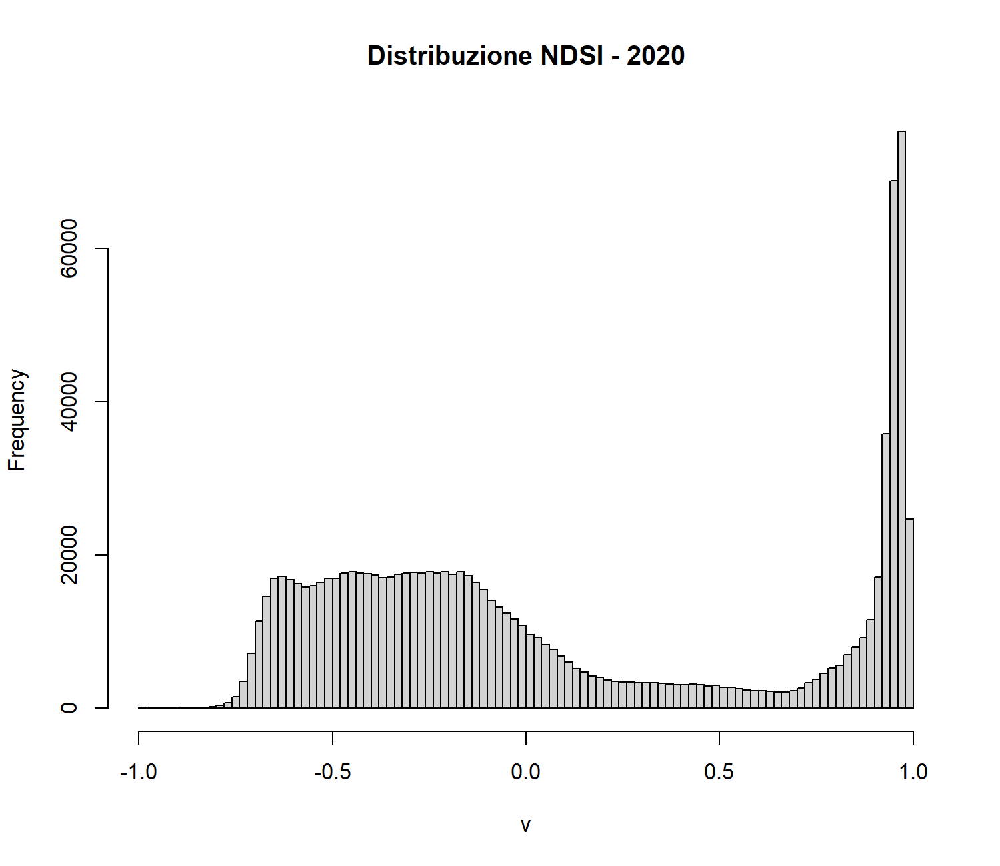
</p>

> Figura 13. Distribuzione dei valori di NDSI nel 2020.

Il calcolo dell'NDSI sfrutta l'esclusiva firma spettrale della neve, caratterizzata da un'elevata riflettanza nel visibile (banda verde) e da un forte assorbimento 
nell'infrarosso a onde corte (SWIR). La distribuzione dell'indice mostra due gruppi: uno largo tra -0.7 e 0.2 (superfici non innevate) e uno stretto vicino a 1 (superfici innevate), ho scelto la soglia NDSI = 0.4 per distinguere efficaciemente la copertura nevosa dal resto del paesaggio: i valori inferiori a 0.4 indicano quindi generalmente terreno nudo, vegetazione o zone in ombra, mentre valori pari o superiori a 0.4 corrispondono a neve. 


```r
soglia_ndsi <- 0.4  # soglia consigliata in letteratura e verificata sperimentalmente tramite confronto con gli outlines ufficiali e con il calcolo delle metriche

# Matrice di riclassificazione: NDSI < 0.4 = 0, NON NEVE; NDSI >= 0.4 = 1, NEVE
ndsi_matrix <- matrix(c(-Inf, soglia_ndsi, 0, soglia_ndsi, Inf, 1), 
                      ncol = 3, byrow = TRUE)

# Applicazione della classificazione ai tre anni
snow_2016_ndsi <- classify(ndsi_2016, ndsi_matrix)
snow_2020_ndsi <- classify(ndsi_2020, ndsi_matrix)
snow_2024_ndsi <- classify(ndsi_2024, ndsi_matrix)
```

Verifica della classificazione con le funzioni definite in 2.4 e calcolo della confusion matrix contro gli outlines NPI.

```r
plot_snow_outlines(snow_2020_ndsi,"NDSI", "output/ndsi_snow_mask_2020.png")
results_ndsi <- calculate_confusion_matrix(classified_raster = snow_2020_ndsi, 
                                           method = "NDSI", output_file = "output/confusion_matrix_ndsi.png")
```

<p align="center">
  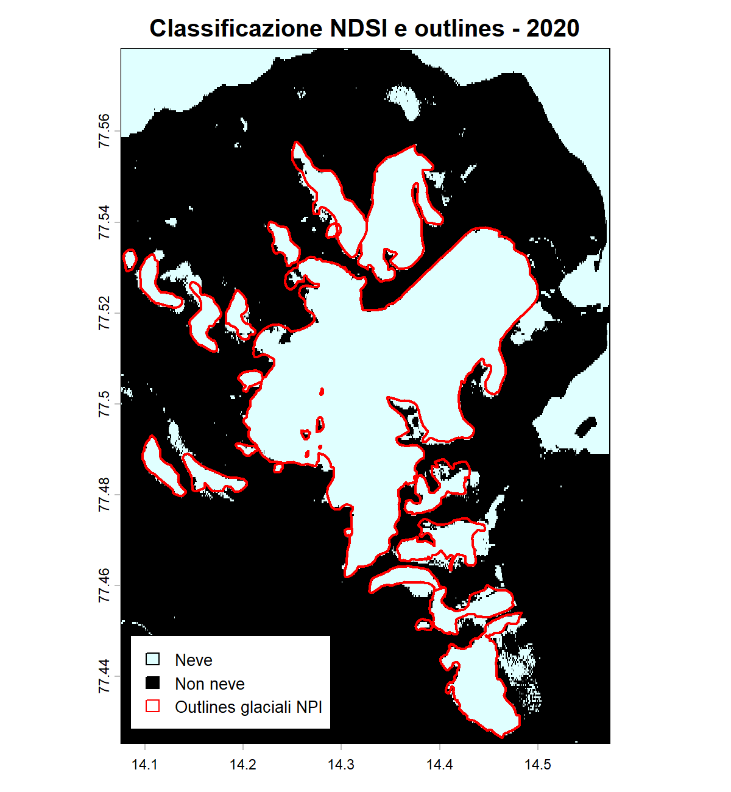
</p>

> Figura 14. Classificazione NDSI (soglia 0.4) sovrapposta agli outlines ufficiali NPI, 2020.

La classe neve copre l'intero corpo glaciale e va oltre il contorno rosso in diversi punti, soprattutto lungo la costa.

<p align="center">
  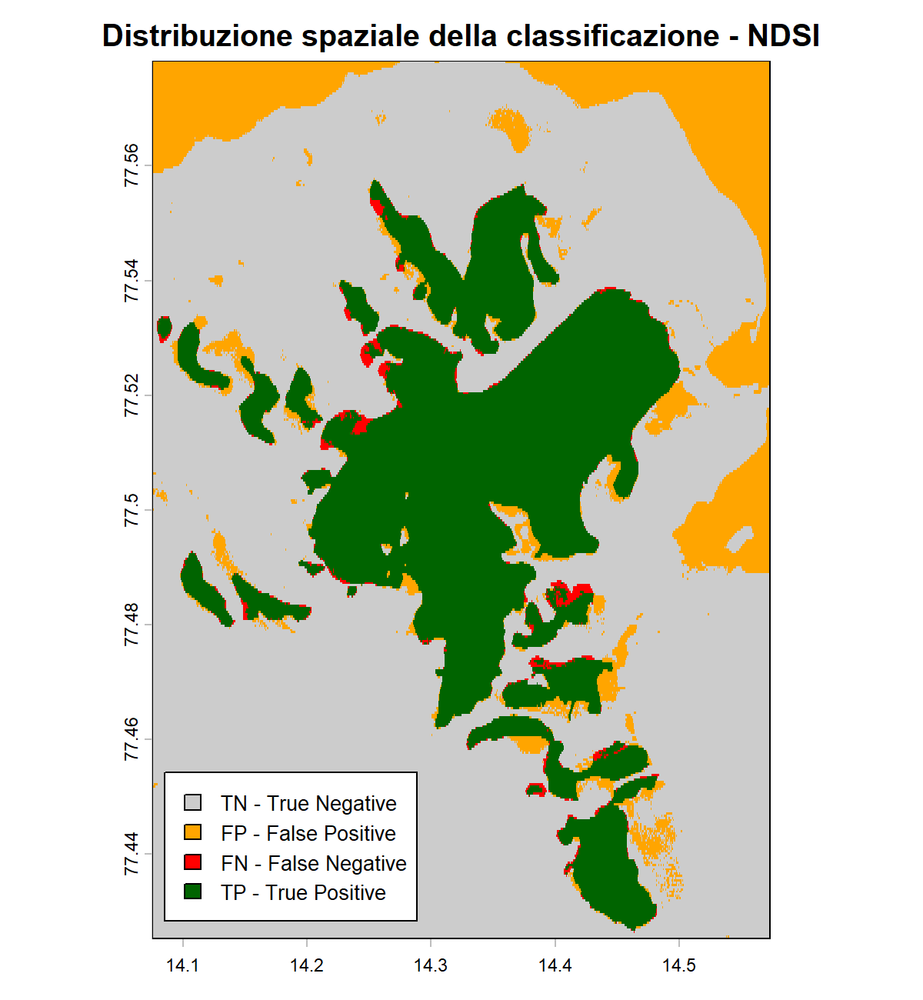
</p>

> Figura 15. Distribuzione spaziale della confusion matrix, metodo NDSI.

L'arancione (falsi positivi) è concentrato sul mare aperto e lungo la costa: è il segnale del mare letto come neve dall'NDSI. Il rosso (falsi negativi) è marginale, solo su alcuni bordi di ghiacciai minori.

 | Metodo | TN | FP | FN | TP | Accuracy | Recall | Precision |
 |---|---|---|---|---|---|---|---|
 | NDSI | 1.586.384 | 253.183 | 17.922 | 503.403 | 88.52% | 96.56% | 66.54% |>

> **Commento**
>
> Recall alta (96.56%): quasi tutta la neve vera viene trovata. Precision bassa (66.54%): un terzo di quello che classifico come neve non lo è — coerente con quello che si vede nella mappa, il mare gonfia i falsi positivi.

### Metodo 2 — NDSI + NDWI 2️⃣

Istogramma per vedere la distribuzione dell'indice e scegliere la soglia di classificazione

```r
png("output/hist_ndwi_2020.png", width = 1500, height = 1300, res = 200)
hist(ndwi_2020, breaks = 100, main = "Distribuzione NDWI - 2020")
dev.off() 
```

<p align="center">
  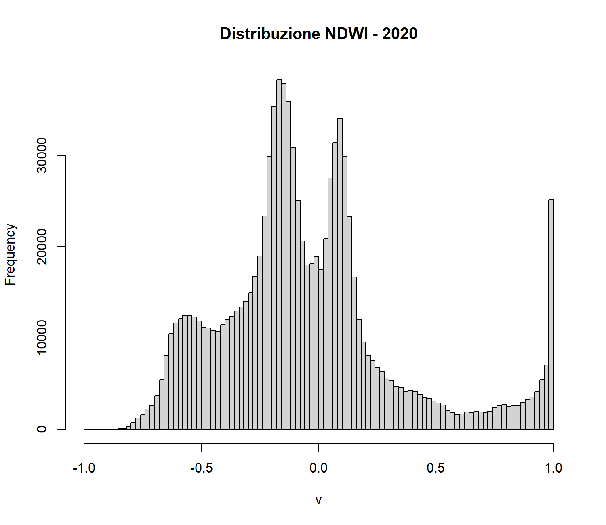
</p>

> Figura 16. Distribuzione dei valori di NDWI nel 2020.

L'NDWI sfrutta il comportamento opposto a quello dell'NDSI per l'acqua: riflettanza ancora alta nel verde ma assorbimento marcato nel NIR, quindi l'acqua libera produce valori NDWI alti quanto quelli della neve nel Metodo 1 — è proprio questa sovrapposizione a generare i falsi positivi visti in Figura 15. La distribuzione mostra una parte ampia tra -0.6 e 0.2 (terreno, neve, ghiaccio) e un picco stretto vicino a 1 (mare aperto). Soglia a 0.7: al di sopra è acqua, al di sotto no.

```r
soglia_ndwi <- 0.7 # soglia verificata sperimentalmente tramite il confronto con gli outlines ufficiali e con il calcolo delle metriche

# Crea una maschera binaria: NDWI < 0.7 = 1, NON ACQUA; NDWI >= 0.7 = 0, ACQUA
ndwi_matrix <- matrix(c(-Inf, soglia_ndwi, 1, soglia_ndwi, Inf, 0), ncol = 3, byrow = TRUE)

not_water_2016 <- classify(ndwi_2016, ndwi_matrix)
not_water_2020 <- classify(ndwi_2020, ndwi_matrix)
not_water_2024 <- classify(ndwi_2024, ndwi_matrix)

# Mantiene solo i pixel classificati come neve e contemporaneamente non acqua
# NDSI >= 0.4 AND NDWI < 0.7
snow_2016_ndsi_ndwi <- snow_2016_ndsi * not_water_2016
snow_2020_ndsi_ndwi <- snow_2020_ndsi * not_water_2020
snow_2024_ndsi_ndwi <- snow_2024_ndsi * not_water_2024
```

Verifica della classificazione e calcolo della confusion matrix, stesso procedimento del Metodo 1.

```r
plot_snow_outlines(snow_2020_ndsi_ndwi, "NDSI + NDWI", "output/ndsi_ndwi_snow_mask_2020.png")
results_ndsi_ndwi <- calculate_confusion_matrix(classified_raster = snow_2020_ndsi_ndwi,
                                                method = "NDSI + NDWI", output_file = "output/confusion_matrix_ndsi_ndwi.png")
```

<p align="center">
  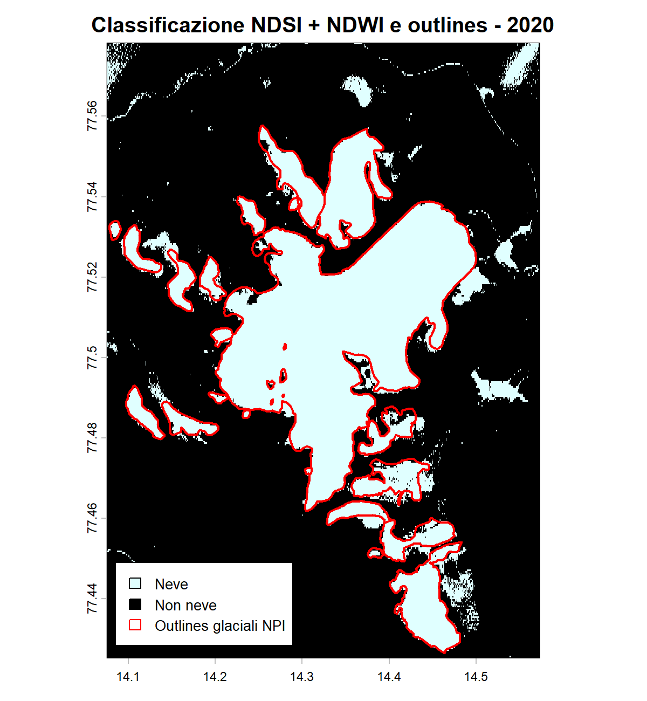
</p>

> Figura 17. Classificazione NDSI + NDWI sovrapposta agli outlines ufficiali NPI, 2020.

Il mare non è più incluso nella classe neve: rispetto alla Figura 14, l'area fuori dal contorno rosso si è ridotta parecchio.

<p align="center">
  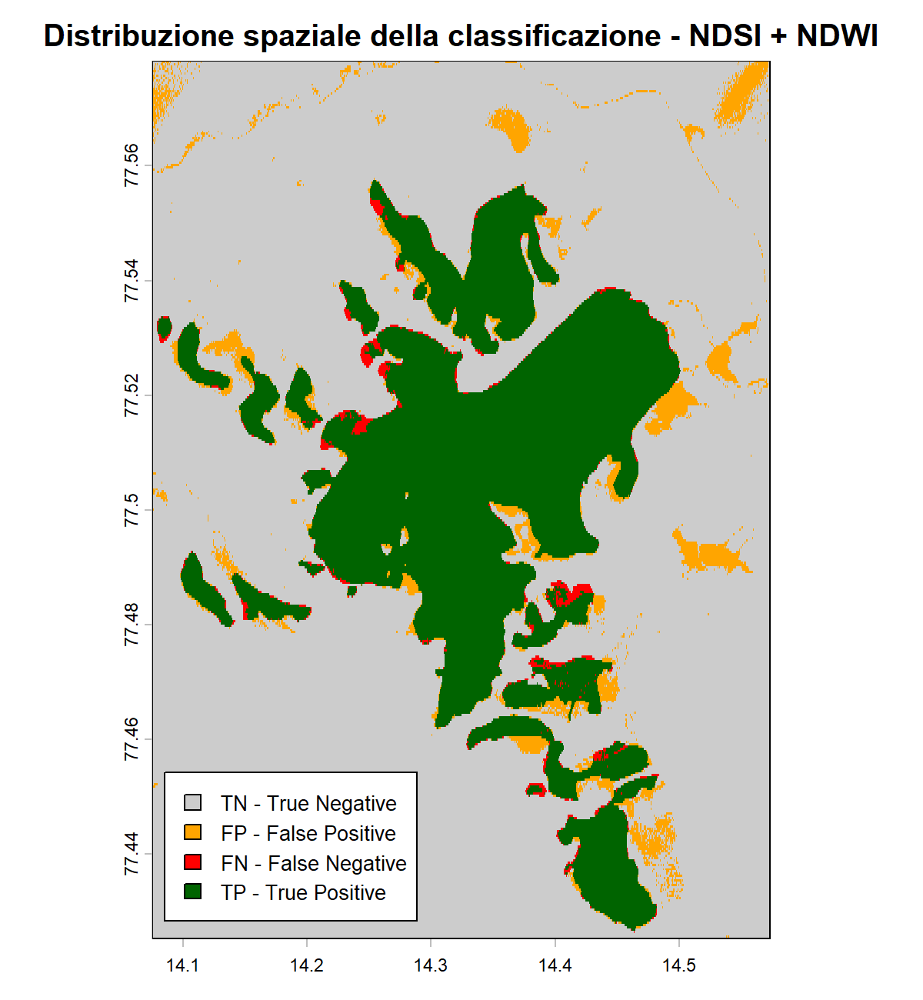
</p>

> Figura 18. Distribuzione spaziale della confusion matrix, metodo NDSI + NDWI.

L'arancione lungo la costa è quasi sparito rispetto al Metodo 1; il verde (True Positive) resta praticamente identico.

| Metodo | TN | FP | FN | TP | Accuracy | Recall | Precision |
|---|---|---|---|---|---|---|---|
| NDSI + NDWI | 1.751.451 | 88.116 | 18.301 | 503.024 | 95.49% | 96.49% | 85.09% |

> **Commento**
>
> Precision passa da 66.54% a 85.09%: il filtro NDWI toglie la maggior parte dei falsi positivi del mare. Recall resta praticamente uguale (96.49% vs 96.56%), quindi il filtro non sta togliendo neve vera — solo acqua. È il miglioramento più netto tra tutti i metodi testati.


### Metodo 3 — NDSI + NIR 3️⃣

Istogramma della banda B8 (NIR) 2020 per scegliere la soglia.

```r
png("output/hist_B8_2020.png", width = 1500, height = 1300, res = 200)
hist(image_2020[["B8"]], breaks = 100, main = "Distribuzione B8 - 2020")
dev.off()
```

<p align="center">
  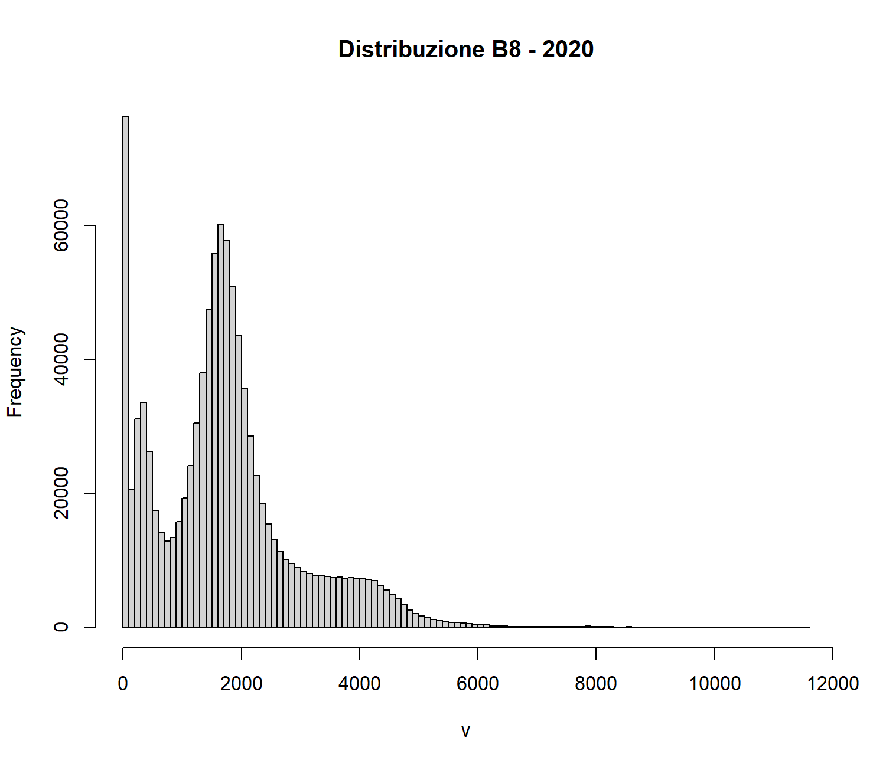
</p>

> Figura 19. Distribuzione dei valori della banda B8 (NIR) nel 2020.

In questo caso non si usa un indice normalizzato ma la riflettanza della banda NIR: valori bassi indicano superfici scure o in ombra, che l'NDSI da solo può comunque classificare come neve se il rapporto verde/SWIR1 resta comunque alto. La distribuzione mostra un picco altissimo vicino a 0 (ombre, acqua scura, superfici molto assorbenti) e un secondo picco più basso e largo tra 1500 e 2000 (neve, ghiaccio, terreno chiaro), con una coda lunga che si esaurisce oltre i 4000. La soglia è stata impostata a 400: al di sotto è riflettanza troppo bassa per essere neve pulita, al di sopra sì.

```r
soglia_nir <- 400 # soglia verificata sperimentalmente tramite il confronto con gli outlines ufficiali e con il calcolo delle metriche

# Matrice di riclassificazione: # NIR < 400 = 0; # NIR >= 400 = 1
nir_matrix <- matrix(c(-Inf, soglia_nir, 0, soglia_nir, Inf, 1), ncol = 3, byrow = TRUE)

nir_mask_2016 <- classify(image_2016[["B8"]], nir_matrix)
nir_mask_2020 <- classify(image_2020[["B8"]], nir_matrix)
nir_mask_2024 <- classify(image_2024[["B8"]], nir_matrix)

# Combinazione delle due condizioni:
# neve = NDSI >= 0.4 AND NIR >= 400
snow_2016_ndsi_nir <- snow_2016_ndsi * nir_mask_2016
snow_2020_ndsi_nir <- snow_2020_ndsi * nir_mask_2020
snow_2024_ndsi_nir <- snow_2024_ndsi * nir_mask_2024
```

```r
plot_snow_outlines(snow_2020_ndsi_nir, "NDSI + NIR", "output/ndsi_nir_snow_mask_2020.png")
results_ndsi_nir <- calculate_confusion_matrix(classified_raster = snow_2020_ndsi_nir,
                                               method = "NDSI + NIR", output_file = "output/confusion_matrix_ndsi_nir.png")
```

<p align="center">
  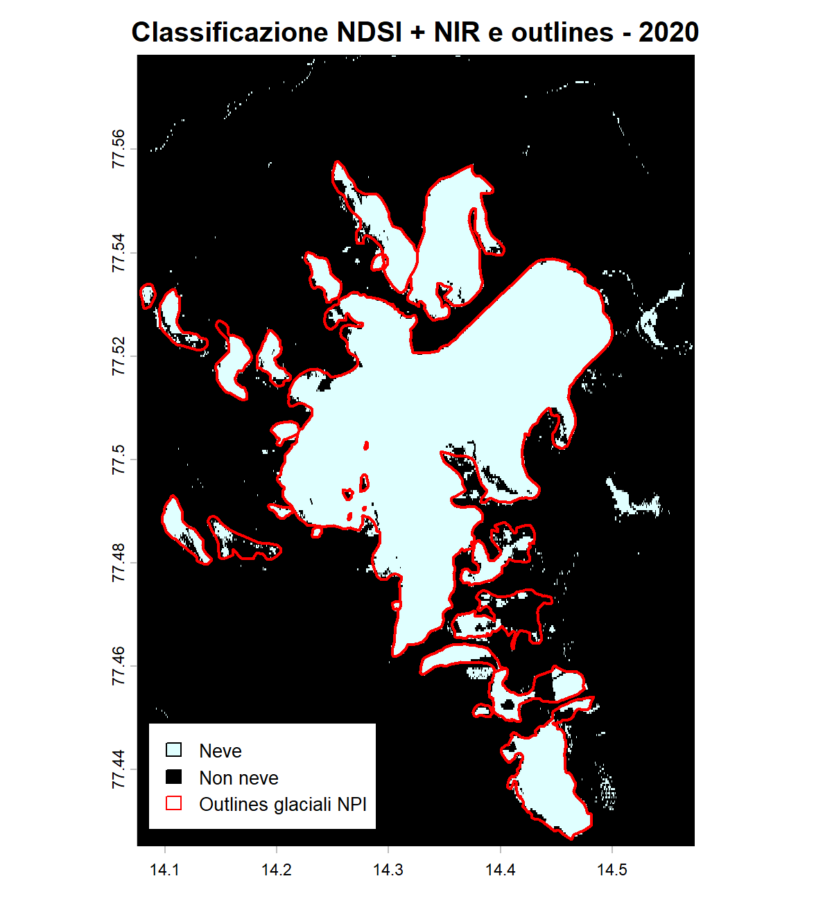
</p>

> Figura 20. Classificazione NDSI + NIR sovrapposta agli outlines ufficiali NPI, 2020.

Il mare è escluso come nel Metodo 2, ma a sud-est del corpo glaciale principale manca un blocco che invece è dentro il contorno rosso: lì la riflettanza NIR scende sotto soglia, probabilmente per ombra o detrito superficiale.

<p align="center">
  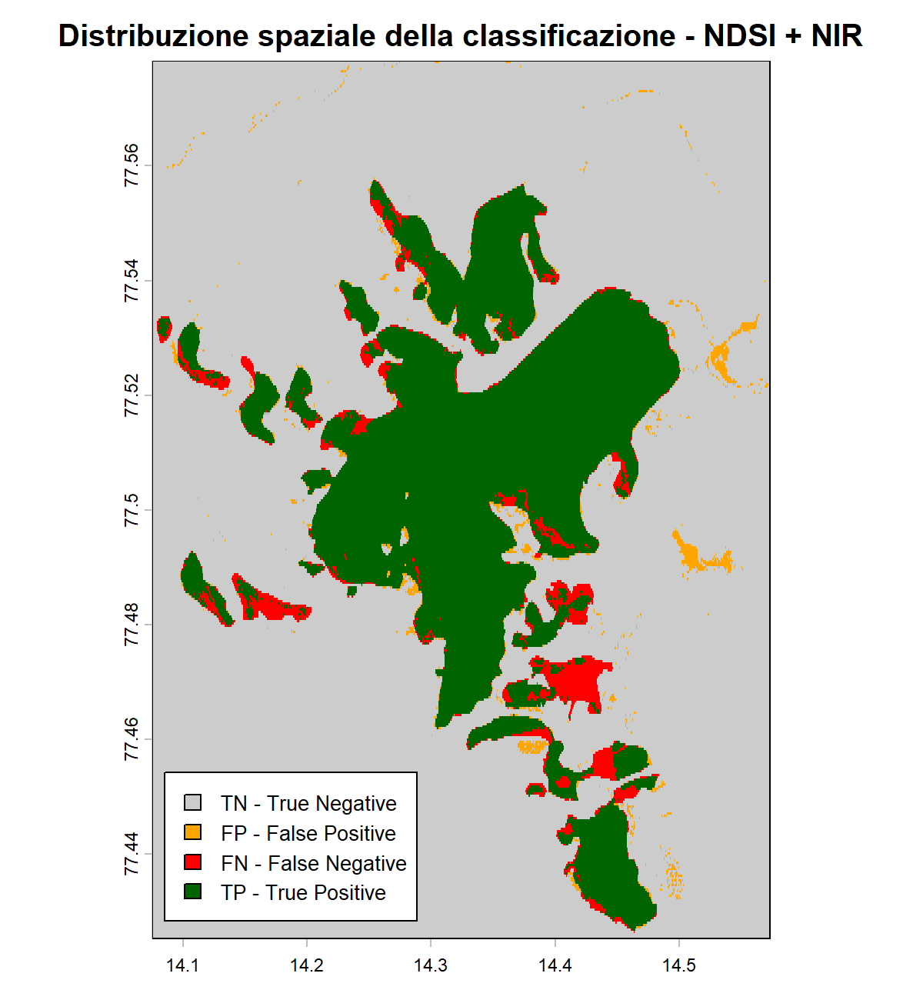
</p>

> Figura 21. Distribuzione spaziale della confusion matrix, metodo NDSI + NIR.

Stesso miglioramento del Metodo 2 sui falsi positivi costieri, ma compare un blocco rosso (falsi negativi) a sud-est, assente negli altri due metodi.

| Metodo | TN | FP | FN | TP | Accuracy | Recall | Precision |
|---|---|---|---|---|---|---|---|
| NDSI + NIR | 1815274 | 24293 | 54356 | 466969 | 96.67% | 89.57	% | 95.05% |

> **Commento**
>
> Precision sale ancora, a 95.05%: il filtro NIR è il più aggressivo contro i falsi positivi. Ma Recall scende a 89.57% (contro il 96.49% di NDSI+NDWI): qui il filtro sta togliendo anche neve vera, non solo mare — è il blocco rosso di Figura 21. Il filtro funziona ma al prezzo di perdere una fetta di neve reale.

> **[Nota]**
>
> L'aggiunta del filtro NDVI alla classificazione NDSI non modifica i risultati delle metriche, perché agisce sulla vegetazione, quasi assente nell'area di studio, mentre i falsi positivi dell'NDSI derivano da acqua e ombre. Per questo motivo il metodo NDSI + NDVI produce una classificazione identica al solo NDSI, e i relativi calcoli non vengono riportati.

### Confronto tra i metodi ⚖️

```r
png("output/comparison_classification_methods_2020.png", width = 2100, height = 800, res = 200)
im.multiframe(1, 3)

# Classificazione NDSI
plot(snow_2020_ndsi, col = c("black", "lightcyan"), type = "classes", legend = FALSE, main = "NDSI")
plot(study_glaciers_2020, add = TRUE, border = "red", lwd = 1.5)
legend("bottomleft", inset = c(0.10, 0.02), xpd = NA,
       legend = c("Neve", "Non neve", "Outlines glaciali NPI"),
       fill = c("lightcyan", "black", NA),
       border = c("black", "black", "red"),
       cex = 0.8, bg = "white", bty = "o")

# Classificazione NDSI + NDWI
plot(snow_2020_ndsi_ndwi, col = c("black", "lightcyan"), type = "classes", legend = FALSE, main = "NDSI + NDWI")
plot(study_glaciers_2020, add = TRUE, border = "red", lwd = 1.5)
legend("bottomleft", inset = c(0.10, 0.02), xpd = NA,
       legend = c("Neve", "Non neve", "Outlines glaciali NPI"),
       fill = c("lightcyan", "black", NA),
       border = c("black", "black", "red"),
       cex = 0.8, bg = "white", bty = "o")

# Classificazione NDSI + NIR
plot(snow_2020_ndsi_nir, col = c("black", "lightcyan"), type = "classes", legend = FALSE, main = "NDSI + NIR")
plot(study_glaciers_2020, add = TRUE, border = "red", lwd = 1.5)
legend("bottomleft", inset = c(0.10, 0.02), xpd = NA,
       legend = c("Neve", "Non neve", "Outlines glaciali NPI"),
       fill = c("lightcyan", "black", NA),
       border = c("black", "black", "red"),
       cex = 0.8, bg = "white", bty = "o")
dev.off()
```

<p align="center">
  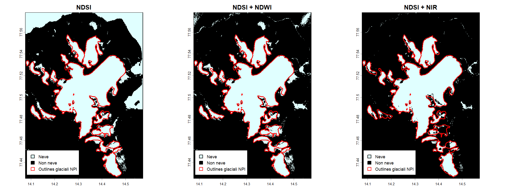
</p>

> Figura 22. Confronto diretto delle classificazioni 2020: NDSI, NDSI + NDWI, NDSI + NIR.

Il salto principale è tra il primo pannello e gli altri due: con il solo NDSI, tutta la fascia in alto (mare aperto) è classificata come neve nonostante sia ben fuori dal contorno rosso. In NDSI + NDWI quella fascia sparisce quasi del tutto. In NDSI + NIR sparisce altrettanto, ma compaiono buchi neri dentro il contorno rosso (in basso, intorno a 77.46-77.47): sono i falsi negativi già visti in Figura 19-20, dove il filtro NIR scarta neve vera.

```r
# Confronto spaziale delle confusion matrix 2020
png("output/confusion_matrix_methods_2020.png", width = 2100, height = 800, res = 200)
im.multiframe(1, 3)

# Classificazione NDSI 
plot(results_ndsi$comparison, col = c("grey80", "orange", "red", "darkgreen"),
     type = "classes", legend = FALSE, main = "NDSI")
legend("bottomleft", inset = c(0.13, 0.02), xpd = NA,
       legend = c("TN - True Negative", "FP - False Positive", "FN - False Negative", "TP - True Positive"),
       fill = c("grey80", "orange", "red", "darkgreen"), border = "black", cex = 0.8, bg = "white", bty = "o")

# Classificazione NDSI + NDWI
plot(results_ndsi_ndwi$comparison, col = c("grey80", "orange", "red", "darkgreen"),
     type = "classes", legend = FALSE, main = "NDSI + NDWI")
legend("bottomleft", inset = c(0.13, 0.02), xpd = NA,
       legend = c("TN - True Negative", "FP - False Positive", "FN - False Negative", "TP - True Positive"),
       fill = c("grey80", "orange", "red", "darkgreen"), border = "black", cex = 0.8, bg = "white", bty = "o")

# Classificazione NDSI + NIR
plot(results_ndsi_nir$comparison, col = c("grey80", "orange", "red", "darkgreen"),
     type = "classes", legend = FALSE, main = "NDSI + NIR")
legend("bottomleft", inset = c(0.13, 0.02), xpd = NA,
       legend = c("TN - True Negative", "FP - False Positive", "FN - False Negative", "TP - True Positive"),
       fill = c("grey80", "orange", "red", "darkgreen"), border = "black", cex = 0.8, bg = "white", bty = "o")
dev.off()
```

<p align="center">
  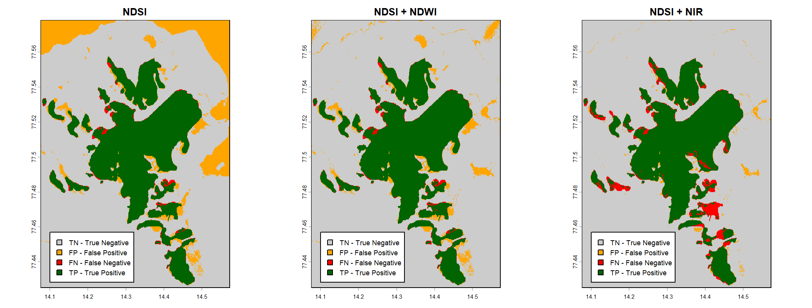
</p>

> Figura 23. Confronto diretto delle confusion matrix spaziali 2020: NDSI, NDSI + NDWI, NDSI + NIR.

L'arancione (falsi positivi) domina l'intero bordo superiore nel pannello NDSI e si riduce a poche macchie sparse negli altri due — è il mare che sparisce dalla classe neve. Il rosso (falsi negativi) è quasi assente in NDSI e NDSI+NDWI, ma diventa un blocco compatto e ben visibile in basso a destra in NDSI+NIR: è il prezzo pagato per il filtro più aggressivo sui falsi positivi.

```r
classification_summary <- rbind(results_ndsi$metrics, results_ndsi_ndwi$metrics, results_ndsi_nir$metrics)
print(classification_summary) 
```

| Metodo | TN | FP | FN | TP | Accuracy | Recall | Precision |
|---|---|---|---|---|---|---|---|
| NDSI | 1.586.384 | 253.183 | 17.922 | 503.403 | 88.52% | 96.56% | 66.54% |
| NDSI + NDWI | 1.751.451 | 88.116 | 18.301 | 503.024 | 95.49% | 96.49% | 85.09% |
| NDSI + NIR | 1.815.274 | 24.293 | 54.356 | 466.969 | 96.67% | 89.57% | 95.05% |

Metodo scelto per l'analisi multitemporale: **NDSI + NDWI**. Ha la Precision più alta dopo NDSI+NIR (85.09% vs 95.05%), ma mantiene la Recall quasi invariata rispetto al solo NDSI (96.49% vs 96.56%) — cosa che NDSI+NIR non fa (Recall scende a 89.57%). Tra i due filtri, NDWI toglie solo mare senza intaccare neve vera; NIR toglie il mare ma anche una fetta di neve reale, come confermano i blocchi rossi in Figura 22 e 23.

# 3. Risultati e Discussione 📊


## 3.1 Percentuali di copertura nevosa

```r
# Frequenze delle classi: 0 = non neve; 1 = neve
freq_2016 <- freq(snow_2016_ndsi_ndwi)
freq_2020 <- freq(snow_2020_ndsi_ndwi)
freq_2024 <- freq(snow_2024_ndsi_ndwi)

# Percentuale di ogni classe rispetto al numero totale di celle
perc_2016 <- freq_2016$count * 100 / ncell(snow_2016_ndsi_ndwi)
perc_2020 <- freq_2020$count * 100 / ncell(snow_2020_ndsi_ndwi)
perc_2024 <- freq_2024$count * 100 / ncell(snow_2024_ndsi_ndwi)
```
Creazione tabella riassuntiva
```r
snow_table <- data.frame(
  Classi = c("Non neve", "Neve"),
  a2016 = round(perc_2016, 2), a2020 = round(perc_2020, 2), a2024 = round(perc_2024, 2)
)
print(snow_table)
```

#### Grafico Comparativo
Funzione per generare i tre grafici a barre affiancati (uno per anno), riutilizzata sia per l'intera area sia per l'area dentro gli outlines.

```r
# Crea e salva tre grafici percentuali affiancati
plot_snow_percentages <- function(table, title, output_file) {
  # table         tabella con Classi, a2016, a2020 e a2024
  # title         parte comune del titolo dei tre grafici
  # output_file   percorso e nome del PNG finale
  
  # Grafico delle percentuali per il 2016
  p1 <- ggplot(table, aes(x = Classi, y = a2016, fill = Classi)) +      # Crea il grafico assegnando X, Y e colore
    geom_col() +                                                        # Crea le barre usando direttamente i valori percentuali
    geom_text(aes(label = paste0(a2016, "%")), vjust = -0.3) +          # Aggiunge i valori percentuali sopra le barre
    scale_fill_viridis_d() +                                            # Applica la palette di colori 'viridis'
    ylim(0, 100) +                                                      # Limita l'asse Y tra 0 e 100%
    labs(title = paste(title, "- 2016"),                                # Imposta titolo ed etichette degli assi
         y = "Percentuale (%)", x = NULL) +
    theme_minimal() +                                                   # Applica un tema grafico pulito
    theme(legend.position = "none")                                     # Rimuove la legenda perché le classi sono già indicate sull'asse X
  
  # Grafico delle percentuali per il 2020
  p2 <- ggplot(table, aes(x = Classi, y = a2020, fill = Classi)) +      
    geom_col() +                                                       
    geom_text(aes(label = paste0(a2020, "%")), vjust = -0.3) +                        
    scale_fill_viridis_d() +                                                           
    ylim(0, 100) +                                                                     
    labs(title = paste(title, "- 2020"),                                                
         y = "Percentuale (%)", x = NULL) +
    theme_minimal() +                                                                  
    theme(legend.position = "none")                                                     
  
  # Grafico delle percentuali per il 2024
  p3 <- ggplot(table, aes(x = Classi, y = a2024, fill = Classi)) +                    
    geom_col() +                                                                       
    geom_text(aes(label = paste0(a2024, "%")), vjust = -0.3) +                      
    scale_fill_viridis_d() +                                                          
    ylim(0, 100) +                                                                     
    labs(title = paste(title, "- 2024"),                                                
         y = "Percentuale (%)", x = NULL) +
    theme_minimal() +                                                                  
    theme(legend.position = "none")                                                    
  
  png(output_file, width = 2400, height = 900, res = 200)               # Apre il dispositivo PNG e definisce dimensioni e risoluzione
  print(p1 + p2 + p3)                                                   # Affianca i tre grafici usando patchwork
  dev.off()                                                             # Chiude il dispositivo grafico e salva il file
}

```
#### Grafici percentuali dell'intera area di studio

```r
plot_snow_percentages(snow_table, "Copertura neve", "output/snow_percentage_comparison.png")
```
<p align="center">
  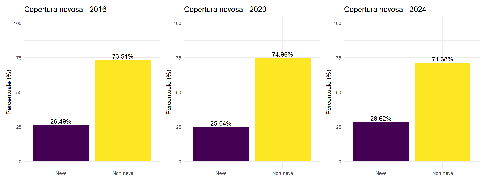
</p>

> Figura 24. Percentuale di copertura neve/non neve sull'intera area di studio, 2016-2020-2024.

| Classi | 2016 | 2020 | 2024 |
|---|---|---|---|
| Non neve | 73.51% | 74.96% | 71.38% |
| Neve | 26.49% | 25.04% | 28.62% |

Il dato grezzo sull'intera area mostra un aumento della percentuale di neve tra il 2016 e il 2024 (26.49% → 28.62%, con un calo intermedio nel 2020). Questo numero da solo non è affidabile: la scena include mare, roccia e versanti montani esterni ai ghiacciai, dove NDSI+NDWI può classificare come neve superfici che non lo sono. Il dato viene quindi verificato nella sezione successiva usando gli outlines del NPI come riferimento.


Crea una maschera per selezionare solo l'area dentro gli outlines:
```r
# Mantiene solamente i pixel interni agli outlines ufficiali del 2020
snow_2016_inside <- mask(snow_2016_ndsi_ndwi, reference_snow, maskvalues = 0)
snow_2020_inside <- mask(snow_2020_ndsi_ndwi, reference_snow, maskvalues = 0)
snow_2024_inside <- mask(snow_2024_ndsi_ndwi, reference_snow, maskvalues = 0)
```
Calcola le percentuali:
```r
freq_inside_2016 <- freq(snow_2016_inside)
freq_inside_2020 <- freq(snow_2020_inside)
freq_inside_2024 <- freq(snow_2024_inside)

# Percentuali rispetto ai soli pixel validi interni agli outlines
perc_inside_2016 <- freq_inside_2016$count * 100 / sum(freq_inside_2016$count)
perc_inside_2020 <- freq_inside_2020$count * 100 / sum(freq_inside_2020$count)
perc_inside_2024 <- freq_inside_2024$count * 100 / sum(freq_inside_2024$count)
```

Crea una tabella riassuntiva:
```r
snow_inside_table <- data.frame(
  Classi = c("Non neve", "Neve"),
  a2016 = round(perc_inside_2016, 2), a2020 = round(perc_inside_2020, 2), a2024 = round(perc_inside_2024, 2)
)
print(snow_inside_table)
```

#### Grafici percentuali dentro gli outlines del 2020
```r
plot_snow_percentages(snow_inside_table, "Area negli outlines", "output/snow_inside_outlines_comparison.png")
```
<p align="center">
  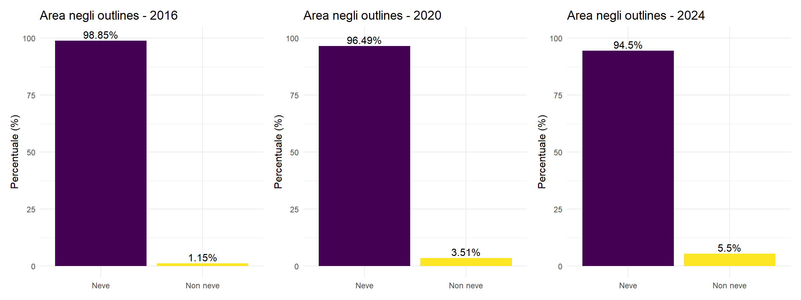
</p>

> Figura 25. Percentuale di copertura neve/non neve dentro gli outlines ufficiali NPI, 2016-2020-2024.

| Classi | 2016 | 2020 | 2024 |
|---|---|---|---|
| Non neve | 1.15% | 3.51% | 5.50% |
| Neve | 98.85% | 96.49% | 94.50% |

Dentro gli outlines il segnale si ribalta rispetto alla Figura 24: la copertura scende da 98.85% a 94.50%, quasi 4.4 punti percentuali in otto anni, senza inversioni — coerente con l'ipotesi di partenza di una diminuzione legato al riscaldamento climatico. Il confronto tra Figura 24 e Figura 25 convalida la scelta metodologica di tutto il capitolo 2.4: filtrare la classificazione con un riferimento glaciologico ufficiale non è un passaggio accessorio, ma la condizione che permette di leggere correttamente il segnale di cambiamento. Applicato all'intera scena, NDSI+NDWI resta soggetto a rumore esterno ai ghiacciai (Figura 24); applicato dentro gli outlines, restituisce un trend pulito e nella direzione attesa.

## 3.2 Mappa delle transizioni 2016-2024

```r
# Mantiene solamente i pixel validi in entrambi gli anni
common_mask <- !is.na(snow_2016_ndsi_ndwi) & !is.na(snow_2024_ndsi_ndwi)
snow_2016_common <- mask(snow_2016_ndsi_ndwi, common_mask, maskvalues = 0)
snow_2024_common <- mask(snow_2024_ndsi_ndwi, common_mask, maskvalues = 0)

# Codifica delle variazioni:
# 0 = non neve stabile; 1 = neve solo nel 2024; 2 = neve solo nel 2016; 3 = neve stabile
change_2016_2024 <- snow_2024_common + 2 * snow_2016_common
freq(change_2016_2024)
```

<p align="center">
  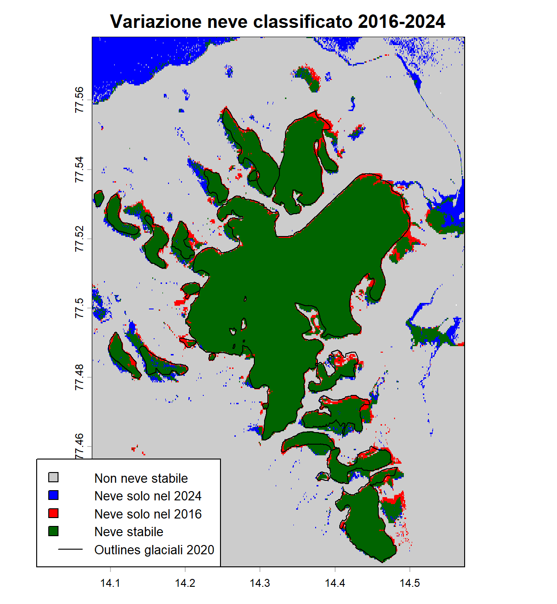
</p>

> Figura 24. Variazione della classificazione neve tra il 2016 e il 2024, intera area di studio.

| Classe | Pixel | % |
|---|---|---|
| Non neve stabile | 1.624.372 | 68.81% |
| Neve solo nel 2024 | 111.110 | 4.71% |
| Neve solo nel 2016 | 60.716 | 2.57% |
| Neve stabile | 564.658 | 23.92% |

Sull'intera area, i pixel "neve solo nel 2024" (blu, 4.71%) sono quasi il doppio di "neve solo nel 2016" (rosso, 2.57%): è lo stesso segnale fuorviante di aumento già visto nella tabella percentuale.

```r
# Ritaglia la mappa delle variazioni sugli outlines ufficiali
change_inside <- mask(change_2016_2024, reference_snow, maskvalues = 0)
freq(change_inside)
```

<p align="center">
  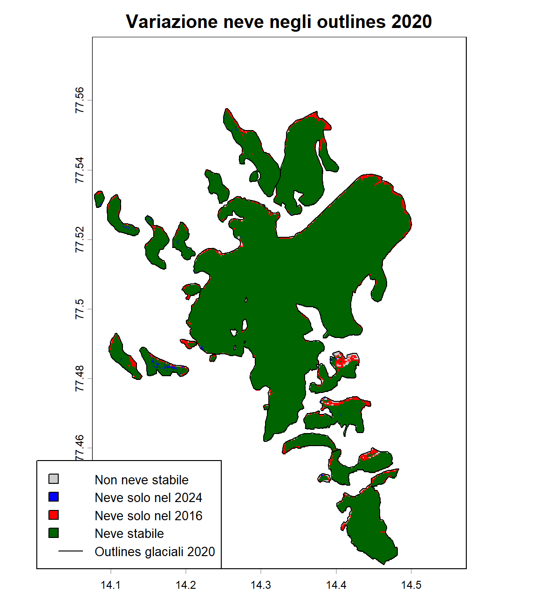
</p>

> Figura 25. Variazione della classificazione neve tra il 2016 e il 2024, dentro gli outlines ufficiali NPI.

| Classe | Pixel | % |
|---|---|---|
| Non neve stabile | 4.364 | 0.84% |
| Neve solo nel 2024 | 1.607 | 0.31% |
| Neve solo nel 2016 | 24.321 | 4.67% |
| Neve stabile | 491.033 | 94.19% |

Qui il rapporto si inverte completamente: "neve solo nel 2016" (rosso, 4.67%) è quindici volte più esteso di "neve solo nel 2024" (blu, 0.31%). La perdita è quasi tutta concentrata ai margini del corpo glaciale principale (visibile come bordo rosso nella Figura 25), coerente con un arretramento perimetrale piuttosto che uno scioglimento diffuso su tutta la superficie.

Il confronto tra Figura 24 e Figura 25 è il risultato più diretto del progetto: **la stessa classificazione, applicata alla stessa area, dà una lettura opposta a seconda che venga validata o meno contro un riferimento glaciologico indipendente**. Senza gli outlines NPI, NDSI + NDWI da solo non è sufficiente a mappare correttamente la neve/ghiaccio su scala di paesaggio, e avrebbe portato a concludere — erroneamente — che la copertura nevosa è aumentata.


# 4. Conclusioni 📝


# 5. Fonti 📚
1. Hall, D.K., Riggs, G.A. (2011). Normalized-Difference Snow Index (NDSI). In: Singh, V.P., Singh, P., Haritashya, U.K. (eds) Encyclopedia of Snow, Ice and Glaciers. Encyclopedia of Earth Sciences Series. Springer, Dordrecht. https://doi.org/10.1007/978-90-481-2642-2_376
IN FORSE 2. Keshri, A., Shukla, A., & Gupta, R. P. (2009). ASTER ratio indices for supraglacial terrain mapping. International Journal of Remote Sensing, 30(2), 519–524. https://doi.org/10.1080/01431160802385459
3. McFEETERS, S. K. (1996). The use of the Normalized Difference Water Index (NDWI) in the delineation of open water features. International Journal of Remote Sensing, 17(7), 1425–1432. https://doi.org/10.1080/01431169608948714
4. Lu, Y., James, T., Schillaci, C., & Lipani, A. (2022). Snow detection in alpine regions with Convolutional Neural Networks: discriminating snow from cold clouds and water body. GIScience & Remote Sensing, 59(1), 1321–1343. https://doi.org/10.1080/15481603.2022.2112391
5. Lith, A., G. Moholdt & J. Kohler. 2021. Svalbard glacier inventory based on Sentinel-2 imagery from summer 2020 [Data set]. Norwegian Polar Institute. https://data.npolar.no/dataset/1b8631bf-7710-449a-a56f-0da1a4fef608
6. König, M., Kohler, J., & Nuth, C. (2013). Glacier Area Outlines - Svalbard 1936-2010 [Dataset]. Norwegian Polar Institute. https://doi.org/10.21334/NPOLAR.2013.89F430F8
7. Zagórski, P., Frydrych, K., Jania, J., Błaszczyk, M., Sund, M., & Moskalik, M. (2023). *Surges in Three Svalbard Glaciers Derived from Historic Sources and Geomorphic Features*. *Annals of the American Association of Geographers, 113*(8), 1835–1855. https://doi.org/10.1080/24694452.2023.2200487
