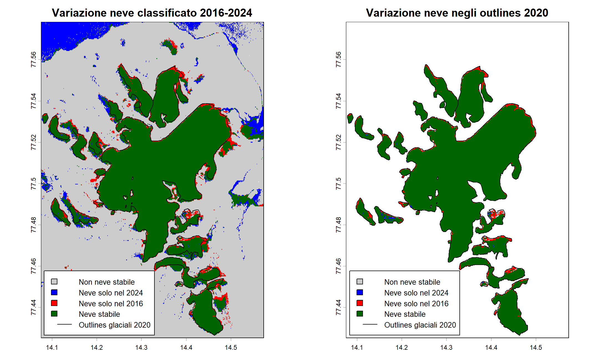

# Monitoraggio multitemporale della copertura nevosa alle Svalbard nel periodo 2016-2024

> #### Progetto d'esame - Telerilevamento Geo-Ecologico in R - 2026
>> ##### Jacopo Moresco, matricola n.1237448

## Indice

- [Abstract](#abstract-)
- [1. Introduzione 📌](#1-introduzione-)
  - [1.1 Area di studio 🛰️](#area-di-studio)
  - [1.2 Obiettivo 🎯](#12-obiettivo-)
- [2. Materiali e Metodi 🧪](#2-materiali-e-metodi-)
  - [2.1 Raccolta delle immagini 📂](#21-raccolta-delle-immagini-)
  - [2.2 Importazione e visualizzazione in R 💻](#22-importazione-e-visualizzazione-in-r-)
  - [2.3 Indici spettrali 📐](#23-indici-spettrali-)
  - [2.4 Classificazione della copertura nevosa 🏔️](#24-classificazione-della-copertura-nevosa-)
- [3. Risultati e Discussione 📊](#3-risultati-e-discussione-)
  - [3.1 Percentuali di copertura nevosa 📈](#31-percentuali-di-copertura-nevosa-)
  - [3.2 Mappa delle transizioni 2016-2024 🔄](#32-mappa-delle-transizioni-2016-2024-)
- [4. Conclusioni 📝](#4-conclusioni-)
  - [Limiti ⚠️](#limiti)
  - [Sviluppi futuri 🚀](#sviluppi-futuri-)
- [5. Fonti 📚](#5-fonti-)

# Abstract 📄

Questo progetto stima la variazione della copertura nevosa in un settore del Recherchefjorden (isole Svalbard) tra il 2016 e il 2024, tramite immagini Sentinel-2 e indici spettrali: NDSI, NDWI, NDVI. La classificazione binaria neve/non neve, basata su NDSI con soglia 0.4, è stata combinata prima con la banda NIR e con l'indice NDWI per ridurre i falsi positivi dovuti ad acqua e ombre, successivamente è stata filtrata sugli outlines glaciali del Norwegian Polar Institute relativi al 2020. Il metodo NDSI+NDWI si è rivelato il migliore compromesso tra Accuracy, Recall e Precision.

Applicata all'intera scena, la classificazione mostra un aumento apparente della copertura nevosa pari al 2.13% riconducibile a superfici esterne ai ghiacciai erroneamente incluse nella classe neve. Restringendo l'analisi agli outlines ufficiali emerge una diminuzione della copertura del 4.35%, concentrata sopratutto ai margini dei corpi glaciali. Il trend osservato è coerente con il quadro di arretramento glaciale e perdita di massa documentato in letteratura per le Svalbard, in un contesto di rapido riscaldamento climatico. Il confronto mostra che un riferimento geomorfologico indipendente è fondamentale per interpretare correttamente gli indici spettrali e distinguere il segnale glaciale dagli errori di classificazione delle superfici circostanti.

Keywords: Telerilevamento; NDSI; Sentinel-2; Svalbard, NDWI

# 1. Introduzione 📌

Le Svalbard rappresentano una delle regioni artiche più sensibili al **riscaldamento climatico in atto**, con tassi di aumento della temperatura superiori alla media globale e conseguenze dirette sulla dinamica dei ghiacciai dell'arcipelago. Studi recenti documentano una **consistente perdita di massa** e un **arretramento del fronte marcato** alternato solo da fasi di avanzamento legate a eventi di *surge*, ossia rapidi trasferimenti di enormi volumi di ghiaccio verso valle (Zagórski et al. 2023)[3]. Questo quadro rende le Svalbard un caso di studio rilevante per verificare, tramite telerilevamento multitemporale, se e come la copertura nevosa stia effettivamente variando in un intervallo temporale recente e osservabile da satellite.

<a name="area-di-studio"></a>
## 1.1 Area di studio 🛰️

L'area di studio è situata nella porzione sud-occidentale dell'isola di Spitsbergen, nell'arcipelago norvegese delle Svalbard, all'interno del Sør-Spitsbergen National Park. In particolare, il sito interessa la parte nord-occidentale del Recherchefjorden e la costa meridionale di Bellsund, nella regione di Wedel Jarlsberg Land (~77°N, 14°E). Nel ritaglio considerato sono presenti Renardbreen - un ghiacciaio vallivo che in passato terminava in mare - Scottbreen, Blomlibreen e alcune superfici glaciali minori.

<p align="center">
  
</p>

> Figura 1. Localizzazione dell'area di studio nel settore sud-occidentale di Spitsbergen, Svalbard.

## 1.2 Obiettivo 🎯

L'obiettivo del progetto è stimare la variazione della copertura nevosa nell'area di studio tra il 2016 e il 2024, utilizzando immagini Sentinel-2, indici spettrali e un'analisi multitemporale, nell'ipotesi che tale estensione si riduca per effetto del riscaldamento climatico in atto alle Svalbard.

# 2. Materiali e Metodi 🧪

## 2.1 Raccolta delle immagini 📂

Le immagini satellitari sono state ottenute tramite [**Google Earth Engine**](https://earthengine.google.com/) (GEE)che consente di acceder all'archivio satellitare pubblico, tra cui le collezioni Sentinel-2, e di elaborarlo senza doverlo scaricare in locale: è possibile filtrare le scene disponibili per area geografica, intervallo temporale e percentuale di copertura nuvolosa, per poi esportare l'immagine risultante già ritagliata sull'area di interesse. Per questo progetto sono state selezionate immagini con una copertura nuvolosa massima del 10% (`CLOUDY_PIXEL_PERCENTAGE < 10`) per ridurre il più possibile l'interferenza delle nuvole nel calcolo degli indici spettrali.


> [!NOTE]
> + Le immagini utilizzate sono composti mediani mensili: per ciascun anno, tutte le scene Sentinel-2 (2016, 2020, 2024) sono state combinate calcolando il valore mediano pixel per pixel, riducendo così l'effetto di rumore residuo e le differenze radiometriche tra acquisizioni singole. 
> + Il dataset di partenza è Sentinel-2 Surface Reflectance Harmonized (Level-2A), già corretto atmosfericamente.
> + E' stato scelto il mese di agosto come periodo perché corrisponde alla fase di massima ablazione glaciale, durante la quale la copertura nevosa stagionale è generalmente ridotta, rendendo più semplice distinguere il ghiaccio permanente dalle superfici circostanti.
> + Il codice completo in JavaScript utilizzato per ottenere le immagini si trova nel file `Code.js`.

Per ciascun anno sono state scaricate le bande Sentinel-2 riportate in tabella, esportate a una risoluzione uniforme di 20 m (nativamente B2, B3, B4 e B8 sarebbero a 10 m, ma sono state allineate alla risoluzione di B11 in fase di esportazione):

| Banda | Nome | Indice/uso |
|---|---|---|
| B2 | Blue | Composizione RGB |
| B3 | Green | Composizione RGB, NDSI, NDWI |
| B4 | Red | Composizione RGB, NDVI |
| B8 | NIR | NDWI, NDVI, filtro NIR |
| B11 | SWIR1 | NDSI |

## 2.2 Importazione e visualizzazione in R 💻

Il primo passaggio è impostare una working directory: 
```r
setwd("C:/Users/Jacopo/OneDrive/Università/Magistrale/Telerilevamento_Rocchini/Exam")
```

Successivamente sono stati installati i seguenti pacchetti:

```r
library(terra)      # Gestione raster e vettori spaziali
library(imageRy)    # Visualizzazione immagini telerilevate
library(viridis)    # Palette cromatiche per mappe
library(ggplot2)    # Grafici finali
library(patchwork)  # Affiancamento grafici
```

### Immagini 🖼️
Dopo aver scaricato i tre raster e averli posizionati all'interno della working directory si importanto con la funzione `rast()` di `terra`, che legge direttamente il file multibanda in formato `.tif` mantenendo la struttura originale delle cinque bande selezionate:

```r
image_2016 <- rast("data_raw/svalbard_glaciers_2016_late_summer.tif")
image_2016          # visualizzo le specifiche del raster
plot(image_2016)    # visualizzo l'immagine
dev.off()           # chiudo il pannello grafico

image_2020 <- rast("data_raw/svalbard_glaciers_2020_late_summer.tif")
image_2020
plot(image_2020)
dev.off()

image_2024 <- rast("data_raw/svalbard_glaciers_2024_late_summer.tif")
image_2024
plot(image_2024)
dev.off()
```

## Outlines glaciali di riferimento 🗺️

Oltre alle tre immagini Sentinel-2, è stato importato lo shapefile con gli outlines glaciali ufficiali del Norwegian Polar Institute (NPI), basato su immagini Sentinel-2 dell'estate 2020 (Lith et al. 2021) [1]. Questo dato vettoriale costituisce l'unico riferimento indipendente disponibile nel progetto e viene utilizzato più avanti per validare la classificazione della copertura nevosa ottenuta dagli indici spettrali.

```r
# Cerco tutti i file .shp nella cartella Shapefile_2020
shapefiles_2020 <- list.files(path = "data_raw/Shapefile_2020",
                              pattern = "\\.shp$", full.names = TRUE)

# Importo gli outlines del 2020
glacier_outlines_2020 <- vect(shapefiles_2020[1]) 
glacier_outlines_2020        # Visualizzo le informazioni del vettore

# Confronto il sistema di riferimento (crs) e l'estensione del raster 2020 e dello shapefile
crs(image_2020) == crs(glacier_outlines_2020)

# C'è una discrepanza, quindi riproietto gli outlines nel CRS del raster del 2020
glacier_outlines_2020_proj <- project(glacier_outlines_2020, crs(image_2020))

# Ritaglio gli outlines sull'area di studio
study_glaciers_2020 <- crop(glacier_outlines_2020_proj, image_2020)

# Salvo gli outlines ritagliati come GeoPackage
writeVector(study_glaciers_2020, "data_processed/study_glaciers_2020.gpkg", overwrite = TRUE)
```

## Visualizzazione RGB e bande 🌈

Una prima composizione a colori naturali (bande 4-3-2) è stata prodotta per i tre anni, utile per farsi un'idea generale della copertura del terreno e della qualità delle immagini prima di procedere al calcolo degli indici.

### Visualizzazione RGB 🎨
```r
png("output/rgb_multitemporal_glaciers.png", width = 2150, height = 1150, res = 200)
im.multiframe(1,3)
plotRGB(image_2016, r = 3, g = 2, b = 1, stretch = "lin", main = "2016", cex.main = 1.8)
plotRGB(image_2020, r = 3, g = 2, b = 1, stretch = "lin", main = "2020", cex.main = 1.8)
plotRGB(image_2024, r = 3, g = 2, b = 1, stretch = "lin", main = "2024", cex.main = 1.8)
dev.off()
```

<p align="center">
  
</p>

> Figura 2. Composizione RGB (bande 4-3-2) a confronto tra 2016, 2020 e 2024.

### Le cinque bande del 2020 🔎
Sono state poi visualizzate singolarmente le cinque bande disponibili (sono state calcolate per ogni anno ma qui è stata inserita solo l'immagine del 2020 per non appesantire troppo il documento):

```r
png("output/bands_2020.png", width = 2200, height = 1400, res = 200)
im.multiframe(2,3)
plot(image_2020[["B2"]],  main = "B2 - Blue", cex.main = 1.8, col = viridis(100))
plot(image_2020[["B3"]],  main = "B3 - Green", cex.main = 1.8, col = viridis(100))
plot(image_2020[["B4"]],  main = "B4 - Red", cex.main = 1.8, col = viridis(100))
plot(image_2020[["B8"]],  main = "B8 - NIR", cex.main = 1.8, col = viridis(100))
plot(image_2020[["B11"]], main = "B11 - SWIR1", cex.main = 1.8, col = viridis(100))
dev.off()
```

<p align="center">
  
</p>

> Figura 3. Le cinque bande Sentinel-2 disponibili per il 2020.

Le tre bande del visibile (B2, B3, B4) e la banda NIR mostrano lo stesso pattern spaziale: il corpo glaciale risulta nettamente più chiaro rispetto al terreno circostante in tutte e quattro. In B11 (SWIR1) il pattern si inverte completamente: il ghiacciaio diventa la zona più scura dell'immagine, mentre il terreno circostante resta su valori medio-alti. 

### Bande del visibile: confronto dei tre anni 👁️
Per favorire il confronto immediato sono state visualizzate prima le bande del visibile fra i tre periodi:

```r
png("output/visible_bands.png", width = 2600, height = 2200, res = 200)
im.multiframe(3, 3)
plot(image_2016[["B2"]], main = "B2 - Blue (2016)", cex.main = 1.8, col = viridis(100))
plot(image_2016[["B3"]], main = "B3 - Green (2016)", cex.main = 1.8, col = viridis(100))
plot(image_2016[["B4"]], main = "B4 - Red (2016)", cex.main = 1.8, col = viridis(100))
plot(image_2020[["B2"]], main = "B2 - Blue (2020)", cex.main = 1.8, col = viridis(100))
plot(image_2020[["B3"]], main = "B3 - Green (2020)", cex.main = 1.8, col = viridis(100))
plot(image_2020[["B4"]], main = "B4 - Red (2020)", cex.main = 1.8, col = viridis(100))
plot(image_2024[["B2"]], main = "B2 - Blue (2024)", cex.main = 1.8, col = viridis(100))
plot(image_2024[["B3"]], main = "B3 - Green (2024)", cex.main = 1.8, col = viridis(100))
plot(image_2024[["B4"]], main = "B4 - Red (2024)", cex.main = 1.8, col = viridis(100))
dev.off()
```

<p align="center">
  
</p>

> Figura 4. Bande del visibile (B2, B3, B4) a confronto tra 2016, 2020 e 2024.

Il pattern spaziale resta stabile nei tre anni: il corpo glaciale è nettamente più chiaro del terreno circostante in tutte le combinazioni banda/anno.

### Bande NIR e SWIR1: confronto dei tre anni 📡
Successivamente sono state visualizzate la banda NIR e SWIR1 nelle tre annate

```r
png("output/nir_swir_bands.png", width = 1600, height = 2200, res = 200)
im.multiframe(3, 2)
plot(image_2016[["B8"]],  main = "B8 - NIR (2016)", cex.main = 1.8, col = viridis(100))
plot(image_2016[["B11"]], main = "B11 - SWIR1 (2016)", cex.main = 1.8, col = viridis(100))
plot(image_2020[["B8"]],  main = "B8 - NIR (2020)",   cex.main = 1.8, col = viridis(100))
plot(image_2020[["B11"]], main = "B11 - SWIR1 (2020)", cex.main = 1.8, col = viridis(100))
plot(image_2024[["B8"]],  main = "B8 - NIR (2024)",   cex.main = 1.8, col = viridis(100))
plot(image_2024[["B11"]], main = "B11 - SWIR1 (2024)", cex.main = 1.8, col = viridis(100))
dev.off()
```

<p align="center">
  
</p>

> Figura 5. Bande B8 (NIR) e B11 (SWIR1) a confronto tra 2016, 2020 e 2024.

In tutti e tre gli anni la banda NIR mostra il ghiacciaio come zona chiara, con un contrasto rispetto al terreno circostante simile a quello delle bande del visibile. La banda SWIR1 mostra  il pattern opposto: il corpo glaciale è la zona più scura dell'immagine, mentre il terreno esposto attorno resta su valori medio-alti.
## 2.3 Indici spettrali 📐

Per caratterizzare la copertura nevosa, l'acqua e la vegetazione sono stati usati tre indici spettrali: **NDSI**, **NDWI** e **NDVI**. Ognuno di questi è stato calcolato per i tre anni e la relativa variazione temporale è stata ottenuta come differenza tra il 2024 e il 2016 (*Δindice = indice_2024 - indice_2016*): valori **positivi** indicano un aumento dell'indice nel 2024, valori **negativi** una diminuzione.

## NDSI - Normalized Difference Snow Index ❄️

$$ NDSI = \frac{Green - SWIR1}{Green + SWIR1} $$

È l'indice **centrale** del progetto su cui si basa l'intera classificazione, varia tra **-1 e +1**, e sfrutta il comportamento spettrale tipico della neve che riflette *intensamente* nel verde e assorbe *fortemente* nello SWIR. In teoria, qualsiasi valore superiore a 0 indica già una componente nevosa; nella pratica, però, valori tra 0 e 0.4 restano ambigui e si confondono facilmente con suolo o roccia esposta, per cui la letteratura utilizza tipicamente una **soglia operativa di 0.4** per classificare in modo affidabile i pixel di sola neve.

Il limite principale dell'NDSI è la **confusione spettrale** con superfici che condividono una firma simile a quella della neve: specchi d'acqua, laghi proglaciali e ombre topografiche possono infatti restituire valori di NDSI altrettanto elevati, portando a una *sovrastima* sistematica dell'area effettivamente coperta da neve (Raghubanshi et al. 2023) [2]. 

Questo limite motiva la scelta metodologica, illustrata più avanti, di combinare l'NDSI con altri indici e bande per isolare i falsi positivi.

```r
# NDSI (Normalized Difference Snow Index) = (Green - SWIR1) / (Green + SWIR1)
# È l'indice standard per evidenziare le superfici innevate
ndsi_2016 <- (image_2016[["B3"]] - image_2016[["B11"]]) / (image_2016[["B3"]] + image_2016[["B11"]])
ndsi_2020 <- (image_2020[["B3"]] - image_2020[["B11"]]) / (image_2020[["B3"]] + image_2020[["B11"]])
ndsi_2024 <- (image_2024[["B3"]] - image_2024[["B11"]]) / (image_2024[["B3"]] + image_2024[["B11"]])
dndsi <- ndsi_2024 - ndsi_2016

png("output/ndsi_multitemporal.png", width = 2150, height = 2150, res = 200)
im.multiframe(2, 2)
plot(ndsi_2016, main = "NDSI - 2016", col = viridis(100))
plot(ndsi_2020, main = "NDSI - 2020", col = viridis(100))
plot(ndsi_2024, main = "NDSI - 2024", col = viridis(100))
plot(dndsi, main = "ΔNDSI", col = viridis(100))
dev.off()
```

<p align="center">
  
</p>

> Figura 6. NDSI nei tre anni e relativa differenza (ΔNDSI, 2024-2016).

Si nota come nei tre periodi l'indice non riesca a distinguere l'acqua dalla neve, infatti entrambe sono di un giallo acceso. 

Nel pannello ΔNDSI le anomalie più marcate si concentrano lungo i **margini e i fronti dei ghiacciai**, suggerendo un segnale di cambiamento localizzato ai bordi piuttosto che una perdita uniforme sull'intero corpo glaciale.

## NDWI - Normalized Difference Water Index 🌊

$$ NDWI = \frac{Green - NIR}{Green + NIR} $$

L'indice sfrutta la firma spettrale dell'acqua, che presenta riflettanza elevata nel verde e forte assorbimento nel NIR. Anche in questo caso il range assoluto va da **-1 a +1**: in teoria qualsiasi valore superiore a 0 indica presenza di acqua, ma nella pratica i valori prossimi allo zero si confondono facilmente con le ombre topografiche, che condividono una firma spettrale simile.

```r
# NDWI (Normalized Difference Water Index) = (Green - NIR) / (Green + NIR)
# Evidenzia acqua marina, laghi proglaciali e superfici umide
ndwi_2016 <- (image_2016[["B3"]] - image_2016[["B8"]]) / (image_2016[["B3"]] + image_2016[["B8"]])
ndwi_2020 <- (image_2020[["B3"]] - image_2020[["B8"]]) / (image_2020[["B3"]] + image_2020[["B8"]])
ndwi_2024 <- (image_2024[["B3"]] - image_2024[["B8"]]) / (image_2024[["B3"]] + image_2024[["B8"]])
dndwi<- ndwi_2024 - ndwi_2016

png("output/ndwi_multitemporal.png", width = 2150, height = 2150, res = 200)
im.multiframe(2, 2)
plot(ndwi_2016, main = "NDWI - 2016", col = viridis(100))
plot(ndwi_2020, main = "NDWI - 2020", col = viridis(100))
plot(ndwi_2024, main = "NDWI - 2024", col = viridis(100))
plot(dndwi, main = "ΔNDWI", col = viridis(100))
dev.off()
```

<p align="center">
  
</p>

> Figura 7. NDWI nei tre anni e relativa differenza (ΔNDWI, 2024-2016).

L'indice separa il mare aperto del Recherchefjorden, attribuendogli valori prossimi a 1, dai corpi glaciali, che restano su valori più bassi. Nell'immagine del 2024 si nota una porzione di acqua in alto a sinistra con valori di NDWI più bassi di quelli che ci aspetteremmo. Confrontando le tre mappe per anno si osserva un progressivo schiarimento: sia il mare sia buona parte della superficie del ghiacciaio e del terreno circostante assumono valori di NDWI via via più alti dal 2016 al 2024, con il 2024 visibilmente più chiaro degli altri due anni su gran parte dell'area. 
Il pannello ΔNDWI, tuttavia, resta quasi ovunque su valori prossimi a 0: il cambiamento diffuso osservato nelle mappe assolute risulta quindi di entità contenuta pixel per pixel, con poche eccezioni isolate — piccole macchie a valore più alto vicino al mare in alto e piccole macchie a valore negativo in basso a destra.

L'indice separa il mare aperto del Recherchefjorden, attribuendogli valori prossimi a 1, dai corpi glaciali, che restano su valori più bassi. Nell'immagine del 2024 si nota una porzione di acqua in alto a sinistra con valori di NDWI più bassi di quelli che ci aspetteremmo. Confrontando le tre mappe per anno si osserva un progressivo schiarimento: sia il mare sia buona parte della superficie del ghiacciaio e del terreno circostante assumono valori di NDWI via via più alti dal 2016 al 2024. 

Il pannello ΔNDWI resta però quasi ovunque su valori prossimi a 0, con una zona leggermente più chiara concentrata proprio sopra il corpo glaciale: il cambiamento osservato nelle mappe assolute è quindi diffuso ma di entità contenuta, e localizzato più sul ghiacciaio che sul mare.

## NDVI - Normalized Difference Vegetation Index 🌿

$$ NDVI = \frac{NIR - Red}{NIR + Red} $$

L'indice valuta la presenza e lo stato di salute della vegetazione, sfruttando il contrasto tra l'assorbimento della luce rossa da parte della clorofilla e l'elevata riflettanza nel NIR dovuta alla struttura cellulare delle foglie. Anche l'NDVI varia, dal punto di vista matematico, tra **-1 e +1**: valori vicini a +1 indicano vegetazione densa e sana, valori negativi corrispondono tipicamente ad acqua o neve, mentre valori intorno a 0 indicano suolo nudo o roccia esposta. Nel contesto artico i valori restano generalmente contenuti rispetto ad ambienti temperati, coerentemente con la scarsità di vegetazione.

```r
# NDVI (Normalized Difference Vegetation Index) = (NIR - Red) / (NIR + Red)
# Serve a individuare eventuale vegetazione/tundra
ndvi_2016 <- im.ndvi(image_2016, nir = 4, red = 3)
ndvi_2020 <- im.ndvi(image_2020, nir = 4, red = 3)
ndvi_2024 <- im.ndvi(image_2024, nir = 4, red = 3)
dndvi <- ndvi_2024 - ndvi_2016

png("output/ndvi_multitemporal.png", width = 2150, height = 2150, res = 200)
im.multiframe(2, 2)
plot(ndvi_2016, main = "NDVI - 2016", col = viridis(100))
plot(ndvi_2020, main = "NDVI - 2020", col = viridis(100))
plot(ndvi_2024, main = "NDVI - 2024", col = viridis(100))
plot(dndvi, main = "ΔNDVI 2024 - 2016", col = viridis(100))
dev.off()
```

<p align="center">
  
</p>

> Figura 8. NDVI nei tre anni e relativa differenza (ΔNDVI, 2024-2016).

I valori di NDVI più alti, vicini a 1, si concentrano nelle aree lontane dai ghiacciai, coerentemente con la presenza di vegetazione/tundra in quelle porzioni di terreno esposto.

Il pannello ΔNDVI 2024-2016 non mostra variazioni apprezzabili sulla maggior parte dell'area: i cambiamenti più marcati si concentrano quasi esclusivamente nell'acqua e in una piccola porzione in basso a destra. Per il resto, la vegetazione presente cambia molto poco tra gli otto anni, un risultato coerente con l'aspettativa: l'indice è stato incluso per verificare un eventuale **aumento della vegetazione** legato al riscaldamento artico (fenomeno noto come *arctic greening*), ma nell'area di studio non emerge un segnale di questo tipo, né un ruolo attivo nella classificazione.

## Confronto delle variazioni multitemporali 🔀

Le tre differenze (ΔNDSI, ΔNDWI, ΔNDVI) sono state confrontate **fianco a fianco** per avere un quadro sintetico di come le tre componenti spettrali si siano modificate tra il 2016 e il 2024 nella stessa area.

```r
# Confronto delle tre differenze (delta = anno finale - anno iniziale)
png("output/index_differences_2024_2016.png", width = 2100, height = 800, res = 200)
im.multiframe(1, 3)
plot(dndsi, col = viridis(100), main = "ΔNDSI 2024 - 2016")
plot(dndwi, col = viridis(100), main = "ΔNDWI 2024 - 2016")
plot(dndvi, col = viridis(100), main = "ΔNDVI 2024 - 2016")
dev.off()
```

<p align="center">
  
</p>

> Figura 9. Confronto tra le variazioni 2024-2016 di NDSI, NDWI e NDVI.

Il confronto affiancato mostra tre pattern ben distinti. Il ΔNDSI è vicino a 0 su gran parte dell'area, con valori negativi marcati (viola scuro) concentrati lungo il perimetro del corpo glaciale: la perdita di neve/ghiaccio si concentra ai margini, non è diffusa. Il ΔNDWI è anch'esso vicino a 0 quasi ovunque, con una zona leggermente più chiara (valori moderatamente positivi) proprio sopra il corpo glaciale: un cambiamento diffuso ma contenuto. Il ΔNDVI resta piatto su quasi tutta l'area, con variazioni marcate solo in due punti: una fascia gialla in alto (valori vicini a 1, coincidente con il mare) e una piccola macchia gialla in basso a destra.

Questo conferma che NDSI e NDWI leggono fenomeni spazialmente distinti ma complementari — rispettivamente margini glaciali e superficie del ghiacciaio — mentre l'NDVI non mostra variazioni diffuse sulla vegetazione, restando un indicatore complementare piuttosto che un filtro operativo nella classificazione.

## 2.4 Classificazione della copertura nevosa 🏔️

Per mappare la copertura nevosa sono stati testati tre metodi di classificazione, calcolando per ciascuno le metriche di validazione Accuracy, Recall e Precision. La classificazione binaria (neve vs. non neve) è stata validata sul 2020, l'unico anno per cui sono disponibili gli outlines glaciali ufficiali del Norwegian Polar Institute (Lith et al. 2021) [1]. La stessa soglia viene poi applicata anche al 2016 e al 2024, per garantire la confrontabilità tra le tre epoche.

La matrice di confusione spaziale è costruita combinando aritmeticamente il raster classificato con il raster di riferimento (`classificato + 2 × riferimento`), ottenendo quattro classi:

| Codice | Significato |
|---|---|
| 0 (True Negative) | pixel classificato correttamente come NON NEVE |
| 1 (False Positive) | pixel classificato come NEVE, ma esterno agli outlines (sovrastima) |
| 2 (False Negative) | pixel classificato come NON NEVE, ma interno agli outlines (omissione)|
| 3 (True Positive) | pixel classificato correttamente come NEVE e interno agli outlines |

Da questi conteggi vengono calcolate tre metriche standard di validazione:

1. **Accuracy**

$$ Accuracy = \frac{TP + TN}{TP + TN + FP + FN} $$

Misura la percentuale di pixel classificati correttamente, **su entrambe le classi**. È la metrica più intuitiva, ma può essere fuorviante quando le due classi sono molto sbilanciate: nell'area di studio i pixel esterni agli outlines sono molto più numerosi di quelli glaciali, quindi un'Accuracy alta può in parte riflettere semplicemente la facilità di riconoscere correttamente il "non neve", più che la reale qualità della classificazione della neve.

2. **Recall (sensibilità)**

$$ Recall = \frac{TP}{TP + FN} $$

Risponde alla domanda: *della superficie realmente nevosa (secondo gli outlines ufficiali), quanta ne viene effettivamente riconosciuta dalla classificazione?* Una Recall bassa indica **omissione**: il metodo lascia fuori superfici realmente coperte, classificandole erroneamente come non neve (falsi negativi).

3. **Precision**

$$ Precision = \frac{TP}{TP + FP} $$

Risponde alla domanda opposta: *di tutta l'area classificata come neve, quanta ricade davvero all'interno degli outlines ufficiali?* Una Precision bassa indica **sovrastima**: il metodo include aree che non sono realmente glaciali (falsi positivi), come acqua, ombre o roccia chiara.

Recall e Precision colgono due tipi di errore opposti e complementari: la prima penalizza chi "lascia fuori" superfici vere, la seconda penalizza chi "include" superfici che non lo sono. Un buon metodo di classificazione cerca il miglior compromesso tra le due, non la massimizzazione di una sola.

Il calcolo e la visualizzazione di questi risultati sono affidati a due funzioni  richiamate identicamente per ciascuno dei metodi testati:

> [!NOTE]
> **Le due funzioni del workflow di classificazione**
>
> - **`plot_snow_outlines()`** — sovrappone gli outlines ufficiali del NPI alla classificazione del 2020, per un controllo visivo diretto di quanto la classe "neve" combaci con il riferimento.
> - **`calculate_confusion_matrix()`** — è la funzione centrale: combina il raster classificato con il raster di riferimento (`classificato + 2 × riferimento`), conta i pixel in ciascuna delle quattro classi (TN, FP, FN, TP), calcola Accuracy, Recall e Precision, produce la mappa spaziale della matrice di confusione e restituisce tutti i risultati (tabelle e raster) in un'unica lista, riutilizzabile nel confronto finale tra metodi.

```r
# Rasterizzazione degli outlines ufficiali sulla griglia del raster classificato
# 1 = area interna agli outlines glaciali; 0 = area esterna agli outlines
reference_snow <- rasterize(study_glaciers_2020, snow_2020_ndsi, field = 1, background = 0)
```

#### plot_snow_outlines()
```r
plot_snow_classified <- function(raster_2016, raster_2020, raster_2024, method, output_file) {
  
  # raster_2016   raster classificato relativo al 2016
  # raster_2020   raster classificato relativo al 2020
  # raster_2024   raster classificato relativo al 2024
  # method        nome del metodo di classificazione usato nei titoli
  # output_file   percorso e nome del file PNG finale
  
  rasters <- c(raster_2016, raster_2020, raster_2024)                   # Unisce i tre raster in un oggetto multilayer
  years <- c(2016, 2020, 2024)                                          # Associa gli anni ai tre raster
  
  png(output_file, width = 2100, height = 800, res = 200)               # Apre il dispositivo grafico PNG
  im.multiframe(1, 3)                                                   # Imposta una griglia con una riga e tre colonne
  
  for (i in 1:3) {                                                      # Ripete il grafico per ciascun anno
    
    plot(rasters[[i]],                                                  # Seleziona il raster corrispondente all'anno
         col = c("black", "lightcyan"),                                 # Assegna i colori alle due classi
         type = "classes",                                              # Tratta i valori come classi discrete
         legend = FALSE,                                                # Disattiva la legenda automatica
         main = paste("Classificazione", method, "-", years[i]))        # Crea il titolo con metodo e anno
    
    legend("bottomleft",                                                # Posiziona la legenda in basso a sinistra
           inset = c(0.12, 0.02),                                       # Sposta leggermente la legenda
           xpd = NA,                                                    # Permette di disegnare fuori dall'area del grafico
           legend = c("Neve", "Non neve"),                              # Etichette delle classi
           fill = c("lightcyan", "black"),                              # Colori associati alle classi
           border = "black",                                            # Bordo dei simboli della legenda
           cex = 0.8,                                                   # Dimensione del testo
           bg = "white",                                                # Sfondo bianco
           bty = "o")                                                   # Disegna il bordo della legenda
  }
  
  dev.off()                                                             # Chiude il dispositivo grafico e salva il file PNG
}
```

#### calculate_confusion_matrix()
```r
calculate_confusion_matrix <- function(classified_raster, method, output_file) {
  
  # classified_raster   raster binario da confrontare con gli outlines ufficiali
  # method              nome del metodo riportato nel titolo e nelle tabelle
  # output_file         percorso e nome del file PNG finale
  
  comparison <- classified_raster + 2 * reference_snow                          # Combina classificazione e riferimento in quattro classi
  cm <- freq(comparison)                                                        # Conta i pixel appartenenti a TN, FP, FN e TP
  
  counts <- setNames(rep(0, 4), 0:3)                                            # Crea un vettore completo delle quattro classi
  counts[as.character(cm$value)] <- cm$count                                    # Inserisce i conteggi osservati
  
  TN <- counts["0"]                                                             # Pixel classificati come non neve ed esterni agli outlines
  FP <- counts["1"]                                                             # Pixel classificati come neve ma esterni agli outlines
  FN <- counts["2"]                                                             # Pixel interni agli outlines non riconosciuti come neve
  TP <- counts["3"]                                                             # Pixel classificati come neve e interni agli outlines
  
  accuracy <- (TP + TN) / (TP + TN + FP + FN) * 100                             # Percentuale totale di pixel classificati correttamente
  recall <- TP / (TP + FN) * 100                                                # Percentuale dei pixel interni agli outlines riconosciuti come neve
  precision <- TP / (TP + FP) * 100                                             # Percentuale dei pixel classificati come neve che ricadono negli outlines
  
  confusion_table <- data.frame(                                                # Crea la tabella della matrice di confusione
    Classificazione = c("NEVE", "NON NEVE"),
    Reference_SNOW = c(TP, FN),
    Reference_NOT_SNOW = c(FP, TN)
  )
  
  metrics_table <- data.frame(                                                  # Crea la tabella delle metriche finali
    Metodo = method,
    TN = as.numeric(TN),
    FP = as.numeric(FP),
    FN = as.numeric(FN),
    TP = as.numeric(TP),
    Accuracy = round(as.numeric(accuracy), 2),
    Recall = round(as.numeric(recall), 2),
    Precision = round(as.numeric(precision), 2)
  )
  
  png(output_file, width = 1200, height = 1300, res = 200)                      # Apre il dispositivo grafico PNG
  
  plot(comparison,                                                              # Visualizza la distribuzione spaziale degli errori
       col = c("grey80", "orange", "red", "darkgreen"),                         # Colori di TN, FP, FN e TP
       main = paste("Distribuzione spaziale della classificazione -", method),
       type = "classes",                                                        # Tratta i valori come classi discrete
       legend = FALSE)                                                          # Disattiva la legenda automatica
  
  legend("bottomleft",                                                          # Aggiunge la legenda
         inset = c(0.13, 0.02),
         xpd = NA,
         legend = c("TN - True Negative", "FP - False Positive",
                    "FN - False Negative", "TP - True Positive"),
         fill = c("grey80", "orange", "red", "darkgreen"),
         cex = 0.8,
         bg = "white",
         bty = "o")
  
  dev.off()                                                                     # Chiude il dispositivo grafico e salva il file PNG
      
  print(confusion_table)                                                        # Stampa la matrice di confusione
  print(metrics_table)                                                          # Stampa accuracy, recall e precision
  
  return(list(                                                                  # Restituisce gli oggetti prodotti
    comparison = comparison,
    frequencies = cm,
    confusion_table = confusion_table,
    metrics = metrics_table
  ))
}
```

### Metodo 1 — Solo NDSI 1️⃣

Istogramma per vedere la distribuzione dell'indice e scegliere la soglia di classificazione

```r
png("output/hist_ndsi_2020.png", width = 1500, height = 1300, res = 200)
hist(ndsi_2020, breaks = 100, main = "Distribuzione NDSI - 2020")
dev.off() 
```

<p align="center">
  
</p>

> Figura 10. Distribuzione dei valori di NDSI nel 2020.
>
> L'NDSI sfrutta la firma spettrale tipica della neve: alta riflettanza nel verde, forte assorbimento nello SWIR. La distribuzione mostra due gruppi: uno largo tra -0.7 e 0.2 (superfici non innevate) e uno stretto vicino a 1 (superfici innevate). Ho scelto la soglia 0.4, sia da letteratura che verificata sperimentalmente: valori inferiori indicano terreno, vegetazione o ombra, valori superiori indicano neve.

```r
soglia_ndsi <- 0.4 

# Matrice di riclassificazione: NDSI < 0.4 = 0, NON NEVE; NDSI >= 0.4 = 1, NEVE
ndsi_matrix <- matrix(c(-Inf, soglia_ndsi, 0, soglia_ndsi, Inf, 1), ncol = 3, byrow = TRUE)

# Applicazione della classificazione ai tre anni
snow_2016_ndsi <- classify(ndsi_2016, ndsi_matrix)
snow_2020_ndsi <- classify(ndsi_2020, ndsi_matrix)
snow_2024_ndsi <- classify(ndsi_2024, ndsi_matrix)
```

Verifica della classificazione con le funzioni definite in 2.4 e calcolo della matrice di confusione contro gli outlines NPI:

```r
# Visualizzazione del confronto classificazione NDSI con gli outlines
plot_snow_outlines(snow_2020_ndsi,"NDSI", "output/ndsi_snow_mask_2020.png")

results_ndsi <- calculate_confusion_matrix(classified_raster = snow_2020_ndsi, method = "NDSI", output_file = "output/confusion_matrix_ndsi.png")
```

<p align="center">
  
</p>

> Figura 11. Classificazione NDSI (soglia 0.4) sovrapposta agli outlines ufficiali NPI, 2020.
> 
> La classe neve copre correttamente l'intero corpo glaciale. Al di fuori del contorno rosso, ampie porzioni di territorio — soprattutto la fascia settentrionale in alto e l'area a est del ghiacciaio principale — vengono comunque classificate come neve.


<p align="center">
  
</p>

> Figura 12. Distribuzione spaziale della matrice di confusione, metodo NDSI.
>
> L'arancione (falsi positivi) domina l'intera fascia superiore e l'angolo a est della mappa: sono il mare aperto e altre superfici esterne agli outlines lette come neve dall'NDSI. Il rosso (falsi negativi) è marginale e sottile, concentrato solo lungo alcuni bordi interni al perimetro — dove la classificazione manca porzioni di ghiaccio vero, ma in modo circoscritto rispetto all'estensione totale dei falsi positivi.

| Metodo | TN | FP | FN | TP | Accuracy | Recall | Precision |
|---|---|---|---|---|---|---|---|
| NDSI | 1.586.384 | 253.183 | 17.922 | 503.403 | 88.52% | 96.56% | 66.54% |

> **Commento**
>
> Recall alta (96.56%): quasi tutta la neve vera viene trovata. Precision bassa (66.54%): un terzo di quello che classifico come neve non lo è — coerente con quello che si vede nella mappa, il mare gonfia i falsi positivi.

### Metodo 2 — NDSI + NIR 2️⃣

Istogramma della banda B8 (NIR) 2020 per scegliere la soglia.

```r
png("output/hist_B8_2020.png", width = 1500, height = 1300, res = 200)
hist(image_2020[["B8"]], breaks = 100, main = "Distribuzione B8 - 2020")
dev.off()
```

<p align="center">
  
</p>

> Figura 13. Distribuzione dei valori della banda B8 (NIR) nel 2020.
>
> La combinazione NDSI + NIR usa la riflettanza grezza della banda B8 per cercare di rimuovere l'acqua residua dalla classificazione: valori bassi indicano superfici scure o in ombra, che l'NDSI da solo classificherebbe comunque come neve se il rapporto verde/SWIR1 resta alto. La distribuzione mostra un picco altissimo vicino a 0 (ombre, acqua scura) e un secondo picco più basso tra 1500 e 2000 (neve, ghiaccio, terreno chiaro). Ho impostato la soglia a 400: al di sotto è riflettanza troppo bassa per essere neve pulita, al di sopra sì.

```r
soglia_nir <- 400 

# Matrice di riclassificazione: # NIR < 400 = 0; # NIR >= 400 = 1
nir_matrix <- matrix(c(-Inf, soglia_nir, 0, soglia_nir, Inf, 1), ncol = 3, byrow = TRUE)

# Creazione delle maschere NIR per i tre anni
nir_mask_2016 <- classify(image_2016[["B8"]], nir_matrix)
nir_mask_2020 <- classify(image_2020[["B8"]], nir_matrix)
nir_mask_2024 <- classify(image_2024[["B8"]], nir_matrix)

# Combinazione delle due condizioni:
# neve = NDSI >= 0.4 AND NIR >= 400
snow_2016_ndsi_nir <- snow_2016_ndsi * nir_mask_2016
snow_2020_ndsi_nir <- snow_2020_ndsi * nir_mask_2020
snow_2024_ndsi_nir <- snow_2024_ndsi * nir_mask_2024
```

Verifica della classificazione con le funzioni definite in 2.4 e calcolo della matrice di confusione contro gli outlines NPI:
```r
# Confronto della classificazione NDSI + filtro NIR con gli outlines
plot_snow_outlines(snow_2020_ndsi_nir, "NDSI + NIR", "output/ndsi_nir_snow_mask_2020.png")

# Risultati della matrice di confusione 
results_ndsi_nir <- calculate_confusion_matrix(classified_raster = snow_2020_ndsi_nir, method = "NDSI + NIR", output_file = "output/confusion_matrix_ndsi_nir.png")
```

<p align="center">
  
</p>

> Figura 14. Classificazione NDSI + NIR sovrapposta agli outlines ufficiali NPI, 2020.
> 
> Il mare viene escluso dalla classe neve, ma a sud-est del corpo glaciale principale manca un blocco che invece è dentro il contorno rosso: lì la riflettanza NIR scende sotto soglia, probabilmente per ombra o detrito superficiale.

<p align="center">
  
</p>

> Figura 15. Distribuzione spaziale della matrice di confusione, metodo NDSI + NIR.
> 
> Rispetto al Metodo 1, i falsi positivi costieri si riducono nettamente, ma compare anche un blocco rosso (falsi negativi) a sud-est del ghiacciaio principale, assente nel Metodo 1: il filtro NIR sta escludendo anche neve vera, non solo il mare.

| Metodo | TN | FP | FN | TP | Accuracy | Recall | Precision |
|---|---|---|---|---|---|---|---|
| NDSI + NIR | 1.815.274 | 24.293 | 54.356 | 466.969 | 96.67% | 89.57% | 95.05% |

> **Commento**
>
> Precision sale nettamente, a 95.05%: il filtro NIR è il più aggressivo contro i falsi positivi. Ma Recall scende a 89.57% (contro il 96.56% del solo NDSI): qui il filtro sta togliendo anche neve vera, non solo mare — è il blocco rosso di Figura 18. Il filtro funziona ma al prezzo di perdere una fetta di neve reale.

### Metodo 3 — NDSI + NDWI 3️⃣

Istogramma per vedere la distribuzione dell'indice e scegliere la soglia di classificazione

```r
png("output/hist_ndwi_2020.png", width = 1500, height = 1300, res = 200)
hist(ndwi_2020, breaks = 100, main = "Distribuzione NDWI - 2020")
dev.off() 
```

<p align="center">
  
</p>

> Figura 16. Distribuzione dei valori di NDWI nel 2020.
>
> L'NDWI sfrutta il comportamento opposto a quello dell'NDSI per l'acqua: riflettanza ancora alta nel verde ma assorbimento marcato nel NIR, quindi l'acqua libera produce valori NDWI alti quanto quelli della neve nel Metodo 1 — è proprio questa sovrapposizione a generare i falsi positivi visti in Figura 15. La distribuzione mostra una parte ampia tra -0.6 e 0.2 (terreno, neve, ghiaccio) e un picco stretto vicino a 1 (mare aperto). Soglia a 0.7: al di sopra è acqua, al di sotto no.

```r
soglia_ndwi <- 0.7 

# Crea una maschera binaria: NDWI < 0.7 = 1, NON ACQUA; NDWI >= 0.7 = 0, ACQUA
ndwi_matrix <- matrix(c(-Inf, soglia_ndwi, 1, soglia_ndwi, Inf, 0), ncol = 3, byrow = TRUE)

# Creazione delle maschere non-acqua per i tre anni
not_water_2016 <- classify(ndwi_2016, ndwi_matrix)
not_water_2020 <- classify(ndwi_2020, ndwi_matrix)
not_water_2024 <- classify(ndwi_2024, ndwi_matrix)

# Mantiene solo i pixel classificati come neve e, contemporaneamente, come non acqua
# NDSI >= 0.4 AND NDWI < 0.7
snow_2016_ndsi_ndwi <- snow_2016_ndsi * not_water_2016
snow_2020_ndsi_ndwi <- snow_2020_ndsi * not_water_2020
snow_2024_ndsi_ndwi <- snow_2024_ndsi * not_water_2024
```

Verifica della classificazione con le funzioni definite in 2.4 e calcolo della matrice di confusione contro gli outlines NPI:

```r
# Confronto della classificazione NDSI + NDWI con gli outlines
plot_snow_outlines(snow_2020_ndsi_ndwi, "NDSI + NDWI", "output/ndsi_ndwi_snow_mask_2020.png")

# Risultati della matrice di confusione 
results_ndsi_ndwi <- calculate_confusion_matrix(classified_raster = snow_2020_ndsi_ndwi, method = "NDSI + NDWI", output_file = "output/confusion_matrix_ndsi_ndwi.png")
```

<p align="center">
  
</p>

> Figura 17. Classificazione NDSI + NDWI sovrapposta agli outlines ufficiali NPI, 2020.
>
> La classe neve riempie correttamente l'intero perimetro degli outlines, comprese le propaggini minori. Rispetto al Metodo 2 (NDSI+NIR), il filtro NDWI rimuove la maggior parte dell'acqua esterna al contorno rosso, anche se qualche porzione residua rimane classificata come neve.

<p align="center">
  
</p>

> Figura 18. Distribuzione spaziale della matrice di confusione, metodo NDSI + NDWI.
>
> L'arancione (falsi positivi) si riduce nettamente rispetto al Metodo 2: gran parte del mare non è più classificata come neve, restano solo poche tracce isolate. Il verde (True Positive) copre l'intero corpo glaciale in modo pressoché identico al metodo precedente, segno che il filtro NDWI toglie acqua senza intaccare la neve vera.

| Metodo | TN | FP | FN | TP | Accuracy | Recall | Precision |
|---|---|---|---|---|---|---|---|
| NDSI + NDWI | 1.751.451 | 88.116 | 18.301 | 503.024 | 95.49% | 96.49% | 85.09% |

> **Commento**
>
> Precision passa da 66.54% a 85.09%: il filtro NDWI toglie la maggior parte dei falsi positivi del mare. Recall resta praticamente uguale (96.49% vs 96.56%), quindi il filtro non sta togliendo neve vera - solo acqua. 

> **[Nota]**
>
> L'aggiunta del filtro NDVI alla classificazione NDSI non modifica i risultati delle metriche, perché agisce sulla vegetazione, quasi assente nell'area di studio, mentre i falsi positivi dell'NDSI derivano da acqua e ombre. Per questo motivo il metodo NDSI + NDVI produce una classificazione identica al solo NDSI, e i relativi calcoli non vengono riportati.

### Confronto tra i metodi ⚖️

```r
classification_summary <- rbind(results_ndsi$metrics, results_ndsi_ndwi$metrics, results_ndsi_nir$metrics)
print(classification_summary) 

# Confronto visivo dei metodi di classificazione
png("output/comparison_classification_methods_2020.png", width = 2100, height = 800, res = 200)
im.multiframe(1, 3)

# Classificazione NDSI
plot(snow_2020_ndsi, col = c("black", "lightcyan"), type = "classes", legend = FALSE, main = "NDSI")
plot(study_glaciers_2020, add = TRUE, border = "red", lwd = 1.5)
legend("bottomleft", inset = c(0.10, 0.02), xpd = NA,
       legend = c("Neve", "Non neve", "Outlines glaciali NPI"),
       fill = c("lightcyan", "black", NA),
       border = c("black", "black", "red"),
       cex = 0.8, bg = "white", bty = "o")

# Classificazione NDSI + NDWI
plot(snow_2020_ndsi_ndwi, col = c("black", "lightcyan"), type = "classes", legend = FALSE, main = "NDSI + NDWI")
plot(study_glaciers_2020, add = TRUE, border = "red", lwd = 1.5)
legend("bottomleft", inset = c(0.10, 0.02), xpd = NA,
       legend = c("Neve", "Non neve", "Outlines glaciali NPI"),
       fill = c("lightcyan", "black", NA),
       border = c("black", "black", "red"),
       cex = 0.8, bg = "white", bty = "o")

# Classificazione NDSI + NIR
plot(snow_2020_ndsi_nir, col = c("black", "lightcyan"), type = "classes", legend = FALSE, main = "NDSI + NIR")
plot(study_glaciers_2020, add = TRUE, border = "red", lwd = 1.5)
legend("bottomleft", inset = c(0.10, 0.02), xpd = NA,
       legend = c("Neve", "Non neve", "Outlines glaciali NPI"),
       fill = c("lightcyan", "black", NA),
       border = c("black", "black", "red"),
       cex = 0.8, bg = "white", bty = "o")
dev.off()
```

<p align="center">
  
</p>

> Figura 19. Confronto diretto delle classificazioni 2020: NDSI, NDSI + NDWI, NDSI + NIR.
>
> Il salto principale è tra il primo pannello e gli altri due: con il solo NDSI, tutta la fascia in alto (mare aperto) è classificata come neve nonostante sia ben fuori dal contorno rosso. In NDSI + NDWI quella fascia sparisce quasi del tutto. In NDSI + NIR sparisce altrettanto, ma compaiono buchi neri dentro il contorno rosso: sono i falsi negativi già visti in cui il filtro NIR scarta neve vera.

Confronto della distribuzione spaziale delle matrici di confusione del 2020:
```r
png("output/confusion_matrix_methods_2020.png", width = 2100, height = 800, res = 200)
im.multiframe(1, 3)

# Classificazione NDSI 
plot(results_ndsi$comparison, col = c("grey80", "orange", "red", "darkgreen"),
     type = "classes", legend = FALSE, main = "NDSI")
legend("bottomleft", inset = c(0.13, 0.02), xpd = NA,
       legend = c("TN - True Negative", "FP - False Positive", "FN - False Negative", "TP - True Positive"),
       fill = c("grey80", "orange", "red", "darkgreen"), border = "black", cex = 0.8, bg = "white", bty = "o")

# Classificazione NDSI + NDWI
plot(results_ndsi_ndwi$comparison, col = c("grey80", "orange", "red", "darkgreen"),
     type = "classes", legend = FALSE, main = "NDSI + NDWI")
legend("bottomleft", inset = c(0.13, 0.02), xpd = NA,
       legend = c("TN - True Negative", "FP - False Positive", "FN - False Negative", "TP - True Positive"),
       fill = c("grey80", "orange", "red", "darkgreen"), border = "black", cex = 0.8, bg = "white", bty = "o")

# Classificazione NDSI + NIR
plot(results_ndsi_nir$comparison, col = c("grey80", "orange", "red", "darkgreen"),
     type = "classes", legend = FALSE, main = "NDSI + NIR")
legend("bottomleft", inset = c(0.13, 0.02), xpd = NA,
       legend = c("TN - True Negative", "FP - False Positive", "FN - False Negative", "TP - True Positive"),
       fill = c("grey80", "orange", "red", "darkgreen"), border = "black", cex = 0.8, bg = "white", bty = "o")
dev.off()
```

<p align="center">
  
</p>

> Figura 20. Confronto diretto delle matrici di confusione spaziali 2020: NDSI, NDSI + NDWI, NDSI + NIR.
>
> Il pannello NDSI mostra l'arancione (falsi positivi) concentrato in un'unica fascia compatta lungo tutto il bordo superiore e in alcune macchie a destra: è il mare letto come neve. Nel pannello NDSI+NDWI quella fascia si riduce a poche tracce sottili sparse lungo lo stesso margine: il filtro NDWI elimina la quasi totalità del mare senza intaccare il verde (True Positive), che resta identico al primo pannello. Nel pannello NDSI+NIR l'arancione si riduce ulteriormente, ma compare un blocco rosso (falsi negativi) esteso e ben visibile a sud-est del corpo glaciale principale, oltre a tracce rosse sui bordi occidentali: il filtro NIR toglie più falsi positivi del NDWI, ma al prezzo di escludere neve vera in quella zona.

| Metodo | TN | FP | FN | TP | Accuracy | Recall | Precision |
|---|---|---|---|---|---|---|---|
| NDSI | 1.586.384 | 253.183 | 17.922 | 503.403 | 88.52% | 96.56% | 66.54% |
| NDSI + NDWI | 1.751.451 | 88.116 | 18.301 | 503.024 | 95.49% | 96.49% | 85.09% |
| NDSI + NIR | 1.815.274 | 24.293 | 54.356 | 466.969 | 96.67% | 89.57% | 95.05% |

Il metodo scelto per l'analisi multitemporale è **NDSI + NDWI**. Rispetto al solo NDSI, la Precision sale nettamente (85.09% contro 66.54%), mentre la Recall resta quasi invariata (96.49% contro 96.56%): il filtro toglie mare senza intaccare neve vera. NDSI+NIR raggiunge una Precision ancora più alta (95.05%), ma al prezzo di una Recall più bassa (89.57%) — il filtro NIR esclude anche neve reale, come mostrano i blocchi rossi in Figura 20. La scelta di NDSI+NDWI come metodo finale è quindi coerente sia con l'evidenza empirica raccolta su quest'area di studio, sia con la letteratura sulla mappatura della neve in ambienti complessi (Raghubanshi et al. 2023) [2].


# 3. Risultati e Discussione 📊

## 3.1 Percentuali di copertura nevosa 📈

```r
# Frequenze delle classi: 0 = assenza di neve; 1 = presenza di neve
freq_2016 <- freq(snow_2016_ndsi_ndwi)
freq_2020 <- freq(snow_2020_ndsi_ndwi)
freq_2024 <- freq(snow_2024_ndsi_ndwi)

# Percentuale di ogni classe rispetto al numero totale di celle
perc_2016 <- freq_2016$count * 100 / ncell(snow_2016_ndsi_ndwi)
perc_2020 <- freq_2020$count * 100 / ncell(snow_2020_ndsi_ndwi)
perc_2024 <- freq_2024$count * 100 / ncell(snow_2024_ndsi_ndwi)
```

Creazione tabella riassuntiva

```r
snow_table <- data.frame(
  Classi = c("Non neve", "Neve"),
  a2016 = round(perc_2016, 2), a2020 = round(perc_2020, 2), a2024 = round(perc_2024, 2)
)
print(snow_table)
```

Funzione per generare i tre grafici a barre affiancati (uno per anno), riutilizzata sia per l'intera area sia per l'area all'interno degli outlines.

```r
plot_snow_percentages <- function(table, title, output_file) {
  # table         tabella con Classi, a2016, a2020 e a2024
  # title         parte comune del titolo dei tre grafici
  # output_file   percorso e nome del PNG finale
  
  # Grafico delle percentuali per il 2016
  p1 <- ggplot(table, aes(x = Classi, y = a2016, fill = Classi)) +      # Crea il grafico assegnando X, Y e colore
    geom_col() +                                                        # Crea le barre usando direttamente i valori percentuali
    geom_text(aes(label = paste0(a2016, "%")), vjust = -0.3) +          # Aggiunge i valori percentuali sopra le barre
    scale_fill_viridis_d() +                                            # Applica la palette di colori 'viridis'
    ylim(0, 100) +                                                      # Limita l'asse Y tra 0 e 100%
    labs(title = paste(title, "- 2016"),                                # Imposta titolo ed etichette degli assi
         y = "Percentuale (%)", x = NULL) +
    theme_minimal() +                                                   # Applica un tema grafico pulito
    theme(legend.position = "none")                                     # Rimuove la legenda perché le classi sono già indicate sull'asse X
  
  # Grafico delle percentuali per il 2020
  p2 <- ggplot(table, aes(x = Classi, y = a2020, fill = Classi)) +      
    geom_col() +                                                       
    geom_text(aes(label = paste0(a2020, "%")), vjust = -0.3) +                        
    scale_fill_viridis_d() +                                                           
    ylim(0, 100) +                                                                     
    labs(title = paste(title, "- 2020"),                                                
         y = "Percentuale (%)", x = NULL) +
    theme_minimal() +                                                                  
    theme(legend.position = "none")                                                     
  
  # Grafico delle percentuali per il 2024
  p3 <- ggplot(table, aes(x = Classi, y = a2024, fill = Classi)) +                    
    geom_col() +                                                                       
    geom_text(aes(label = paste0(a2024, "%")), vjust = -0.3) +                      
    scale_fill_viridis_d() +                                                          
    ylim(0, 100) +                                                                     
    labs(title = paste(title, "- 2024"),                                                
         y = "Percentuale (%)", x = NULL) +
    theme_minimal() +                                                                  
    theme(legend.position = "none")                                                    
  
  png(output_file, width = 2400, height = 900, res = 200)               # Apre il dispositivo grafico PNG e definisce dimensioni e risoluzione
  print(p1 + p2 + p3)                                                   # Affianca i tre grafici usando patchwork
  dev.off()                                                             # Chiude il dispositivo grafico e salva il file
}
```

Grafici delle percentuali nell'intera area di studio 

```r
plot_snow_percentages(snow_table, "Copertura nevosa", "output/snow_percentage_comparison.png")
```

<p align="center">
  
</p>

> Figura 21. Percentuale di copertura neve/non neve sull'intera area di studio, 2016-2020-2024.

| Classi | 2016 | 2020 | 2024 |
|---|---|---|---|
| Non neve | 73.51% | 74.96% | 71.38% |
| Neve | 26.49% | 25.04% | 28.62% |

Il dato grezzo sull'intera area mostra un aumento della percentuale di neve tra il 2016 e il 2024 (26.49% → 28.62%, con un calo intermedio nel 2020). Questo numero da solo non è affidabile: la scena include mare, roccia e versanti montani esterni ai ghiacciai, dove NDSI+NDWI può classificare come neve superfici che non lo sono. Il dato viene quindi verificato nella sezione successiva usando gli outlines del NPI come riferimento.

Crea una maschera per selezionare solo l'area all'interno degli outlines:

```r
# Mantiene solamente i pixel compresi all'interno degli outlines ufficiali del 2020
snow_2016_inside <- mask(snow_2016_ndsi_ndwi, reference_snow, maskvalues = 0)
snow_2020_inside <- mask(snow_2020_ndsi_ndwi, reference_snow, maskvalues = 0)
snow_2024_inside <- mask(snow_2024_ndsi_ndwi, reference_snow, maskvalues = 0)
```

Calcola le percentuali:

```r
# Frequenze delle classi all'interno degli outlines
freq_inside_2016 <- freq(snow_2016_inside)
freq_inside_2020 <- freq(snow_2020_inside)
freq_inside_2024 <- freq(snow_2024_inside)

# Percentuali calcolate rispetto ai soli pixel validi interni agli outlines
perc_inside_2016 <- freq_inside_2016$count * 100 / sum(freq_inside_2016$count)
perc_inside_2020 <- freq_inside_2020$count * 100 / sum(freq_inside_2020$count)
perc_inside_2024 <- freq_inside_2024$count * 100 / sum(freq_inside_2024$count)
```

Crea una tabella riassuntiva:

```r
snow_inside_table <- data.frame(
  Classi = c("Non neve", "Neve"),
  a2016 = round(perc_inside_2016, 2), a2020 = round(perc_inside_2020, 2), a2024 = round(perc_inside_2024, 2)
)
print(snow_inside_table)
```

Grafici delle percentuali all'interno degli outlines ufficiali 

```r
plot_snow_percentages(snow_inside_table, "Copertura nevosa negli outlines", "output/snow_inside_outlines_comparison.png")
```

<p align="center">
  
</p>

> Figura 22. Percentuale di copertura neve/non neve all'interno degli outlines ufficiali NPI, 2016-2020-2024.

| Classi | 2016 | 2020 | 2024 |
|---|---|---|---|
| Non neve | 1.15% | 3.51% | 5.50% |
| Neve | 98.85% | 96.49% | 94.50% |

All'interno degli outlines il segnale si ribalta rispetto alla Figura 21: la copertura scende da 98.85% a 94.50%, quasi 4.4% in otto anni — coerente con l'ipotesi di partenza di una diminuzione legata al riscaldamento climatico. 
Il confronto tra Figura 21 e Figura 22 convalida la scelta metodologica di tutto il capitolo 2.4: filtrare la classificazione con un riferimento glaciologico ufficiale non è un passaggio accessorio, ma la condizione che permette di leggere correttamente il segnale di cambiamento. Applicato all'intera scena, NDSI+NDWI resta soggetto a rumore esterno ai ghiacciai (Figura 22); applicato all'interno degli outlines, restituisce un trend pulito e nella direzione attesa.

## 3.2 Mappa delle transizioni 2016-2024 🔄

Creo una maschera che mantiene solamente i pixel validi in entrambi gli anni

```r
common_mask <- !is.na(snow_2016_ndsi_ndwi) & !is.na(snow_2024_ndsi_ndwi)
snow_2016_common <- mask(snow_2016_ndsi_ndwi, common_mask, maskvalues = 0)
snow_2024_common <- mask(snow_2024_ndsi_ndwi, common_mask, maskvalues = 0)
```

Codifica delle variazioni: 0 = non neve stabile; 1 = neve solo nel 2024; 2 = neve solo nel 2016; 3 = neve stabile

```r
change_2016_2024 <- snow_2024_common + 2 * snow_2016_common
freq(change_2016_2024)
```


Creo una maschera che mantiene solamente i pixel validi in entrambi gli anni, per evitare che eventuali NA presenti solo in uno dei due raster vengano interpretati erroneamente come una transizione reale.

```r
common_mask <- !is.na(snow_2016_ndsi_ndwi) & !is.na(snow_2024_ndsi_ndwi)
snow_2016_common <- mask(snow_2016_ndsi_ndwi, common_mask, maskvalues = 0)
snow_2024_common <- mask(snow_2024_ndsi_ndwi, common_mask, maskvalues = 0)
```

Codifica delle variazioni (stessa logica a somma pesata della matrice di confusione in 2.4, applicata qui tra due anni invece che tra classificato e riferimento): 0 = non neve stabile; 1 = neve solo nel 2024; 2 = neve solo nel 2016; 3 = neve stabile.

```r
change_2016_2024 <- snow_2024_common + 2 * snow_2016_common
freq(change_2016_2024)
```

Confronto visivo della variazione della copertura nevosa: mappa dell'intera area vs mappa all'interno degli outlines 2020

```r
png("output/snow_change_comparison.png", width = 2200, height = 1300, res = 200)
im.multiframe(1, 2)

# 1. Variazione della copertura nevosa classificata tra il 2016 e il 2024 nell'intera area
plot(change_2016_2024,
     col = c("grey80", "blue", "red", "darkgreen"),
     type = "classes", legend = FALSE,
     main = "Variazione della copertura nevosa classificata 2016-2024")
plot(study_glaciers_2020, add = TRUE, border = "black", lwd = 1.2)
legend("bottomleft",
       legend = c("Non neve stabile", "Neve solo nel 2024",
                  "Neve solo nel 2016", "Neve stabile",
                  "Outlines glaciali 2020"),
       fill = c("grey80", "blue", "red", "darkgreen", NA),
       border = c("black", "black", "black", "black", NA),
       lty = c(NA, NA, NA, NA, 1),
       col = c(NA, NA, NA, NA, "black"),
       lwd = c(NA, NA, NA, NA, 1.2),
       cex = 0.8, bg = "white", inset = c(0.085, 0.009), xpd = NA, bty = "o")

# 2. Variazione della copertura nevosa all'interno degli outlines del 2020: limita la mappa delle variazioni agli outlines ufficiali
change_inside <- mask(change_2016_2024, reference_snow, maskvalues = 0)
plot(change_inside,
     col = c("grey80", "blue", "red", "darkgreen"),
     type = "classes", legend = FALSE,
     main = "Variazione della copertura nevosa negli outlines 2020")
plot(study_glaciers_2020, add = TRUE, border = "black", lwd = 1.2)
legend("bottomleft",
       legend = c("Non neve stabile", "Neve solo nel 2024",
                  "Neve solo nel 2016", "Neve stabile", "Outlines glaciali 2020"),
       fill = c("grey80", "blue", "red", "darkgreen", NA),
       border = c("black", "black", "black", "black", NA),
       lty = c(NA, NA, NA, NA, 1),
       col = c(NA, NA, NA, NA, "black"),
       lwd = c(NA, NA, NA, NA, 1.2),
       cex = 0.8, bg = "white",  inset = c(0.085, 0.009), xpd = NA, bty = "o")
dev.off()
```

<p align="center">
  
</p>

> Figura 23. Variazione della classificazione neve tra il 2016 e il 2024: intera area di studio (sinistra) vs all'interno degli outlines ufficiali NPI (destra).


| Classe | Intera area (pixel) | Intera area (%) | Dentro outlines (pixel) | Dentro outlines (%) |
|---|---|---|---|---|
| Non neve stabile | 1.624.372 | 68.81% | 4.364 | 0.84% |
| Neve solo nel 2024 | 111.110 | 4.71% | 1.607 | 0.31% |
| Neve solo nel 2016 | 60.716 | 2.57% | 24.321 | 4.67% |
| Neve stabile | 564.658 | 23.92% | 491.033 | 94.19% |

Il pannello di sinistra spiega da dove viene il segnale fuorviante della Figura 21: in alto a sinistra c'è un **blocco blu compatto** sul mare - non rumore sparso, ma un'area estesa di acqua classificata come "neve solo nel 2024" - che da sola gonfia gran parte del 4.71%. È lo stesso problema visto nella classificazione con solo NDSI (capitolo 2.4): fuori dagli outlines la classe neve resta contaminata da superfici che non sono ghiaccio.

Nel pannello di destra questo blocco sparisce del tutto. Quello che resta è un **bordo rosso sottile e continuo** intorno al perimetro del corpo glaciale principale, in particolare sul lato nord-est: pixel che nel 2016 erano neve e nel 2024 non lo sono più. Il blu (neve solo nel 2024) è quasi assente. Questo pattern — perdita concentrata ai margini, — è coerente con un arretramento reale del fronte glaciale piuttosto che con rumore di classificazione, e conferma il calo già visto in Figura 23.

# 4. Conclusioni 📝

L'obiettivo del progetto era stimare la variazione della copertura nevosa nell'area di studio tra il 2016 e il 2024. Per farlo è stata usata la classificazione NDSI+NDWI, la migliore fra i tre metodi proposti: il solo NDSI sovrastima per confusione con acqua e ombre; l'NDWI corregge il problema dell'acqua senza intaccare la neve vera (Recall quasi invariata); il filtro NIR è più aggressivo ma toglie anche neve reale (Recall -7 punti); l'NDVI non ha effetto perché risolve un problema — la vegetazione — che nell'area di studio non esiste.

C'è però da distinguere chiaramente dove viene applicata questa classificazione:

+ sull'intera area di studio si ottiene un risultato controintuitivo: un aumento della copertura dal 2016 al 2024 del 2.13% (26.49% → 28.62%);
+ analizzando solo l'area racchiusa dagli outlines ufficiali del NPI, la stessa classificazione mostra invece una diminuzione della copertura del 4.35% (98.85% → 94.50%).

L'aumento sull'intera area è un artefatto della classificazione, non un segnale reale. Nell'immagine NDWI del 2024, una porzione di mare in alto a sinistra mostra valori più vicini a 0.5 che a 1, sotto la soglia di 0.7 usata per identificare l'acqua: quella porzione non viene quindi esclusa dal filtro NDWI e resta classificata come neve. È lo stesso blocco blu compatto visibile nella mappa delle transizioni (Figura 23, pannello sinistro), e da solo gonfia gran parte del +4.71% di "neve solo nel 2024" registrato sull'intera scena. Gli outlines ufficiali NPI permettono di restringere l'analisi al solo perimetro glaciale, escludono a monte questa porzione di mare ed eliminano l'artefatto. Il confronto mostra che un riferimento geomorfologico indipendente (gli outlines glaciali) è fondamentale per interpretare correttamente gli indici spettrali e distinguere il segnale glaciale, eliminando l'artefatto, dagli errori di classificazione delle superfici circostanti.

La mappa delle transizioni conferma inoltre che, dentro gli outlines, la perdita è concentrata ai **margini** del corpo glaciale (bordo rosso continuo in Figura 23) e non distribuita a chiazze sull'interno: un pattern coerente con un arretramento del fronte piuttosto che con rumore di classificazione casuale. La direzione di questo risultato è coerente con il quadro di riscaldamento e perdita di massa documentato per le Svalbard in letteratura da Zagórski et al. (2023), anche se si tratta di due misure diverse: la loro riguarda i tassi arretramento del fronte glaciale, la nostra la variazione percentuale di superficie classificata come neve.

<a name="limiti"></a>
## Limiti ⚠️

- Le soglie (NDSI ≥ 0.4, NDWI < 0.7) sono fisse e validate solo sul 2020: applicarle al 2016 e al 2024 assume condizioni di illuminazione e acquisizione comparabili.
- Gli outlines NPI sono fissi al 2020: il confronto misura la variazione della copertura *dentro un perimetro fisso*, non l'eventuale variazione del perimetro stesso.
- NDSI+NDWI non rileva il ghiaccio coperto da detrito superficiale, che restituisce la firma spettrale della roccia.
- La validazione quantitativa (Accuracy/Recall/Precision) è disponibile solo per il 2020; per il 2016 e il 2024 la qualità della classificazione è assunta, non verificata direttamente.
- Il confronto usa tre epoche puntuali (composti mediani di agosto), non una serie continua: non è possibile garantire condizioni meteorologiche omogenee tra le diverse annate.

## Sviluppi futuri 🚀

Il passo naturale per proseguire questo lavoro è infittire la serie temporale: passare da tre epoche puntuali (2016, 2020, 2024) a un'analisi anno per anno permetterebbe di distinguere un trend di arretramento continuo dalle oscillazioni stagionali, e di verificare se il pattern di perdita marginale osservato in questo progetto si mantiene costante nel tempo o accelera.

Un secondo sviluppo utile sarebbe l'acquisizione di outlines glaciali aggiornati al 2024, per verificare quanto il perimetro fisso assunto in questa analisi (limite più rilevante tra quelli elencati) si sia effettivamente spostato nello stesso periodo.

# 5. Fonti 📚
1. Lith, A., G. Moholdt & J. Kohler. 2021. Svalbard glacier inventory based on Sentinel-2 imagery from summer 2020 [Data set]. Norwegian Polar Institute. https://data.npolar.no/dataset/1b8631bf-7710-449a-a56f-0da1a4fef608
2. Raghubanshi, S., Agrawal, R., & Rathore, B. P. (2023). Enhanced snow cover mapping using object-based classification and normalized difference snow index (NDSI). Earth Science Informatics, 16(3), 2813–2824. https://doi.org/10.1007/s12145-023-01077-6
3. Zagórski, P., Frydrych, K., Jania, J., Błaszczyk, M., Sund, M., & Moskalik, M. (2023). *Surges in Three Svalbard Glaciers Derived from Historic Sources and Geomorphic Features*. *Annals of the American Association of Geographers, 113*(8), 1835–1855. https://doi.org/10.1080/24694452.2023.2200487
