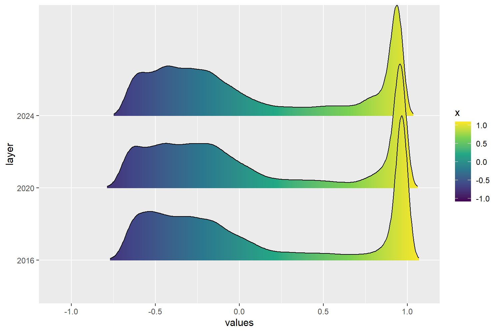
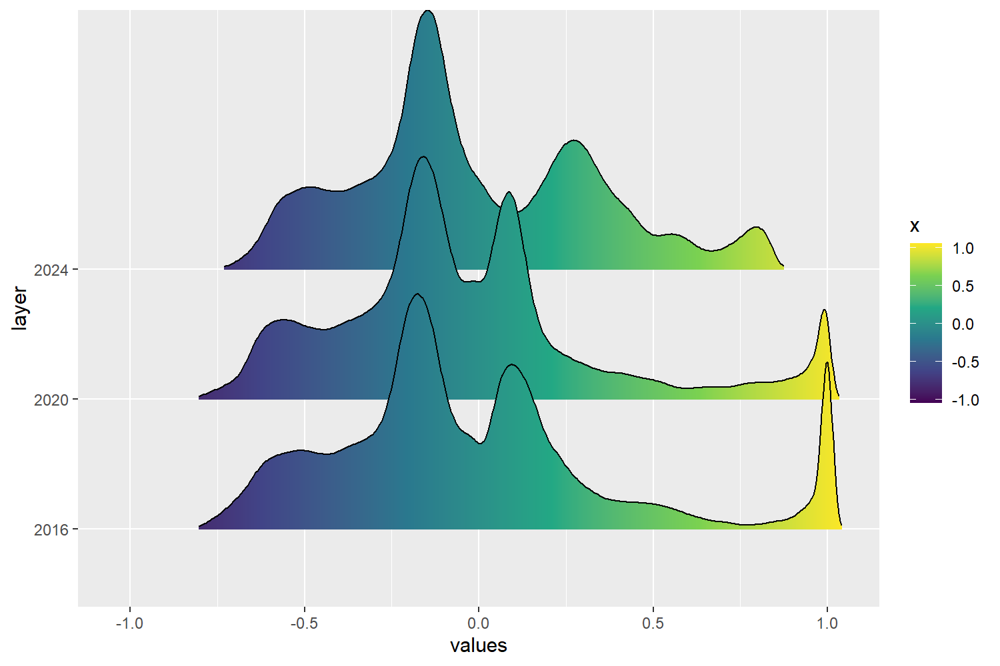
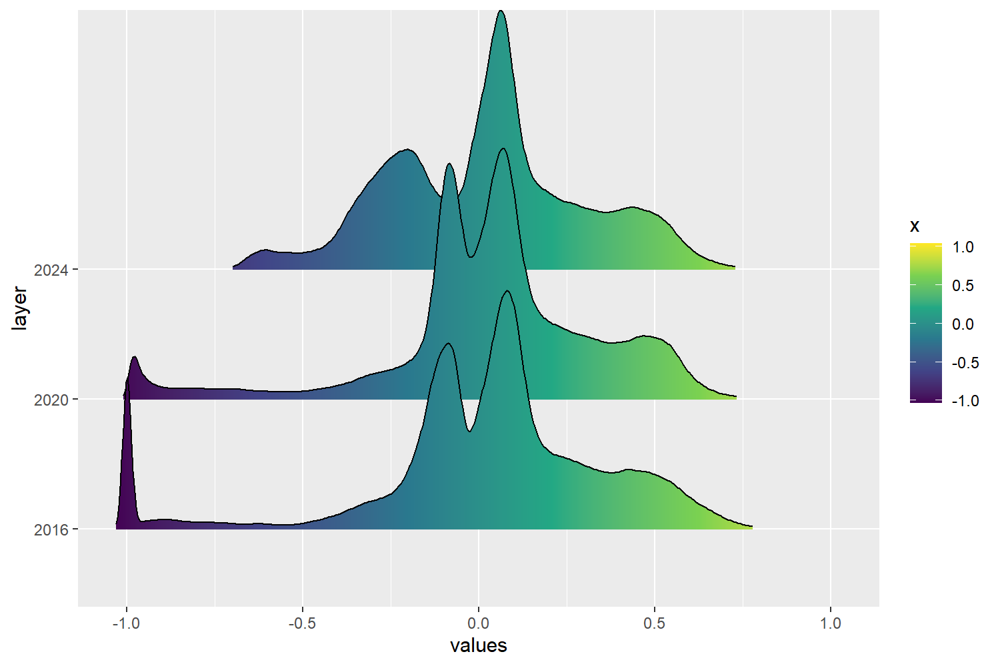

# Monitoraggio multitemporale della copertura di neve/ghiaccio alle Svalbard (2016-2020-2024)

> #### Progetto d'esame - Telerilevamento Geo-Ecologico in R - 2026
>> ##### Jacopo Moresco, matricola n.1237448

# Abstract

# 1. Introduzione 📌

Le Svalbard rappresentano una delle regioni artiche più sensibili al riscaldamento climatico in atto, con tassi di aumento della temperatura superiori alla media globale e conseguenze dirette sulla dinamica dei ghiacciai dell'arcipelago. Studi recenti basati su fonti storiche e geomorfologiche documentano, per questi e altri ghiacciai, una consistente perdita di massa e un arretramento marcato alternato solo da fasi di avanzata legate a eventi di *surge* [Zagorski et al.](https://doi.org/10.1080/24694452.2023.2200487). Questo quadro rende le Svalbard un caso di studio rilevante per verificare, tramite telerilevamento multitemporale, se e come la copertura di neve e ghiaccio stia effettivamente variando in un intervallo temporale recente e osservabile da satellite.

## Area di studio 🛰️

L'area di studio è situata nella porzione sud-occidentale dell'isola di Spitsbergen, nell'arcipelago norvegese delle Svalbard, all'interno del Sør-Spitsbergen National Park. In particolare, il sito interessa la parte nord-occidentale del Recherchefjorden e la costa meridionale di Bellsund, nella regione di Wedel Jarlsberg Land (~77°N, 14°E). Nel ritaglio considerato sono presenti Renardbreen — un ghiacciaio vallivo che in passato terminava in mare — Scottbreen, Blomlibreen e alcune superfici glaciali minori.

Si tratta di ghiacciai di tipo *surge*, soggetti a temporanei e violenti avanzamenti pulsanti seguiti da lunghe fasi di quiescenza; tuttavia, la tendenza dominante osservata negli ultimi decenni in questa regione, fortemente influenzata dal rapido riscaldamento artico, è quella di un arretramento marcato e di una consistente perdita di massa.

<p align="center">
  
</p>

> Figura 1. Localizzazione dell'area di studio nel settore sud-occidentale di Spitsbergen, Svalbard.

## Obiettivo 🎯

L'obiettivo del progetto è stimare la variazione della copertura di neve/ghiaccio nell'area di studio tra il 2016 e il 2024, utilizzando immagini Sentinel-2 attraverso il calcolo di indici spettrali e un'analisi multitemporale, nell'ipotesi che tale estensione si riduca per effetto del riscaldamento climatico in atto alle Svalbard.

# 2. Materiali e Metodi 📌

## Raccolta delle immagini 📂

Le immagini satellitari sono state ottenute tramite [**Google Earth Engine**](https://earthengine.google.com/) (GEE), una piattaforma cloud che consente di accedere direttamente all'archivio satellitare pubblico, tra cui le collezioni Sentinel-2, e di elaborarlo senza doverlo scaricare in locale: è possibile filtrare le scene disponibili per area geografica, intervallo temporale e percentuale di copertura nuvolosa, per poi esportare l'immagine risultante già ritagliata sull'area di interesse. Per questo progetto sono state selezionate immagini con una copertura nuvolosa massima del 10% (`CLOUDY_PIXEL_PERCENTAGE < 10`), soglia scelta per ridurre il più possibile l'interferenza delle nuvole nel calcolo degli indici spettrali.

+ Le immagini utilizzate sono composti mediani mensili: per ciascun anno, tutte le scene Sentinel-2 di agosto (2016, 2020, 2024) con copertura nuvolosa inferiore al 10% sono state combinate calcolando il valore mediano pixel per pixel, riducendo così l'effetto di rumore residuo e le differenze radiometriche tra acquisizioni singole. 
+ Il dataset di partenza è Sentinel-2 Surface Reflectance Harmonized (Level-2A), già corretto atmosfericamente.
+ Il periodo estivo è stato scelto perché corrisponde alla fase di massima ablazione glaciale, durante la quale la copertura nevosa stagionale è generalmente ridotta, rendendo più semplice distinguere il ghiaccio permanente dalle superfici circostanti.

> [!NOTE]
> Il codice completo in JavaScript utilizzato per ottenere le immagini si trova nel file `Code.js`.

Per ciascun anno sono state scaricate le bande Sentinel-2 riportate in tabella, esportate a una risoluzione uniforme di 20 m (nativamente B2, B3, B4 e B8 sarebbero a 10 m, ma sono state allineate alla risoluzione di B11 in fase di esportazione):

| Banda | Nome | Indice/uso |
|---|---|---|
| B2 | Blue | Composizione RGB |
| B3 | Green | Composizione RGB, NDSI, NDWI |
| B4 | Red | NDVI, Composizione RGB |
| B8 | NIR | NDWI, NDVI, filtro NIR |
| B11 | SWIR1 | NDSI |

# 3. Procedimento R-Studio 🧪

Una volta scaricate, le tre immagini sono state importate in RStudio dopo aver impostato una working directory.

```r
setwd("C:/Users/Jacopo/OneDrive/Università/Magistrale/Telerilevamento_Rocchini/Exam")
```

Successivamente sono stati installati i seguenti pacchetti:

```r
library(terra)      # Gestione raster e vettori spaziali
library(imageRy)    # Visualizzazione immagini telerilevate
library(viridis)    # Palette cromatiche per mappe
library(ggplot2)    # Grafici finali
library(patchwork)  # Affiancamento grafici
library(ggridges)   # Distribuzioni degli indici
library(reshape2)   # Riorganizzazione tabelle per ggplot
```

## Importazione e visualizzazione delle immagini 💻

I tre raster Sentinel-2 sono stati importati con la funzione `rast()` di `terra`, che legge direttamente il file multibanda in formato `.tif` mantenendo la struttura originale delle cinque bande selezionate in fase di esportazione da GEE.

```r
image_2016 <- rast("data_raw/svalbard_glaciers_2016_late_summer.tif")
image_2016          # visualizzo le specifiche del raster
plot(image_2016)    # visualizzo l'immagine
dev.off()           # chiudo il pannello grafico

image_2020 <- rast("data_raw/svalbard_glaciers_2020_late_summer.tif")
image_2020
plot(image_2020)
dev.off()

image_2024 <- rast("data_raw/svalbard_glaciers_2024_late_summer.tif")
image_2024
plot(image_2024)
dev.off()
```

## Importazione degli outlines glaciali di riferimento 🗺️

Oltre alle tre immagini Sentinel-2, è stato importato lo shapefile con gli outlines glaciali ufficiali del Norwegian Polar Institute (NPI), disponibile per l'anno 2020. Questo dato vettoriale costituisce l'unico riferimento indipendente disponibile nel progetto e viene utilizzato più avanti per validare la classificazione neve/ghiaccio ottenuta dagli indici spettrali.

```r
# Cerco tutti i file .shp nella cartella Shapefile_2020
shapefiles_2020 <- list.files(path = "data_raw/Shapefile_2020", pattern = "\\.shp$",  full.names = TRUE)

# Importo gli outlines del 2020
glacier_outlines_2020 <- vect(shapefiles_2020[1]) 
glacier_outlines_2020        # Visualizzo informazioni del vettore

# Confronto il sistema di riferimento (crs) e l'estensione del raster 2020 e dello shapefile
crs(image_2020) == crs(glacier_outlines_2020)

# Riproietto gli outlines nel CRS dell raster del 2020
glacier_outlines_2020_proj <- project(glacier_outlines_2020, crs(image_2020))

# Ritaglio gli outlines sull'area di studio
study_glaciers_2020 <- crop(glacier_outlines_2020_proj, image_2020)

# Salvo gli outlines ritagliati come GeoPackage
writeVector(study_glaciers_2020, "data_processed/study_glaciers_2020.gpkg", overwrite = TRUE)
```

## Visualizzazione RGB e bande 🎨

Una prima composizione a colori naturali (bande 4-3-2) è stata prodotta per i tre anni, utile per farsi un'idea generale della copertura del terreno e della qualità delle immagini prima di procedere al calcolo degli indici.

### Visualizzazione RGB
```r
png("output/rgb_multitemporal_glaciers.png", width = 2150, height = 1150, res = 200)
im.multiframe(1,3)
plotRGB(image_2016, r = 3, g = 2, b = 1, stretch = "lin", main = "2016", 
        cex.main = 1.8)
plotRGB(image_2020, r = 3, g = 2, b = 1, stretch = "lin", main = "2020", 
        cex.main = 1.8)
plotRGB(image_2024, r = 3, g = 2, b = 1, stretch = "lin", main = "2024", 
        cex.main = 1.8)
dev.off()
```

<p align="center">
  
</p>

> Figura 2. Composizione RGB (bande 4-3-2) a confronto tra 2016, 2020 e 2024.

Sono state poi visualizzate singolarmente le cinque bande disponibili per ciascun anno, per verificare la qualità radiometrica delle immagini e la corrispondenza tra bande e superfici osservabili (neve, roccia, acqua, ombre) prima di calcolare gli indici.

### Le cinque bande del 2020
```r
png("output/bands_2020.png", width = 2200, height = 1400, res = 200)
im.multiframe(2,3)
plot(image_2020[["B2"]],  main = "B2 - Blue",  col = viridis(100))
plot(image_2020[["B3"]],  main = "B3 - Green", col = viridis(100))
plot(image_2020[["B4"]],  main = "B4 - Red",   col = viridis(100))
plot(image_2020[["B8"]],  main = "B8 - NIR",   col = viridis(100))
plot(image_2020[["B11"]], main = "B11 - SWIR1", col = viridis(100))
dev.off()
```

<p align="center">
  
</p>

> Figura 3. Le cinque bande Sentinel-2 disponibili per il 2020.


Prima di calcolare gli indici spettrali, le bande del visibile e le bande NIR/SWIR1 sono state confrontate  tra i tre anni: le prime sono propedeutiche a NDVI e alla composizione RGB, le seconde a NDSI e NDWI.

### Bande del visibile: confronto dei tre anni
```r
png("output/visible_bands.png", width = 2600, height = 2200, res = 200)
im.multiframe(3, 3)
plot(image_2016[["B2"]], main = "B2 - Blue (2016)", cex.main = 1.8, col = viridis(100))
plot(image_2016[["B3"]], main = "B3 - Green (2016)", cex.main = 1.8, col = viridis(100))
plot(image_2016[["B4"]], main = "B4 - Red (2016)", cex.main = 1.8, col = viridis(100))
plot(image_2020[["B2"]], main = "B2 - Blue (2020)", cex.main = 1.8, col = viridis(100))
plot(image_2020[["B3"]], main = "B3 - Green (2020)", cex.main = 1.8, col = viridis(100))
plot(image_2020[["B4"]], main = "B4 - Red (2020)", cex.main = 1.8, col = viridis(100))
plot(image_2024[["B2"]], main = "B2 - Blue (2024)", cex.main = 1.8, col = viridis(100))
plot(image_2024[["B3"]], main = "B3 - Green (2024)", cex.main = 1.8, col = viridis(100))
plot(image_2024[["B4"]], main = "B4 - Red (2024)", cex.main = 1.8, col = viridis(100))
dev.off()
```

<p align="center">
  
</p>

> Figura 4. Bande del visibile (B2, B3, B4) a confronto tra 2016, 2020 e 2024.

### Bande NIR e SWIR: confronto dei tre anni

```r
png("output/nir_swir_bands.png", width = 1600, height = 2200, res = 200)
im.multiframe(3, 2)
plot(image_2016[["B8"]],  main = "B8 - NIR (2016)", cex.main = 1.8, col = viridis(100))
plot(image_2016[["B11"]], main = "B11 - SWIR1 (2016)", cex.main = 1.8, col = viridis(100))
plot(image_2020[["B8"]],  main = "B8 - NIR (2020)",   cex.main = 1.8, col = viridis(100))
plot(image_2020[["B11"]], main = "B11 - SWIR1 (2020)", cex.main = 1.8, col = viridis(100))
plot(image_2024[["B8"]],  main = "B8 - NIR (2024)",   cex.main = 1.8, col = viridis(100))
plot(image_2024[["B11"]], main = "B11 - SWIR1 (2024)", cex.main = 1.8, col = viridis(100))
dev.off()
```

<p align="center">
  
</p>

> Figura 5. Bande B8 (NIR) e B11 (SWIR1) a confronto tra 2016, 2020 e 2024.

## Indici spettrali 📐

Per caratterizzare la copertura di neve/ghiaccio, l'acqua e la vegetazione sono stati calcolati tre indici spettrali normalizzati: **NDSI**, **NDWI** e **NDVI**. Ciascun indice è stato calcolato per i tre anni, e la relativa variazione temporale è stata ottenuta come differenza tra il 2024 e il 2016 (*Δindice = indice_2024 - indice_2016*): valori **positivi** indicano un aumento dell'indice nel 2024, valori **negativi** una diminuzione.

## NDSI - Normalized Difference Snow Index

$$ NDSI = \frac{Green - SWIR1}{Green + SWIR1} $$

L'NDSI sfrutta il comportamento spettrale tipico della neve e del ghiaccio, che riflettono *intensamente* nel verde e assorbono *fortemente* nello SWIR1: superfici innevate o ghiacciate assumono quindi valori di NDSI **elevati**, generalmente superiori a 0.4, mentre roccia, vegetazione e acqua restano su valori più bassi. È l'indice **centrale** del progetto, su cui si basa l'intera classificazione del capitolo successivo.

Il limite principale dell'NDSI, ben noto in letteratura, è la **confusione spettrale** con superfici che condividono una firma simile a quella della neve: specchi d'acqua, laghi proglaciali e ombre topografiche possono infatti restituire valori di NDSI altrettanto elevati, portando a una *sovrastima* dell'area effettivamente coperta da neve/ghiaccio se l'indice viene usato da solo. Questo limite motiva la scelta metodologica, illustrata nel capitolo 4, di combinare l'NDSI con altri indici e bande per isolare i falsi positivi.

```r
ndsi_2016 <- (image_2016[["B3"]] - image_2016[["B11"]]) / (image_2016[["B3"]] + image_2016[["B11"]])
ndsi_2020 <- (image_2020[["B3"]] - image_2020[["B11"]]) / (image_2020[["B3"]] + image_2020[["B11"]])
ndsi_2024 <- (image_2024[["B3"]] - image_2024[["B11"]]) / (image_2024[["B3"]] + image_2024[["B11"]])
dndsi <- ndsi_2024 - ndsi_2016

png("output/ndsi_multitemporal.png", width = 2150, height = 2150, res = 200)
im.multiframe(2, 2)
plot(ndsi_2016, main = "NDSI - 2016", col = viridis(100))
plot(ndsi_2020, main = "NDSI - 2020", col = viridis(100))
plot(ndsi_2024, main = "NDSI - 2024", col = viridis(100))
plot(dndsi, main = "ΔNDSI", col = viridis(100))
dev.off()
```

<p align="center">
  
</p>

> Figura 6. NDSI nei tre anni e relativa differenza (ΔNDSI, 2024-2016).

> **Commento**
>
> Nei tre anni la mappa NDSI mostra un pattern spaziale coerente: i valori più **alti** (verso il giallo) si concentrano stabilmente sui corpi glaciali, mentre il mare aperto e le superfici rocciose esposte restano su valori **bassi o negativi** (viola/blu scuro), come atteso dalla formula dell'indice. Nel pannello ΔNDSI la maggior parte dell'area glaciale interna appare in colori intermedi (variazione contenuta, vicina allo zero), mentre le anomalie più marcate si concentrano lungo i **margini e i fronti dei ghiacciai**, suggerendo un segnale di cambiamento localizzato ai bordi piuttosto che una perdita uniforme sull'intero corpo glaciale.

## NDWI - Normalized Difference Water Index

$$ NDWI = \frac{Green - NIR}{Green + NIR} $$

L'NDWI evidenzia la presenza di **acqua libera** (mare, laghi proglaciali, superfici umide), che assorbe fortemente nel NIR pur mantenendo una riflettanza relativamente alta nel verde. Nel progetto questo indice viene utilizzato principalmente per *distinguere l'acqua dal ghiaccio*, entrambi caratterizzati da riflettanza elevata nel verde e quindi facilmente confondibili dal solo NDSI.

```r
ndwi_2016 <- (image_2016[["B3"]] - image_2016[["B8"]]) / (image_2016[["B3"]] + image_2016[["B8"]])
ndwi_2020 <- (image_2020[["B3"]] - image_2020[["B8"]]) / (image_2020[["B3"]] + image_2020[["B8"]])
ndwi_2024 <- (image_2024[["B3"]] - image_2024[["B8"]]) / (image_2024[["B3"]] + image_2024[["B8"]])
dndwi<- ndwi_2024 - ndwi_2016

png("output/ndwi_multitemporal.png", width = 2150, height = 2150, res = 200)
im.multiframe(2, 2)
plot(ndwi_2016, main = "NDWI - 2016", col = viridis(100))
plot(ndwi_2020, main = "NDWI - 2020", col = viridis(100))
plot(ndwi_2024, main = "NDWI - 2024", col = viridis(100))
plot(dndwi, main = "ΔNDWI", col = viridis(100))
dev.off()
```

<p align="center">
  
</p>

> Figura 7. NDWI nei tre anni e relativa differenza (ΔNDWI, 2024-2016).

> **Commento**
>
> La mappa NDWI separa nettamente il mare aperto del Bellsund/Recherchefjorden (valori elevati) dai corpi glaciali, che restano su valori negativi o prossimi allo zero: questa netta distinzione conferma che l'indice è **efficace nel discriminare l'acqua dal ghiaccio**, ed è proprio ciò che lo rende utile come filtro nella classificazione del capitolo 4. Il pannello ΔNDWI mostra le variazioni più marcate lungo la linea di costa e nelle aree proglaciali, mentre l'interno dei ghiacciai resta più stabile: un segnale che rafforza l'idea che l'NDWI stia isolando correttamente la componente acquosa, senza "sporcare" la lettura del ghiaccio vero e proprio.


## NDVI - Normalized Difference Vegetation Index

$$ NDVI = \frac{NIR - Red}{NIR + Red} $$

L'NDVI individua l'eventuale presenza di **vegetazione o tundra**, distinguendola dalle superfici prive di copertura vegetale. Nel contesto artico i valori di NDVI restano generalmente *contenuti* rispetto ad ambienti temperati, ma l'indice è comunque utile per escludere le aree vegetate dalla classe neve/ghiaccio in fase di classificazione.

```r
ndvi_2016 <- im.ndvi(image_2016, nir = 4, red = 3)
ndvi_2020 <- im.ndvi(image_2020, nir = 4, red = 3)
ndvi_2024 <- im.ndvi(image_2024, nir = 4, red = 3)
dndvi <- ndvi_2024 - ndvi_2016

png("output/ndvi_multitemporal.png", width = 2150, height = 2150, res = 200)
im.multiframe(2, 2)
plot(ndvi_2016, main = "NDVI - 2016", col = viridis(100))
plot(ndvi_2020, main = "NDVI - 2020", col = viridis(100))
plot(ndvi_2024, main = "NDVI - 2024", col = viridis(100))
plot(dndvi, main = "ΔNDVI 2024 - 2016", col = viridis(100))
dev.off()
```

<p align="center">
  
</p>

> Figura 8. NDVI nei tre anni e relativa differenza (ΔNDVI, 2024-2016).


> **Commento**
>
> I valori di NDVI restano contenuti su gran parte dell'area, coerentemente con un ambiente artico a vegetazione scarsa: la maggior parte della superficie si colloca vicino allo zero o su valori leggermente negativi, con isolate zone a NDVI più alto concentrate nelle aree libere dal ghiaccio (morene, terreni costieri). Il pannello ΔNDVI 2024-2016 non mostra variazioni sistematiche di grande entità, un risultato in linea con l'aspettativa: l'indice è stato incluso per verificare un eventuale **aumento della vegetazione** legato al riscaldamento artico (fenomeno noto come *arctic greening*), più che per un ruolo attivo nella classificazione del ghiaccio, dove i valori così contenuti e poco variabili non offrono un potere discriminante utile.

## Confronto delle variazioni multitemporali

Le tre differenze (ΔNDSI, ΔNDWI, ΔNDVI) sono state confrontate **fianco a fianco** per avere un quadro sintetico di come le tre componenti spettrali si siano modificate tra il 2016 e il 2024 nella stessa area.

```r
png("output/index_differences_2024_2016.png", width = 2100, height = 800, res = 200)
im.multiframe(1, 3)
plot(dndsi, col = viridis(100), main = "ΔNDSI 2024 - 2016")
plot(dndwi, col = viridis(100), main = "ΔNDWI 2024 - 2016")
plot(dndvi, col = viridis(100), main = "ΔNDVI 2024 - 2016")
dev.off()
```

<p align="center">
  
</p>

> Figura 9. Confronto tra le variazioni 2024-2016 di NDSI, NDWI e NDVI.

> **Commento**
>
> Il confronto affiancato delle tre differenze mostra come i segnali di cambiamento più marcati si distribuiscano in porzioni diverse dell'area di studio: il ΔNDWI si concentra lungo la costa e le aree proglaciali, il ΔNDSI ai margini dei ghiacciai, mentre il ΔNDVI resta diffuso e di **bassa intensità** su tutta l'area. Questo conferma che NDSI e NDWI stanno leggendo fenomeni spazialmente distinti ma complementari — rispettivamente ghiaccio e acqua — il che giustifica il loro uso combinato nella classificazione del capitolo 4. L'NDVI, pur mostrando un pattern spaziale coerente con la vegetazione artica, non presenta variazioni sufficientemente marcate da fornire un contributo discriminante analogo nella classificazione, e nel progetto resta quindi un indicatore **complementare** di monitoraggio ambientale piuttosto che un filtro operativo.

## Ridgeline plot

Per confrontare visivamente le distribuzioni dei tre indici nei tre anni, *senza ricorrere a un test statistico*, sono stati prodotti dei ridgeline plot: uno spostamento della curva verso destra indica un aumento generalizzato dei valori dell'indice, una curva più larga indica una maggiore eterogeneità spaziale, più picchi indicano una distribuzione multimodale.

```r
# Stack multitemporali dei tre indici
ndsi_ridge <- c(ndsi_2016, ndsi_2020, ndsi_2024)
ndwi_ridge <- c(ndwi_2016, ndwi_2020, ndwi_2024)
ndvi_ridge <- c(ndvi_2016, ndvi_2020, ndvi_2024)

# Nomi degli anni
names(ndsi_ridge) <- c("2016", "2020", "2024")
names(ndwi_ridge) <- c("2016", "2020", "2024")
names(ndvi_ridge) <- c("2016", "2020", "2024")
```

#### NDSI

```r
png("output/ridgeline_ndsi.png", width = 1500, height = 1000, res = 200) # NDSI
im.ridgeline(ndsi_ridge, scale = 2, palette = "viridis")
dev.off()
```

<p align="center">
  
</p>

> Figura 10. Distribuzione dei valori di NDSI nei tre anni.

> **Commento**
>
> In tutti e tre gli anni la distribuzione presenta un **picco netto vicino a +1**, corrispondente ai pixel di neve/ghiaccio, affiancato da una componente più ampia e appiattita centrata intorno a **-0.4/-0.3**, riconducibile alle superfici non innevate. Il picco vicino a +1 risulta **più alto nel 2024** rispetto al 2020 e al 2016, un andamento che a prima vista sembrerebbe indicare *più* pixel ad alto NDSI nell'anno più recente — un risultato da verificare con attenzione nella mappa di classificazione, perché potrebbe riflettere anche differenze nella copertura nevosa stagionale residua piuttosto che una reale variazione del ghiaccio permanente.

#### NDWI

```r
png("output/ridgeline_ndwi.png", width = 1500, height = 1000, res = 200) # NDWI
im.ridgeline(ndwi_ridge, scale = 2, palette = "viridis")
dev.off()
```

<p align="center">
  
</p>

> Figura 11. Distribuzione dei valori di NDWI nei tre anni.

> **Commento**
>
> Nel 2016 e nel 2020 la distribuzione è dominata da un **picco stretto e molto alto vicino a +1**, mentre nel 2024 lo stesso picco si abbassa e si allarga in una **collinetta più ampia tra 0.3 e 0.7**. Trattandosi di NDWI, i valori più alti corrispondono a superfici d'acqua: la differenza di forma tra il 2024 e gli anni precedenti suggerisce una minore concentrazione di pixel con riflettanza tipicamente "acquosa" pura, da incrociare con la mappa ΔNDWI e con eventuali differenze di copertura nuvolosa/mare aperto tra le tre acquisizioni.

#### NDVI

```r
png("output/ridgeline_ndvi.png", width = 1500, height = 1000, res = 200) # NDVI
im.ridgeline(ndvi_ridge, scale = 2, palette = "viridis")
dev.off()
```

<p align="center">
  
</p>

> Figura 12. Distribuzione dei valori di NDVI nei tre anni.

> **Commento**
>
> Il 2016 mostra un netto **accumulo di pixel a NDVI = -1**, assente o molto ridotto nel 2020 e nel 2024: valori così estremi e concentrati in un unico punto sono tipici di pixel mascherati o di denominatore vicino a zero, più che di una reale caratteristica della superficie, e andrebbero verificati con un controllo dei NoData su quell'anno. Per il resto, tutti e tre gli anni mostrano una distribuzione **multimodale**, con il picco principale centrato vicino allo zero (coerente con un ambiente artico privo di vegetazione diffusa) e una componente secondaria più ampia tra 0.3 e 0.6, probabilmente legata a tundra o suolo esposto.


## Teoria di Base - Da rielaborare
Nel dominio del visibile (VIS, lunghezze d'onda tra $0.4\ \mu\text{m}$ e $0.7\ \mu\text{m}$), e in particolare nelle bande del blu e del verde, la neve fresca e il ghiaccio pulito (clean ice) esibiscono una riflettanza eccezionalmente elevata, spesso superiore all'80-90% della radiazione solare incidente. Questa caratteristica conferisce ai ghiacciai la loro tipica luminosità abbagliante. L'alto grado di riflessione nel visibile è primariamente dominato dallo scattering multiplo all'interno della matrice dei cristalli di ghiaccio, dove l'assorbimento è minimo.
Nel vicino infrarosso (NIR, $\sim0.8 - 1.1\ \mu\text{m}$), la riflettanza inizia a decrescere progressivamente, influenzata principalmente dalla dimensione equivalente dei grani di neve. 

Nel dominio dell'infrarosso a onde corte (SWIR, $1.5 - 2.5\ \mu\text{m}$), la situazione si estremizza: le molecole d'acqua nel reticolo cristallino presentano bande di assorbimento formidabili. Di conseguenza, la riflettanza della neve e del ghiaccio nello SWIR crolla a valori prossimi allo zero. 


Questo marcato contrasto dicotomico, altissima riflettanza nel VIS e forte assorbimento nello SWIR, è il principio fisico fondamentale sfruttato dagli indici spettrali per isolare le coperture glaciali.

### NDSI
Formulato da Hall et al.(1995) per mitigare l'influenza delle nubi e standardizzare la mappatura della criosfera a livello globale. Capitalizza la massima escursione di riflettanza del ghiaccio tra la regione visibile e l'infrarosso a onde corte, operando una normalizzazione che riduce gli effetti **dell'atmosfera**, **dell'illuminazione asimmetrica** e del **rumore topografico**.


$$\text{NDSI} = \frac{\text{Green} - \text{SWIR}}{\text{Green} + \text{SWIR}}$$

Può asumere vlaori contininui da -1 a +1 e compensa intrinsecamente le differenze di illuminazione tra versanti esposti al sole e versanti in ombra, permettendo in molti casi di rintracciare la neve persino nelle profonde ombre proiettate dalle vette montane.

### Criticità NDSI
Per trasformare l'indcie da gradiente continuo a una mappa di classificazione binaria (Pixel glaciale vs. Pixel non-glaciale) è rischiesta l'applicazione di una soglia numerica ottimale (Optimal Threshold Value, OTHV). Storicamente, e nella maggior parte delle applicazioni operative si usa un valore soglia parti a $\text{NDSI} \geq 0.40$ spesso accoppiata a un vincolo accessorio nel NIR (es. riflettanza NIR $\geq 0.11$) per impedire l'inclusione di acqua estremamente scura o ombre nere. 

1. L'Ambivalenza Acqua-Ghiaccio: I laghi proglaciali e le acque superficiali presentano tassi di assorbimento massicci nella banda SWIR e una discreta riflettanza nel Verde. Di conseguenza, il rapporto normalizzato dell'NDSI per i pixel d'acqua produce spesso valori elevati, indistinguibili da quelli del ghiaccio. Senza l'ausilio di lunghe operazioni di mascheramento esterno (Water Masks), l'NDSI sovrastima sistematicamente l'area glaciale includendo i laghi terminali.
2. Sensibilità ai Pixel Misti: Ai bordi del ghiacciaio, dove il ghiaccio sottile si mescola con formazioni rocciose o vegetazione, la risoluzione spaziale dei satelliti (es. 30 m di Landsat) genera pixel misti.
3. Debris Cover: L'NDSI è fisiologicamente incapace di rilevare il ghiaccio sepolto da coperture detritiche.Poiché la litologia della copertura detritica (ghiaia, polveri, massi) copre totalmente il ghiaccio sottostante, gli indici ottici basati sul VIS-SWIR (NDSI, ANDSI, AGEI) restituiscono sistematicamente la firma spettrale della roccia. L'estrazione da remoto ignora del tutto la massa di ghiaccio sepolta, confondendo i limiti laterali e frontali inferiori del ghiacciaio con il letto periglaciale della vallata.
Il tracciamento dei ghiacciai neri necessita di flussi di lavoro eterogenei, i cui due assi portanti sono il telerilevamento termico e i sensori attivi. 


# 3. Risultati e Discussione


# 4. Conclusioni


# 5. Fonti
1. Hall, D.K., Riggs, G.A. (2011). Normalized-Difference Snow Index (NDSI). In: Singh, V.P., Singh, P., Haritashya, U.K. (eds) Encyclopedia of Snow, Ice and Glaciers. Encyclopedia of Earth Sciences Series. Springer, Dordrecht. https://doi.org/10.1007/978-90-481-2642-2_376
2. Keshri, A., Shukla, A., & Gupta, R. P. (2009). ASTER ratio indices for supraglacial terrain mapping. International Journal of Remote Sensing, 30(2), 519–524. https://doi.org/10.1080/01431160802385459
3. McFEETERS, S. K. (1996). The use of the Normalized Difference Water Index (NDWI) in the delineation of open water features. International Journal of Remote Sensing, 17(7), 1425–1432. https://doi.org/10.1080/01431169608948714
4. Lu, Y., James, T., Schillaci, C., & Lipani, A. (2022). Snow detection in alpine regions with Convolutional Neural Networks: discriminating snow from cold clouds and water body. GIScience & Remote Sensing, 59(1), 1321–1343. https://doi.org/10.1080/15481603.2022.2112391
5. Lith, A., G. Moholdt & J. Kohler. 2021. Svalbard glacier inventory based on Sentinel-2 imagery from summer 2020 [Data set]. Norwegian Polar Institute. https://data.npolar.no/dataset/1b8631bf-7710-449a-a56f-0da1a4fef608
6. König, M., Kohler, J., & Nuth, C. (2013). Glacier Area Outlines - Svalbard 1936-2010 [Dataset]. Norwegian Polar Institute. https://doi.org/10.21334/NPOLAR.2013.89F430F8
7. Zagórski, P., Frydrych, K., Jania, J., Błaszczyk, M., Sund, M., & Moskalik, M. (2023). *Surges in Three Svalbard Glaciers Derived from Historic Sources and Geomorphic Features*. *Annals of the American Association of Geographers, 113*(8), 1835–1855. https://doi.org/10.1080/24694452.2023.2200487


