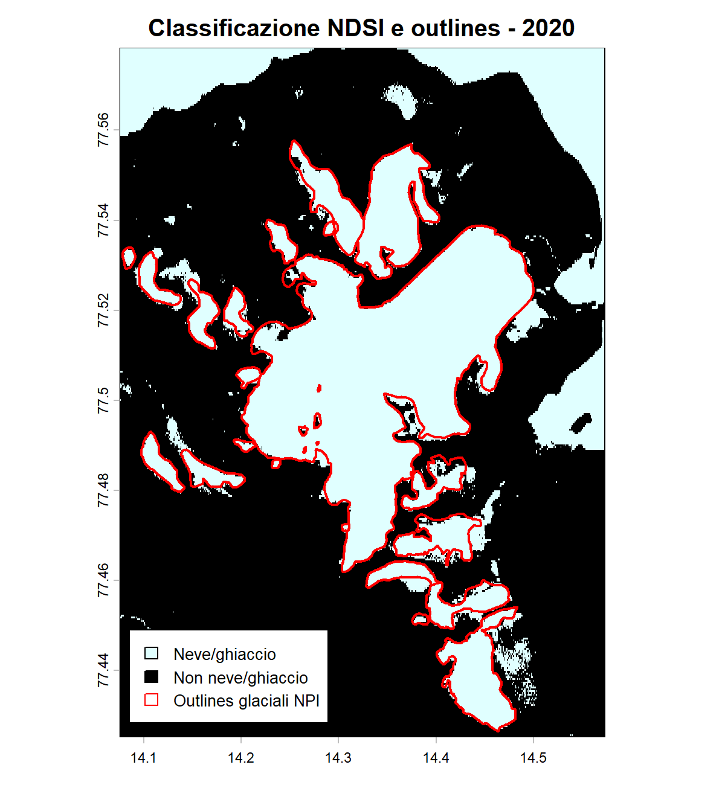
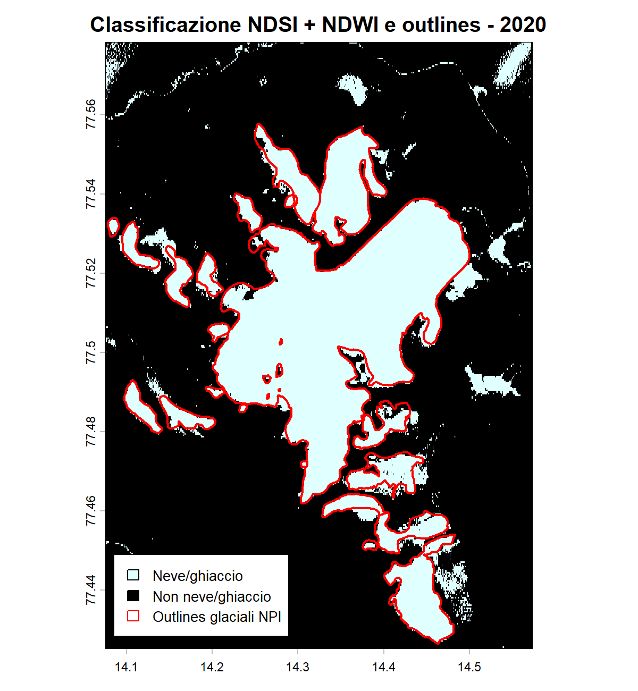
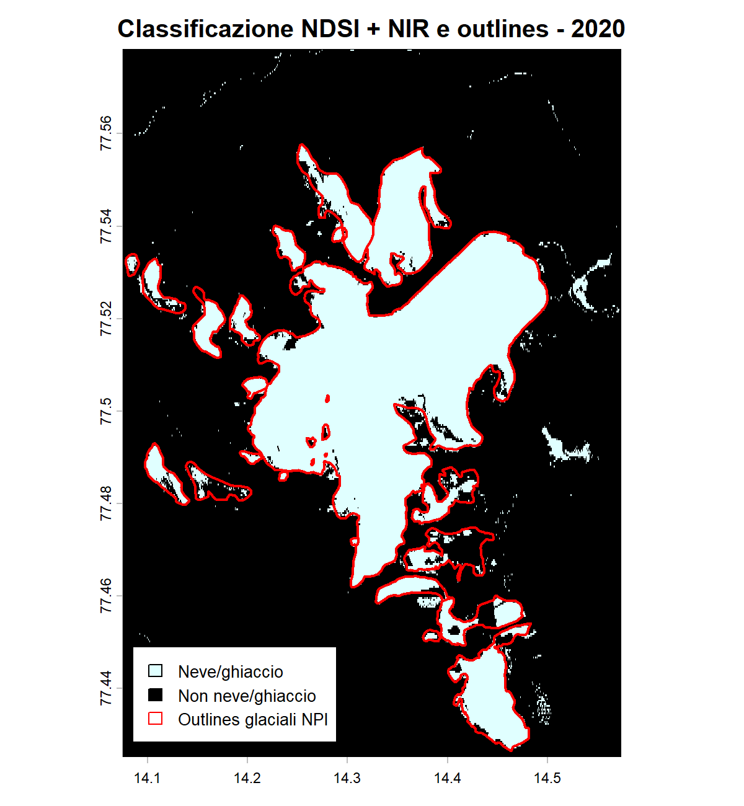
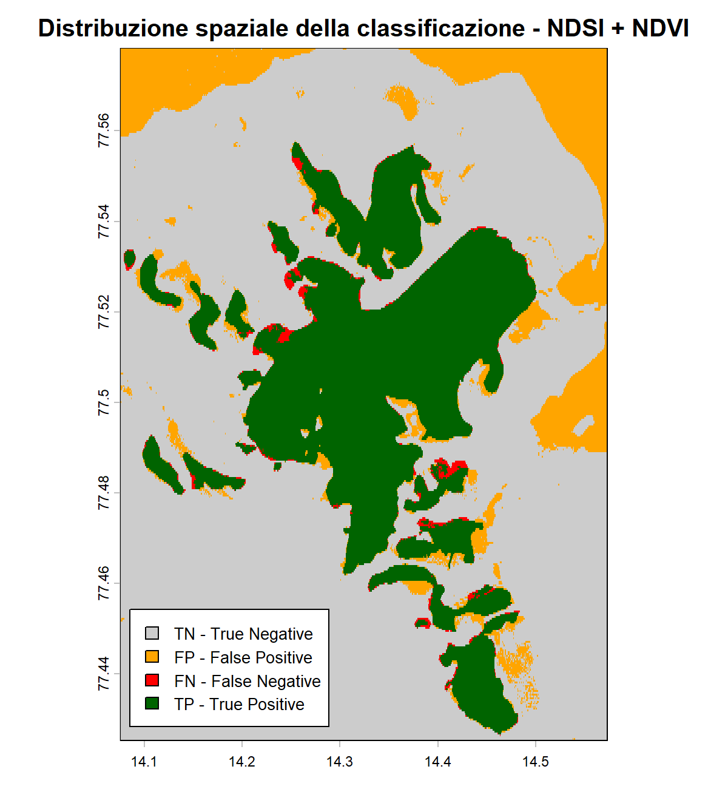

# Monitoraggio multitemporale della copertura di neve/ghiaccio alle Svalbard (2016-2020-2024)

> #### Progetto d'esame - Telerilevamento Geo-Ecologico in R - 2026
>> ##### Jacopo Moresco, matricola n.1237448

# Abstract

# 1. Introduzione 📌

Le Svalbard rappresentano una delle regioni artiche più sensibili al riscaldamento climatico in atto, con tassi di aumento della temperatura superiori alla media globale e conseguenze dirette sulla dinamica dei ghiacciai dell'arcipelago. Studi recenti basati su fonti storiche e geomorfologiche documentano, per questi e altri ghiacciai, una consistente perdita di massa e un arretramento marcato alternato solo da fasi di avanzata legate a eventi di *surge* (Zagorski et al. 2023)[7]. Questo quadro rende le Svalbard un caso di studio rilevante per verificare, tramite telerilevamento multitemporale, se e come la copertura di neve e ghiaccio stia effettivamente variando in un intervallo temporale recente e osservabile da satellite.

## 1.1 Area di studio 🛰️

L'area di studio è situata nella porzione sud-occidentale dell'isola di Spitsbergen, nell'arcipelago norvegese delle Svalbard, all'interno del Sør-Spitsbergen National Park. In particolare, il sito interessa la parte nord-occidentale del Recherchefjorden e la costa meridionale di Bellsund, nella regione di Wedel Jarlsberg Land (~77°N, 14°E). Nel ritaglio considerato sono presenti Renardbreen — un ghiacciaio vallivo che in passato terminava in mare — Scottbreen, Blomlibreen e alcune superfici glaciali minori.

Si tratta di ghiacciai di tipo *surge*, soggetti a temporanei e violenti avanzamenti pulsanti seguiti da lunghe fasi di quiescenza; tuttavia, la tendenza dominante osservata negli ultimi decenni in questa regione, fortemente influenzata dal rapido riscaldamento artico, è quella di un arretramento marcato e di una consistente perdita di massa.

<p align="center">
  
</p>

> Figura 1. Localizzazione dell'area di studio nel settore sud-occidentale di Spitsbergen, Svalbard.

## 1.2 Obiettivo 🎯

L'obiettivo del progetto è stimare la variazione della copertura di neve/ghiaccio nell'area di studio tra il 2016 e il 2024, utilizzando immagini Sentinel-2 attraverso il calcolo di indici spettrali e un'analisi multitemporale, nell'ipotesi che tale estensione si riduca per effetto del riscaldamento climatico in atto alle Svalbard.

# 2. Materiali e Metodi 🧪

## 2.1 Raccolta delle immagini 📂

Le immagini satellitari sono state ottenute tramite [**Google Earth Engine**](https://earthengine.google.com/) (GEE), una piattaforma cloud che consente di accedere direttamente all'archivio satellitare pubblico, tra cui le collezioni Sentinel-2, e di elaborarlo senza doverlo scaricare in locale: è possibile filtrare le scene disponibili per area geografica, intervallo temporale e percentuale di copertura nuvolosa, per poi esportare l'immagine risultante già ritagliata sull'area di interesse. Per questo progetto sono state selezionate immagini con una copertura nuvolosa massima del 10% (`CLOUDY_PIXEL_PERCENTAGE < 10`), soglia scelta per ridurre il più possibile l'interferenza delle nuvole nel calcolo degli indici spettrali.

+ Le immagini utilizzate sono composti mediani mensili: per ciascun anno, tutte le scene Sentinel-2 di agosto (2016, 2020, 2024) con copertura nuvolosa inferiore al 10% sono state combinate calcolando il valore mediano pixel per pixel, riducendo così l'effetto di rumore residuo e le differenze radiometriche tra acquisizioni singole. 
+ Il dataset di partenza è Sentinel-2 Surface Reflectance Harmonized (Level-2A), già corretto atmosfericamente.
+ Il periodo estivo è stato scelto perché corrisponde alla fase di massima ablazione glaciale, durante la quale la copertura nevosa stagionale è generalmente ridotta, rendendo più semplice distinguere il ghiaccio permanente dalle superfici circostanti.

> [!NOTE]
> Il codice completo in JavaScript utilizzato per ottenere le immagini si trova nel file `Code.js`.

Per ciascun anno sono state scaricate le bande Sentinel-2 riportate in tabella, esportate a una risoluzione uniforme di 20 m (nativamente B2, B3, B4 e B8 sarebbero a 10 m, ma sono state allineate alla risoluzione di B11 in fase di esportazione):

| Banda | Nome | Indice/uso |
|---|---|---|
| B2 | Blue | Composizione RGB |
| B3 | Green | Composizione RGB, NDSI, NDWI |
| B4 | Red | Composizione RGB, NDVI |
| B8 | NIR | NDWI, NDVI, filtro NIR |
| B11 | SWIR1 | NDSI |

## 2.2 Importazione e visualizzazione in R 💻

Una volta scaricate, le tre immagini sono state importate in RStudio dopo aver impostato una working directory.

```r
setwd("C:/Users/Jacopo/OneDrive/Università/Magistrale/Telerilevamento_Rocchini/Exam")
```

Successivamente sono stati installati i seguenti pacchetti:

```r
library(terra)      # Gestione raster e vettori spaziali
library(imageRy)    # Visualizzazione immagini telerilevate
library(viridis)    # Palette cromatiche per mappe
library(ggplot2)    # Grafici finali
library(patchwork)  # Affiancamento grafici
library(ggridges)   # Distribuzioni degli indici
library(reshape2)   # Riorganizzazione tabelle per ggplot
```

### Immagini

I tre raster Sentinel-2 sono stati importati con la funzione `rast()` di `terra`, che legge direttamente il file multibanda in formato `.tif` mantenendo la struttura originale delle cinque bande selezionate in fase di esportazione da GEE.

```r
image_2016 <- rast("data_raw/svalbard_glaciers_2016_late_summer.tif")
image_2016          # visualizzo le specifiche del raster
plot(image_2016)    # visualizzo l'immagine
dev.off()           # chiudo il pannello grafico

image_2020 <- rast("data_raw/svalbard_glaciers_2020_late_summer.tif")
image_2020
plot(image_2020)
dev.off()

image_2024 <- rast("data_raw/svalbard_glaciers_2024_late_summer.tif")
image_2024
plot(image_2024)
dev.off()
```

## Outlines glaciali di riferimento 🗺️

Oltre alle tre immagini Sentinel-2, è stato importato lo shapefile con gli outlines glaciali ufficiali del Norwegian Polar Institute (NPI), disponibile per l'anno 2020. Questo dato vettoriale costituisce l'unico riferimento indipendente disponibile nel progetto e viene utilizzato più avanti per validare la classificazione neve/ghiaccio ottenuta dagli indici spettrali.

```r
# Cerco tutti i file .shp nella cartella Shapefile_2020
shapefiles_2020 <- list.files(path = "data_raw/Shapefile_2020", pattern = "\\.shp$",  full.names = TRUE)

# Importo gli outlines del 2020
glacier_outlines_2020 <- vect(shapefiles_2020[1]) 
glacier_outlines_2020        # Visualizzo informazioni del vettore

# Confronto il sistema di riferimento (crs) e l'estensione del raster 2020 e dello shapefile
crs(image_2020) == crs(glacier_outlines_2020)

# Riproietto gli outlines nel CRS dell raster del 2020
glacier_outlines_2020_proj <- project(glacier_outlines_2020, crs(image_2020))

# Ritaglio gli outlines sull'area di studio
study_glaciers_2020 <- crop(glacier_outlines_2020_proj, image_2020)

# Salvo gli outlines ritagliati come GeoPackage
writeVector(study_glaciers_2020, "data_processed/study_glaciers_2020.gpkg", overwrite = TRUE)
```

## Visualizzazione RGB e bande 🌈

Una prima composizione a colori naturali (bande 4-3-2) è stata prodotta per i tre anni, utile per farsi un'idea generale della copertura del terreno e della qualità delle immagini prima di procedere al calcolo degli indici.

### Visualizzazione RGB 🎨
```r
png("output/rgb_multitemporal_glaciers.png", width = 2150, height = 1150, res = 200)
im.multiframe(1,3)
plotRGB(image_2016, r = 3, g = 2, b = 1, stretch = "lin", main = "2016", 
        cex.main = 1.8)
plotRGB(image_2020, r = 3, g = 2, b = 1, stretch = "lin", main = "2020", 
        cex.main = 1.8)
plotRGB(image_2024, r = 3, g = 2, b = 1, stretch = "lin", main = "2024", 
        cex.main = 1.8)
dev.off()
```

<p align="center">
  
</p>

> Figura 2. Composizione RGB (bande 4-3-2) a confronto tra 2016, 2020 e 2024.

### Le cinque bande del 2020 🔎

Sono state poi visualizzate singolarmente le cinque bande disponibili per ciascun anno (è stata inserita solo l'immagine del 2020 per non appesantire troppo il documento), per verificare la qualità radiometrica delle immagini e la corrispondenza tra bande e superfici osservabili (neve, roccia, acqua, ombre) prima di calcolare gli indici.
```r
png("output/bands_2020.png", width = 2200, height = 1400, res = 200)
im.multiframe(2,3)
plot(image_2020[["B2"]],  main = "B2 - Blue",  col = viridis(100))
plot(image_2020[["B3"]],  main = "B3 - Green", col = viridis(100))
plot(image_2020[["B4"]],  main = "B4 - Red",   col = viridis(100))
plot(image_2020[["B8"]],  main = "B8 - NIR",   col = viridis(100))
plot(image_2020[["B11"]], main = "B11 - SWIR1", col = viridis(100))
dev.off()
```

<p align="center">
  
</p>

> Figura 3. Le cinque bande Sentinel-2 disponibili per il 2020.

### Bande del visibile: confronto dei tre anni 👁️
Prima di calcolare gli indici spettrali, le bande del visibile e le bande NIR/SWIR1 sono state confrontate  tra i tre anni: le prime sono propedeutiche a NDVI e alla composizione RGB, le seconde a NDSI e NDWI.

```r
png("output/visible_bands.png", width = 2600, height = 2200, res = 200)
im.multiframe(3, 3)
plot(image_2016[["B2"]], main = "B2 - Blue (2016)", cex.main = 1.8, col = viridis(100))
plot(image_2016[["B3"]], main = "B3 - Green (2016)", cex.main = 1.8, col = viridis(100))
plot(image_2016[["B4"]], main = "B4 - Red (2016)", cex.main = 1.8, col = viridis(100))
plot(image_2020[["B2"]], main = "B2 - Blue (2020)", cex.main = 1.8, col = viridis(100))
plot(image_2020[["B3"]], main = "B3 - Green (2020)", cex.main = 1.8, col = viridis(100))
plot(image_2020[["B4"]], main = "B4 - Red (2020)", cex.main = 1.8, col = viridis(100))
plot(image_2024[["B2"]], main = "B2 - Blue (2024)", cex.main = 1.8, col = viridis(100))
plot(image_2024[["B3"]], main = "B3 - Green (2024)", cex.main = 1.8, col = viridis(100))
plot(image_2024[["B4"]], main = "B4 - Red (2024)", cex.main = 1.8, col = viridis(100))
dev.off()
```

<p align="center">
  
</p>

> Figura 4. Bande del visibile (B2, B3, B4) a confronto tra 2016, 2020 e 2024.

### Bande NIR e SWIR: confronto dei tre anni 📡

```r
png("output/nir_swir_bands.png", width = 1600, height = 2200, res = 200)
im.multiframe(3, 2)
plot(image_2016[["B8"]],  main = "B8 - NIR (2016)", cex.main = 1.8, col = viridis(100))
plot(image_2016[["B11"]], main = "B11 - SWIR1 (2016)", cex.main = 1.8, col = viridis(100))
plot(image_2020[["B8"]],  main = "B8 - NIR (2020)",   cex.main = 1.8, col = viridis(100))
plot(image_2020[["B11"]], main = "B11 - SWIR1 (2020)", cex.main = 1.8, col = viridis(100))
plot(image_2024[["B8"]],  main = "B8 - NIR (2024)",   cex.main = 1.8, col = viridis(100))
plot(image_2024[["B11"]], main = "B11 - SWIR1 (2024)", cex.main = 1.8, col = viridis(100))
dev.off()
```

<p align="center">
  
</p>

> Figura 5. Bande B8 (NIR) e B11 (SWIR1) a confronto tra 2016, 2020 e 2024.

## 2.3 Indici spettrali 📐

Per caratterizzare la copertura di neve/ghiaccio, l'acqua e la vegetazione sono stati calcolati tre indici spettrali normalizzati: **NDSI**, **NDWI** e **NDVI**. Ciascun indice è stato calcolato per i tre anni, e la relativa variazione temporale è stata ottenuta come differenza tra il 2024 e il 2016 (*Δindice = indice_2024 - indice_2016*): valori **positivi** indicano un aumento dell'indice nel 2024, valori **negativi** una diminuzione.

## NDSI - Normalized Difference Snow Index ❄️

$$ NDSI = \frac{Green - SWIR1}{Green + SWIR1} $$

L'NDSI, fromulato da **Hall e Riggs (2011) [1]** per la mappatura standardizzata della criosfera, sfruttando il comportamento spettrale tipico della neve e del ghiaccio, che riflettono *intensamente* nel verde e assorbono *fortemente* nello SWIR1: superfici innevate o ghiacciate assumono quindi valori di NDSI **elevati**, generalmente superiori a 0.4, mentre roccia, vegetazione e acqua restano su valori più bassi. È l'indice **centrale** del progetto, su cui si basa l'intera classificazione del capitolo successivo.

Il limite principale dell'NDSI, ben noto in letteratura, è la **confusione spettrale** con superfici che condividono una firma simile a quella della neve: specchi d'acqua, laghi proglaciali e ombre topografiche possono infatti restituire valori di NDSI altrettanto elevati, portando a una *sovrastima* dell'area effettivamente coperta da neve/ghiaccio se l'indice viene usato da solo. Questo limite motiva la scelta metodologica, illustrata nel capitolo 4, di combinare l'NDSI con altri indici e bande per isolare i falsi positivi.

```r
ndsi_2016 <- (image_2016[["B3"]] - image_2016[["B11"]]) / (image_2016[["B3"]] + image_2016[["B11"]])
ndsi_2020 <- (image_2020[["B3"]] - image_2020[["B11"]]) / (image_2020[["B3"]] + image_2020[["B11"]])
ndsi_2024 <- (image_2024[["B3"]] - image_2024[["B11"]]) / (image_2024[["B3"]] + image_2024[["B11"]])
dndsi <- ndsi_2024 - ndsi_2016

png("output/ndsi_multitemporal.png", width = 2150, height = 2150, res = 200)
im.multiframe(2, 2)
plot(ndsi_2016, main = "NDSI - 2016", col = viridis(100))
plot(ndsi_2020, main = "NDSI - 2020", col = viridis(100))
plot(ndsi_2024, main = "NDSI - 2024", col = viridis(100))
plot(dndsi, main = "ΔNDSI", col = viridis(100))
dev.off()
```

<p align="center">
  
</p>

> Figura 6. NDSI nei tre anni e relativa differenza (ΔNDSI, 2024-2016).

Nei tre anni la mappa NDSI mostra un pattern spaziale coerente: i valori più **alti** (verso il giallo) si concentrano stabilmente sui corpi glaciali, mentre il mare aperto e le superfici rocciose esposte restano su valori **bassi o negativi** (viola/blu scuro), come atteso dalla formula dell'indice. 

Nel pannello ΔNDSI la maggior parte dell'area glaciale interna appare in colori intermedi (variazione contenuta, vicina allo zero), mentre le anomalie più marcate si concentrano lungo i **margini e i fronti dei ghiacciai**, suggerendo un segnale di cambiamento localizzato ai bordi piuttosto che una perdita uniforme sull'intero corpo glaciale.

## NDWI - Normalized Difference Water Index 🌊

$$ NDWI = \frac{Green - NIR}{Green + NIR} $$

L'NDWI proposto da **McFeeters (1996) [3]** evidenzia la presenza di **acqua libera** (mare, laghi proglaciali, superfici umide), che assorbe fortemente nel NIR pur mantenendo una riflettanza relativamente alta nel verde. Nel progetto questo indice viene utilizzato principalmente per *distinguere l'acqua dal ghiaccio*, entrambi caratterizzati da riflettanza elevata nel verde e quindi facilmente confondibili dal solo NDSI.

```r
ndwi_2016 <- (image_2016[["B3"]] - image_2016[["B8"]]) / (image_2016[["B3"]] + image_2016[["B8"]])
ndwi_2020 <- (image_2020[["B3"]] - image_2020[["B8"]]) / (image_2020[["B3"]] + image_2020[["B8"]])
ndwi_2024 <- (image_2024[["B3"]] - image_2024[["B8"]]) / (image_2024[["B3"]] + image_2024[["B8"]])
dndwi<- ndwi_2024 - ndwi_2016

png("output/ndwi_multitemporal.png", width = 2150, height = 2150, res = 200)
im.multiframe(2, 2)
plot(ndwi_2016, main = "NDWI - 2016", col = viridis(100))
plot(ndwi_2020, main = "NDWI - 2020", col = viridis(100))
plot(ndwi_2024, main = "NDWI - 2024", col = viridis(100))
plot(dndwi, main = "ΔNDWI", col = viridis(100))
dev.off()
```

<p align="center">
  
</p>

> Figura 7. NDWI nei tre anni e relativa differenza (ΔNDWI, 2024-2016).

La mappa NDWI separa nettamente il mare aperto del Bellsund/Recherchefjorden (valori elevati) dai corpi glaciali, che restano su valori negativi o prossimi allo zero: questa netta distinzione conferma che l'indice è **efficace nel discriminare l'acqua dal ghiaccio**, ed è proprio ciò che lo rende utile come filtro nella classificazione. 

Il pannello ΔNDWI mostra le variazioni più marcate lungo la linea di costa e nelle aree proglaciali, mentre l'interno dei ghiacciai resta più stabile: un segnale che rafforza l'idea che l'NDWI stia isolando correttamente la componente acquosa, senza "sporcare" la lettura del ghiaccio vero e proprio.


## NDVI - Normalized Difference Vegetation Index 🌿

$$ NDVI = \frac{NIR - Red}{NIR + Red} $$

L'NDVI individua l'eventuale presenza di **vegetazione o tundra**, distinguendola dalle superfici prive di copertura vegetale. Nel contesto artico i valori di NDVI restano generalmente *contenuti* rispetto ad ambienti temperati, ma l'indice è comunque utile per escludere le aree vegetate dalla classe neve/ghiaccio in fase di classificazione.

```r
ndvi_2016 <- im.ndvi(image_2016, nir = 4, red = 3)
ndvi_2020 <- im.ndvi(image_2020, nir = 4, red = 3)
ndvi_2024 <- im.ndvi(image_2024, nir = 4, red = 3)
dndvi <- ndvi_2024 - ndvi_2016

png("output/ndvi_multitemporal.png", width = 2150, height = 2150, res = 200)
im.multiframe(2, 2)
plot(ndvi_2016, main = "NDVI - 2016", col = viridis(100))
plot(ndvi_2020, main = "NDVI - 2020", col = viridis(100))
plot(ndvi_2024, main = "NDVI - 2024", col = viridis(100))
plot(dndvi, main = "ΔNDVI 2024 - 2016", col = viridis(100))
dev.off()
```

<p align="center">
  
</p>

> Figura 8. NDVI nei tre anni e relativa differenza (ΔNDVI, 2024-2016).

I valori di NDVI restano contenuti su gran parte dell'area, coerentemente con un ambiente artico a vegetazione scarsa: la maggior parte della superficie si colloca vicino allo zero o su valori leggermente negativi, con isolate zone a NDVI più alto concentrate nelle aree libere dal ghiaccio (morene, terreni costieri). 

Il pannello ΔNDVI 2024-2016 non mostra variazioni sistematiche di grande entità, un risultato in linea con l'aspettativa: l'indice è stato incluso per verificare un eventuale **aumento della vegetazione** legato al riscaldamento artico (fenomeno noto come *arctic greening*), più che per un ruolo attivo nella classificazione del ghiaccio, dove i valori così contenuti e poco variabili non offrono un potere discriminante utile.

## Confronto delle variazioni multitemporali 🔀

Le tre differenze (ΔNDSI, ΔNDWI, ΔNDVI) sono state confrontate **fianco a fianco** per avere un quadro sintetico di come le tre componenti spettrali si siano modificate tra il 2016 e il 2024 nella stessa area.

```r
png("output/index_differences_2024_2016.png", width = 2100, height = 800, res = 200)
im.multiframe(1, 3)
plot(dndsi, col = viridis(100), main = "ΔNDSI 2024 - 2016")
plot(dndwi, col = viridis(100), main = "ΔNDWI 2024 - 2016")
plot(dndvi, col = viridis(100), main = "ΔNDVI 2024 - 2016")
dev.off()
```

<p align="center">
  
</p>

> Figura 9. Confronto tra le variazioni 2024-2016 di NDSI, NDWI e NDVI.

Il confronto affiancato delle tre differenze mostra come i segnali di cambiamento più marcati si distribuiscano in porzioni diverse dell'area di studio: il ΔNDWI si concentra lungo la costa e le aree proglaciali, il ΔNDSI ai margini dei ghiacciai, mentre il ΔNDVI resta diffuso e di **bassa intensità** su tutta l'area. Questo conferma che NDSI e NDWI stanno leggendo fenomeni spazialmente distinti ma complementari — rispettivamente ghiaccio e acqua — il che giustifica il loro uso combinato nella classificazione del capitolo 4.

L'NDVI, pur mostrando un pattern spaziale coerente con la vegetazione artica, non presenta variazioni sufficientemente marcate da fornire un contributo discriminante analogo nella classificazione, e nel progetto resta quindi un indicatore **complementare** di monitoraggio ambientale piuttosto che un filtro operativo.

## 2.4 Classificazione della copertura neve/ghiaccio 🧊

La classificazione binaria (neve/ghiaccio vs. non neve/ghiaccio) è stata validata sul 2020, l'unico anno per cui sono disponibili gli outlines glaciali ufficiali del Norwegian Polar Institute. La stessa soglia viene poi applicata anche al 2016 e al 2024, per garantire la confrontabilità tra le tre epoche.

La confusion matrix spaziale è costruita combinando aritmeticamente il raster classificato con il raster di riferimento (`classificato + 2 × riferimento`), ottenendo quattro classi:

| Codice | Significato |
|---|---|
| 0 (TN) | classificato NON neve/ghiaccio, esterno agli outlines |
| 1 (FP) | classificato neve/ghiaccio, ma esterno agli outlines |
| 2 (FN) | classificato NON neve/ghiaccio, ma interno agli outlines |
| 3 (TP) | classificato neve/ghiaccio, interno agli outlines |

```r
# Rasterizzazione degli outlines ufficiali sulla griglia del raster classificato
# 1 = area interna agli outlines glaciali; 0 = area esterna agli outlines
reference_ice <- rasterize(study_glaciers_2020, ice_2020_ndsi, field = 1, background = 0)
```

Da questi conteggi vengono calcolate tre metriche standard di validazione:

1. **Accuracy**

$$ Accuracy = \frac{TP + TN}{TP + TN + FP + FN} $$

Misura la percentuale di pixel classificati correttamente, **su entrambe le classi** (neve/ghiaccio e non). È la metrica più intuitiva, ma può essere fuorviante quando le due classi sono molto sbilanciate: nell'area di studio i pixel esterni agli outlines sono molto più numerosi di quelli glaciali, quindi un'Accuracy alta può in parte riflettere semplicemente la facilità di riconoscere correttamente il "non ghiaccio", più che la reale qualità della classificazione del ghiaccio.

2. **Recall (sensibilità)**

  $$ Recall = \frac{TP}{TP + FN} $$
  
Risponde alla domanda: *della superficie realmente glaciale (secondo gli outlines ufficiali), quanta ne viene effettivamente riconosciuta dalla classificazione?* Una Recall bassa indica **omissione**: il metodo lascia fuori porzioni di ghiaccio vero, classificandole erroneamente come non ghiaccio (falsi negativi).

3. **Precision**

  $$ Precision = \frac{TP}{TP + FP} $$
  
Risponde alla domanda opposta: *di tutta l'area classificata come neve/ghiaccio, quanta ricade davvero dentro gli outlines ufficiali?* Una Precision bassa indica **sovrastima**: il metodo include aree che non sono realmente ghiaccio (falsi positivi), come acqua, ombre o roccia chiara.

> [!NOTE]
> Recall e Precision colgono due tipi di errore opposti e complementari: la prima penalizza chi "lascia fuori" ghiaccio vero, la seconda penalizza chi "include" superfici che non lo sono. Un buon metodo di classificazione cerca il miglior compromesso tra le due, non la massimizzazione di una sola.

Il calcolo e la visualizzazione di questi risultati sono affidati a tre funzioni scritte appositamente per il progetto, richiamate identicamente per ciascuno dei quattro metodi testati:

> [!NOTE]
> **Le tre funzioni del workflow di classificazione**
>
> - **`plot_ice_classified()`** — affianca le mappe classificate (neve/ghiaccio vs. non neve/ghiaccio) dei tre anni (2016, 2020, 2024) in un'unica figura, con legenda comune.
> - **`plot_ice_outlines()`** — sovrappone outlines ufficiali del NPI alla classificazione del 2020 per un controllo visivo diretto di quanto la classe "neve/ghiaccio" combaci con il riferimento.
> - **`calculate_confusion_matrix()`** — è la funzione centrale: combina il raster classificato con il raster di riferimento (`classificato + 2 × riferimento`), conta i pixel in ciascuna delle quattro classi (TN, FP, FN, TP), calcola Accuracy, Recall e Precision, produce la mappa spaziale della confusion matrix e restituisce tutti i risultati (tabelle e raster) in un'unica lista, riutilizzabile nel confronto finale tra metodi.

#### plot_ice_classified()
```r
plot_ice_classified <- function(raster_2016, raster_2020, raster_2024, method, output_file) {
  # raster_2016     raster classificato relativo al 2016
  # raster_2020     raster classificato relativo al 2020
  # raster_2024     raster classificato relativo al 2024
  # method          nome del metodo di classificazione usato nei titoli
  # output_file     percorso e nome del file PNG finale

  rasters <- c(raster_2016, raster_2020, raster_2024)   # unisce i tre raster in un unico oggetto multilayer
  years <- c(2016, 2020, 2024)                          # vettore con gli anni associati ai tre raster    
  
  png(output_file, width = 2100, height = 800, res = 200)  
  im.multiframe(1, 3)   

  # Ripete lo stesso plot per ciascun anno, con legenda identica
  for (i in 1:3) { plot(rasters[[i]], col = c("black", "lightcyan"), type = "classes", legend = FALSE,
         main = paste("Classificazione", method, "-", years[i]))
    legend("bottomleft", inset = c(0.12, 0.02), xpd = NA, legend = c("Neve/ghiaccio", "Non neve/ghiaccio"),
    fill = c("lightcyan", "black"), border = "black", cex = 0.8, bg = "white", bty = "o")
  }
  dev.off()
}
```

#### plot_ice_outlines()
```r
plot_ice_outlines <- function(raster, method, output_file) {
  # raster          raster classificato relativo al 2020
  # method          nome del metodo di classificazione usato nel titolo
  # output_file     percorso e nome del file PNG finale
  
  png(output_file, width = 1200, height = 1300, res = 200)

  # Plotta il raster con titolo e colori standard
 plot(raster, col = c("black", "lightcyan"), type = "classes", legend = FALSE,
       main = paste("Classificazione", method, "e outlines - 2020"))
  plot(study_glaciers_2020, add = TRUE, border = "red", lwd = 2)

  legend("bottomleft", inset = c(0.13, 0.02), xpd = NA,
         legend = c("Neve/ghiaccio", "Non neve/ghiaccio", "Outlines glaciali NPI"),
         fill = c("lightcyan", "black", NA),
         border = c("black", "black", "red"),
         cex = 0.8, bg = "white", bty = "o")
  dev.off()
}
```


#### calculate_confusion_matrix()
```r
calculate_confusion_matrix <- function(classified_raster, method, output_file) {

  # classified_raster     raster binario da confrontare con gli outlines ufficiali
  # method                nome del metodo riportato nelle tabelle e nel titolo
  # output_file           percorso e nome del file PNG della confusion matrix spaziale

# Somma pesata: ogni combinazione classificato/riferimento produce un codice univoco
  # 0 = TN, 1 = FP, 2 = FN, 3 = TP (vedi tabella in relazione)
  comparison <- classified_raster + 2 * reference_ice
  cm <- freq(comparison) # Conta il numero di pixel appartenenti alle quattro classi 
  
  counts <- setNames(rep(0, 4), 0:3)
  counts[as.character(cm$value)] <- cm$count
  
  TN <- counts["0"]; FP <- counts["1"]; FN <- counts["2"]; TP <- counts["3"]
  
  accuracy <- (TP + TN) / (TP + TN + FP + FN) * 100
  recall <- TP / (TP + FN) * 100
  precision <- TP / (TP + FP) * 100
  
  confusion_table <- data.frame(
    Classificazione = c("NEVE/GHIACCIO", "NON NEVE/GHIACCIO"),
    Reference_ICE = c(TP, FN),
    Reference_NOT_ICE = c(FP, TN)
  )
  
  metrics_table <- data.frame(
    Metodo = method,
    TN = as.numeric(TN), FP = as.numeric(FP), FN = as.numeric(FN), TP = as.numeric(TP),
    Accuracy = round(as.numeric(accuracy), 2),
    Recall = round(as.numeric(recall), 2),
    Precision = round(as.numeric(precision), 2)
  )
  
  png(output_file, width = 1200, height = 1300, res = 200)
  plot(comparison, col = c("grey80", "orange", "red", "darkgreen"),
       main = paste("Distribuzione spaziale della classificazione -", method),
       type = "classes", legend = FALSE)
  legend("bottomleft", inset = c(0.13, 0.02), xpd = NA,
         legend = c("TN - True Negative", "FP - False Positive",
                    "FN - False Negative", "TP - True Positive"),
         fill = c("grey80", "orange", "red", "darkgreen"),
         cex = 0.8, bg = "white", bty = "o")
  dev.off()
  
  print(confusion_table)
  print(metrics_table)
  
  return(list(comparison = comparison, frequencies = cm,
              confusion_table = confusion_table, metrics = metrics_table))
}
```

### Metodo 1 — Solo NDSI 1️⃣

```r
png("output/hist_ndsi_2020.png", width = 1500, height = 1300, res = 200)
hist(ndsi_2020, breaks = 100, main = "Distribuzione NDSI - 2020")
dev.off() 

# Soglia iniziale verificata tramite confronto con gli outlines ufficiali
soglia_ndsi <- 0.4

# Matrice di riclassificazione: NDSI < 0.4 = 0, NON NEVE/GHIACCIO; NDSI >= 0.4 = 1, NEVE/GHIACCIO
ndsi_matrix <- matrix(c(-Inf, soglia_ndsi, 0, soglia_ndsi, Inf, 1), 
                      ncol = 3, byrow = TRUE)

ice_2016_ndsi <- classify(ndsi_2016, ndsi_matrix)
ice_2020_ndsi <- classify(ndsi_2020, ndsi_matrix)
ice_2024_ndsi <- classify(ndsi_2024, ndsi_matrix)
```

<p align="center">
  
</p>

> Figura 13. Distribuzione dei valori di NDSI nel 2020, con la soglia 0.4 scelta al netto separatore tra la componente principale a valori negativi/moderati e il picco a valori prossimi a +1.

```r
plot_ice_classified(ice_2016_ndsi, ice_2020_ndsi, ice_2024_ndsi,
                    "NDSI", "output/ice_classification_ndsi.png")
plot_ice_outlines(ice_2020_ndsi,"NDSI", "output/ndsi_ice_mask_2020.png")
results_ndsi <- calculate_confusion_matrix(classified_raster = ice_2020_ndsi, 
                                           method = "NDSI", output_file = "output/confusion_matrix_ndsi.png")
```

<p align="center">
  
</p>

> Figura 14. Classificazione NDSI (soglia 0.4) sovrapposta agli outlines ufficiali NPI, 2020.

<p align="center">
  
</p>

> Figura 15. Distribuzione spaziale della confusion matrix, metodo NDSI.

Il solo NDSI riproduce correttamente la forma generale dei ghiacciai (ampia area verde di True Positive coincidente con gli outlines), ma mostra una quantità considerevole di **falsi positivi** (arancione) distribuiti soprattutto lungo il margine costiero e nelle aree esterne agli outlines, riconducibili al mare aperto e ad altre superfici con firma spettrale simile alla neve. I falsi negativi (rosso) sono invece limitati e concentrati ai bordi di alcune propaggini glaciali minori. Accuracy = [XX.XX]%, Recall = [XX.XX]%, Precision = [XX.XX]%.

### Metodo 2 — NDSI + NDWI 2️⃣

```r
png("output/hist_ndwi_2020.png", width = 1500, height = 1300, res = 200)
hist(ndwi_2020, breaks = 100, main = "Distribuzione NDWI - 2020")
dev.off() 

# Soglia NDWI i pixel con NDWI >= 0.7 vengono considerati acqua
soglia_ndwi <- 0.7 # soglia sperimentale verificata con outlines e metriche

# Crea una maschera binaria: NDWI < 0.7 = 1, NON ACQUA; NDWI >= 0.7 = 0, ACQUA
ndwi_matrix <- matrix(c(-Inf, soglia_ndwi, 1, soglia_ndwi, Inf, 0), ncol = 3, byrow = TRUE)

not_water_2016 <- classify(ndwi_2016, ndwi_matrix)
not_water_2020 <- classify(ndwi_2020, ndwi_matrix)
not_water_2024 <- classify(ndwi_2024, ndwi_matrix)

# Mantiene solo i pixel classificati come neve/ghiaccio e contemporaneamente non acqua
# NDSI >= 0.4 AND NDWI < 0.7
ice_2016_ndsi_ndwi <- ice_2016_ndsi * not_water_2016
ice_2020_ndsi_ndwi <- ice_2020_ndsi * not_water_2020
ice_2024_ndsi_ndwi <- ice_2024_ndsi * not_water_2024
```

```r
plot_ice_classified(ice_2016_ndsi_ndwi, ice_2020_ndsi_ndwi, ice_2024_ndsi_ndwi,
                    "NDSI + NDWI", "output/ice_classification_ndsi_ndwi.png")
plot_ice_outlines(ice_2020_ndsi_ndwi, "NDSI + NDWI", "output/ndsi_ndwi_ice_mask_2020.png")
results_ndsi_ndwi <- calculate_confusion_matrix(classified_raster = ice_2020_ndsi_ndwi,
                                                method = "NDSI + NDWI", output_file = "output/confusion_matrix_ndsi_ndwi.png")
```

<p align="center">
  
</p>

> Figura 16. Classificazione NDSI + NDWI sovrapposta agli outlines ufficiali NPI, 2020.

<p align="center">
  
</p>

> Figura 17. Distribuzione spaziale della confusion matrix, metodo NDSI + NDWI.

Rispetto al solo NDSI, l'aggiunta del filtro NDWI **riduce visibilmente i falsi positivi** lungo il margine costiero e in mare aperto, senza intaccare in modo apprezzabile l'area di True Positive: il filtro rimuove correttamente l'acqua senza "mangiare" ghiaccio reale. Accuracy = [XX.XX]%, Recall = [XX.XX]%, Precision = [XX.XX]%.

### Metodo 3 — NDSI + NIR 3️⃣

```r
png("output/hist_B8_2020.png", width = 1500, height = 1300, res = 200)
hist(image_2020[["B8"]], breaks = 100, main = "Distribuzione B8 - 2020")
dev.off()

# Soglia NIR per escludere i pixel con riflettanza troppo bassa
soglia_nir <- 400 # soglia sperimentale verificata con outlines e metriche

# Matrice di riclassificazione: # NIR < 400 = 0; # NIR >= 400 = 1
nir_matrix <- matrix(c(-Inf, soglia_nir, 0, soglia_nir, Inf, 1), ncol = 3, byrow = TRUE)

nir_mask_2016 <- classify(image_2016[["B8"]], nir_matrix)
nir_mask_2020 <- classify(image_2020[["B8"]], nir_matrix)
nir_mask_2024 <- classify(image_2024[["B8"]], nir_matrix)

# Combinazione delle due condizioni:
# neve/ghiaccio = NDSI >= 0.4 AND NIR >= 400
ice_2016_ndsi_nir <- ice_2016_ndsi * nir_mask_2016
ice_2020_ndsi_nir <- ice_2020_ndsi * nir_mask_2020
ice_2024_ndsi_nir <- ice_2024_ndsi * nir_mask_2024
```

```r
plot_ice_classified(ice_2016_ndsi_nir, ice_2020_ndsi_nir, ice_2024_ndsi_nir,
                    "NDSI + NIR", "output/ice_classification_ndsi_nir.png")
plot_ice_outlines(ice_2020_ndsi_nir, "NDSI + NIR", "output/ndsi_nir_ice_mask_2020.png")
results_ndsi_nir <- calculate_confusion_matrix(classified_raster = ice_2020_ndsi_nir,
                                               method = "NDSI + NIR", output_file = "output/confusion_matrix_ndsi_nir.png")
```

<p align="center">
  
</p>

> Figura 18. Classificazione NDSI + NIR sovrapposta agli outlines ufficiali NPI, 2020.

<p align="center">
  
</p>

> Figura 19. Distribuzione spaziale della confusion matrix, metodo NDSI + NIR.

Il filtro NIR riduce i falsi positivi in modo simile al filtro NDWI, ma introduce un blocco compatto di **falsi negativi** (rosso) in una zona a sud-est del corpo glaciale principale, dove pixel realmente interni agli outlines vengono esclusi perché la loro riflettanza NIR scende sotto la soglia di 400 — verosimilmente per la presenza di ombra o ghiaccio ricoperto da detrito superficiale, meno riflettente nel NIR. Accuracy = [XX.XX]%, Recall = [XX.XX]%, Precision = [XX.XX]%.

### Metodo 4 — NDSI + NDVI 4️⃣

```r
png("output/hist_ndvi_2020.png", width = 1500, height = 1300, res = 200)
hist(ndvi_2020, breaks = 100, main = "Distribuzione NDVI - 2020")
dev.off() 

# Soglia NDVI per distinguere vegetazione e non vegetazione
soglia_ndvi <- 0.3

# Matrice di riclassificazione:
# NDVI < 0.3 = 1, NON VEGETAZIONE
# NDVI >= 0.3 = 0, VEGETAZIONE
ndvi_matrix <- matrix(c(-Inf, soglia_ndvi, 1, soglia_ndvi, Inf, 0), ncol = 3, byrow = TRUE)

not_vegetation_2016 <- classify(ndvi_2016, ndvi_matrix)
not_vegetation_2020 <- classify(ndvi_2020, ndvi_matrix)
not_vegetation_2024 <- classify(ndvi_2024, ndvi_matrix)

# Combinazione delle due condizioni:
# neve/ghiaccio = NDSI >= 0.4 AND NDVI < 0.3
ice_2016_ndsi_ndvi <- ice_2016_ndsi * not_vegetation_2016
ice_2020_ndsi_ndvi <- ice_2020_ndsi * not_vegetation_2020
ice_2024_ndsi_ndvi <- ice_2024_ndsi * not_vegetation_2024
```

```r
plot_ice_classified(ice_2016_ndsi_ndvi, ice_2020_ndsi_ndvi, ice_2024_ndsi_ndvi,
                    "NDSI + NDVI", "output/ice_classification_ndsi_ndvi.png")
plot_ice_outlines(ice_2020_ndsi_ndvi, "NDSI + NDVI", "output/ndsi_ndvi_ice_mask_2020.png")
results_ndsi_ndvi <- calculate_confusion_matrix(classified_raster = ice_2020_ndsi_ndvi,
                                                method = "NDSI + NDVI", output_file = "output/confusion_matrix_ndsi_ndvi.png")
```

<p align="center">
  
</p>

> Figura 20. Classificazione NDSI + NDVI sovrapposta agli outlines ufficiali NPI, 2020.

<p align="center">
  
</p>

> Figura 21. Distribuzione spaziale della confusion matrix, metodo NDSI + NDVI.

Coerentemente con quanto osservato nella sezione sugli indici, il filtro NDVI **non modifica in modo sostanziale** la classificazione ottenuta dal solo NDSI: la vegetazione è talmente scarsa nell'area di studio che la maschera "non vegetazione" lascia quasi inalterati sia i falsi positivi sia i falsi negativi. Accuracy = [XX.XX]%, Recall = [XX.XX]%, Precision = [XX.XX]%.

### Confronto tra i metodi ⚖️

```r
classification_summary <- rbind(results_ndsi$metrics, results_ndsi_ndwi$metrics, results_ndsi_nir$metrics)
print(classification_summary) 
```

[qui la tabella `classification_summary` con i valori reali]

Sulla base del confronto, il metodo scelto per l'analisi multitemporale (capitolo 3) è **NDSI + NDWI**: riduce i falsi positivi rispetto al solo NDSI senza introdurre i falsi negativi concentrati osservati con il filtro NIR, e senza la ridondanza del filtro NDVI, che nell'area di studio non discrimina alcuna superficie aggiuntiva.


# 4. Risultati e Discussione 📊


# 5. Conclusioni 📝


# 6. Fonti 📚
1. Hall, D.K., Riggs, G.A. (2011). Normalized-Difference Snow Index (NDSI). In: Singh, V.P., Singh, P., Haritashya, U.K. (eds) Encyclopedia of Snow, Ice and Glaciers. Encyclopedia of Earth Sciences Series. Springer, Dordrecht. https://doi.org/10.1007/978-90-481-2642-2_376 QUESTO è IN FORSE
IN FORSE 2. Keshri, A., Shukla, A., & Gupta, R. P. (2009). ASTER ratio indices for supraglacial terrain mapping. International Journal of Remote Sensing, 30(2), 519–524. https://doi.org/10.1080/01431160802385459
3. McFEETERS, S. K. (1996). The use of the Normalized Difference Water Index (NDWI) in the delineation of open water features. International Journal of Remote Sensing, 17(7), 1425–1432. https://doi.org/10.1080/01431169608948714
4. Lu, Y., James, T., Schillaci, C., & Lipani, A. (2022). Snow detection in alpine regions with Convolutional Neural Networks: discriminating snow from cold clouds and water body. GIScience & Remote Sensing, 59(1), 1321–1343. https://doi.org/10.1080/15481603.2022.2112391
5. Lith, A., G. Moholdt & J. Kohler. 2021. Svalbard glacier inventory based on Sentinel-2 imagery from summer 2020 [Data set]. Norwegian Polar Institute. https://data.npolar.no/dataset/1b8631bf-7710-449a-a56f-0da1a4fef608
6. König, M., Kohler, J., & Nuth, C. (2013). Glacier Area Outlines - Svalbard 1936-2010 [Dataset]. Norwegian Polar Institute. https://doi.org/10.21334/NPOLAR.2013.89F430F8
7. Zagórski, P., Frydrych, K., Jania, J., Błaszczyk, M., Sund, M., & Moskalik, M. (2023). *Surges in Three Svalbard Glaciers Derived from Historic Sources and Geomorphic Features*. *Annals of the American Association of Geographers, 113*(8), 1835–1855. https://doi.org/10.1080/24694452.2023.2200487


